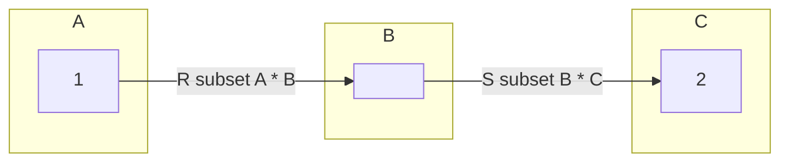
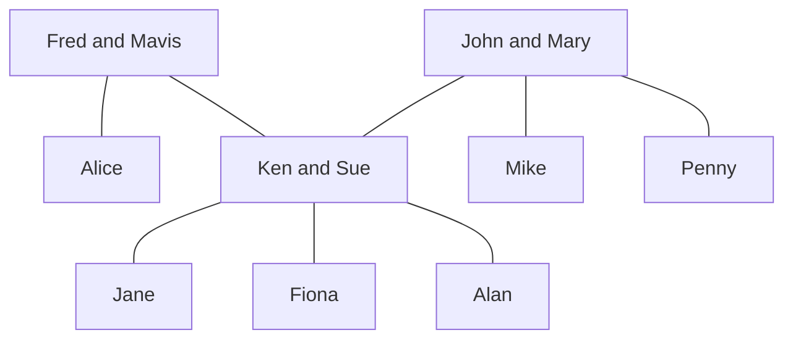
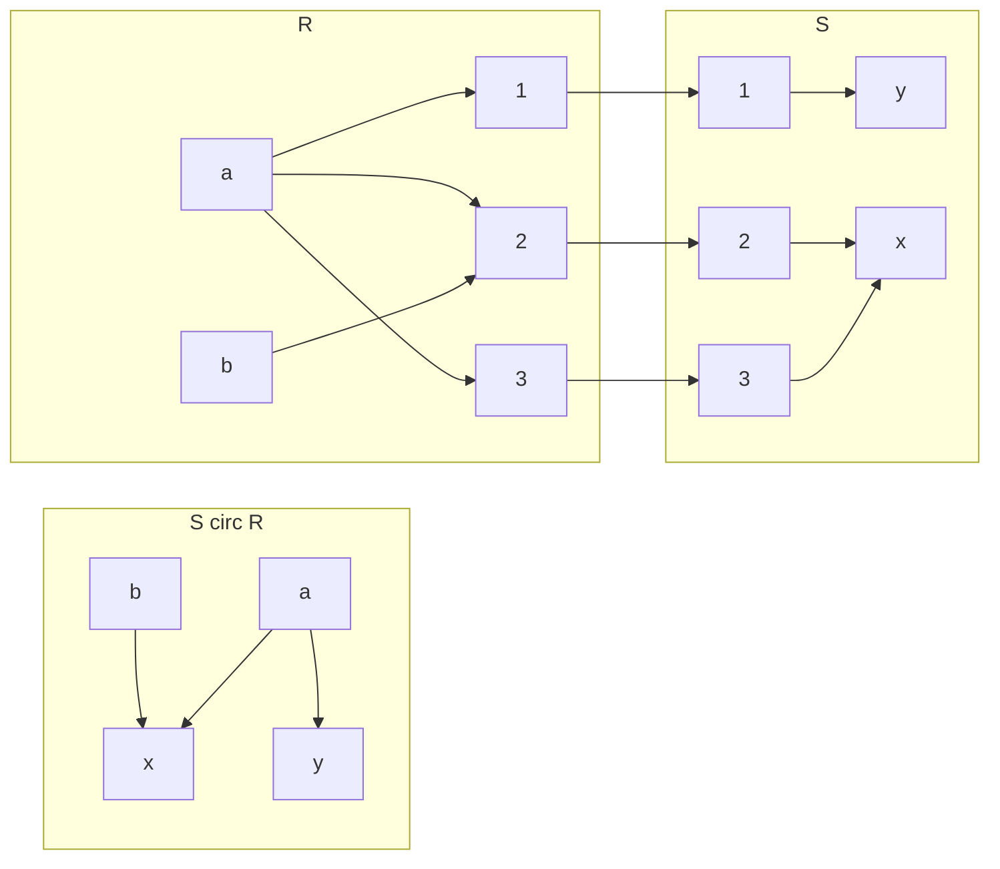
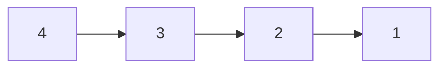
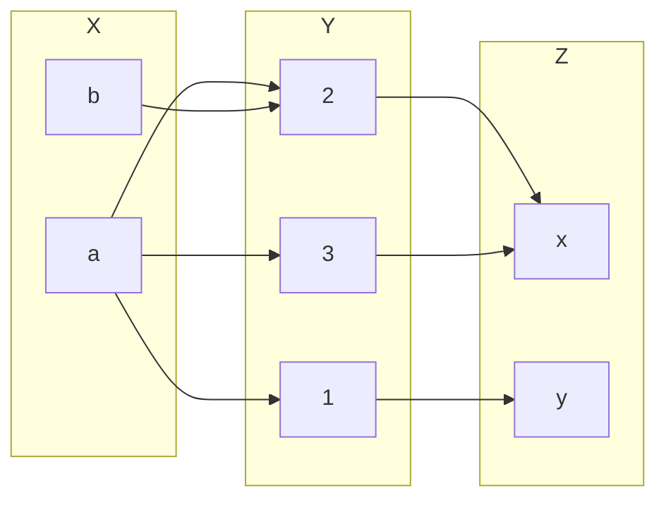
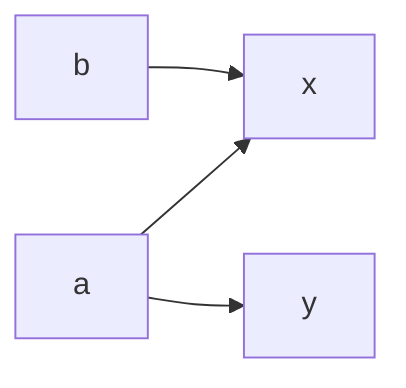

## Building New Relations from Given Ones
### Inverse Relation
Given a realtion $$R\subseteq A \times B$$. we define the inverse relation $$R^{-1}\subset B\times A$$ by:

$$R^{-1}=\{(b,a)\vert (a,b) \in R\}$$

Example:

* The inverse of the relation *is a parent of* on the set of people is the relation *is a child of*.

In other words if you swap the elements of a given relation you should get the inverse relation.

#### Example
$$A=\{1,2,3,4\},R=\{(x,y)\vert x\leq y\}$$

Therefore: 

$$R=\{(1,1),(1,2),(1,3),(1,4),(2,2),(2,3),(2,4),(3,3),(3,4),(4,4)\}$$

And:

$$R=\{(1,1),(2,1),(3,1),(4,1),(2,2),(3,2),(4,2),(3,3),(4,3),(4,4)\}$$

You could also say:

$$R^{-1}=\{(y,x)\vert x \leq y\} = \{(u,v)\vert u\geq v\}$$

In these examples you either swap the predicate to denote the inverse or you swap the evaluation such that it produces the inverse.

### Composition of Relations
Let $$R\subseteq A\times b$$ and $$s\subseteq B\times C$$. The (functional) composition of $$R$$ and $$S$$, denoted by $$S\circ R$$, is the binary relation between $$A$$ and $$C$$ given by:

$$S\circ R = \{(a,c)\vert \text{ exists } b\in B \text{ such that } aRb \text{ and } bSc\}$$

The notation $$aRb$$ is another way of writing $$(a,b)\in R$$.
{:.info}

Example:

* If $$R$$ is the relation *is a sister of* and $$S$$ is the relation *is a parent of* then:
	* \$$S\circ R$$ is the relation *is an aunt of*.
	* \$$S\circ S$$ is the relation *is a grandparent of*.
	
#### Example

* \$$R:$$ is a sister of
* \$$S:$$ is a parent of
* \$$S\circ R=\{(a,c)\vert\text{ exists } b\in B\text{ such that } aRb \text{ and } bSc\}$$

* Alice $$R$$ Ken and Ken $$S$$ Alan so Alice $$S\circ R$$ Alan.
	* This can also be written as $$(\text{Alice, Alan})\in S\circ R$$
	
#### Diagraph Representation of Compositions

For this diagram $$A=\{a,b\},B=\{1,2,3\},C=\{x,y\}$$:

## Computer Friendly Representation of Binary Relations - Matrices

Let $$A=\{a_1,\ldots,a_n\},B=\{b_1,\ldots,b_m\}$$ and $$R\subseteq A\times B$$.

We represent $$R$$ by an array $$M$$ of $$n$$ rows and $$m$$ columns. Such an array is called an $$n$$ by $$m$$ matrix.

The entry in row $$i$$ and column $$j$$ of this matrix is given by $$M(i,j)$$ where:

$$
M(i,j)=\begin{cases}
1 & \text{ if } (a_i,b_j)\in R\\
0 & \text{ if } (a_1,b_j)\notin R
\end{cases}
$$

### Example 1
Let $$A=\{1,3,5,7\}, B=\{2,4,6\}$$ and:

$$U=\{(x,y)\in A\times B\vert x + y = 9\}$$

Assume an enumeration $$a_1=1,a_2=3,a_3=5,a_4=7$$ and $$b_1=2,b_2=4,b_3=6$$. Then $$M$$ represents $$U$$, where:

$$
M = \begin{bmatrix}
0 & 0 & 0\\
0 & 0 & 1\\
0 & 1 & 0\\
1 & 0 & 0
\end{bmatrix}
$$

When representing in a matrix the rows are the items in set $$A$$ going down and the columns are the items in set $$B$$ going across.
{:.info}

You can then read the answers from the matrix as: $$U=\{(7,2),(5,4),(4,6)\}$$.

### Example 2
The binary relation $$R$$ on $$A=\{1,2,3,4\}$$ has the following digraph representation:

1. What are the ordered pairs?
	
	$$R=\{(4,3),(3,2),(2,1)\}$$
1. Draw the matrix.
	
	$$
	\begin{bmatrix}
	0&0&0&0\\
	1&0&0&0\\
	0&1&0&0\\
	0&0&1&0
	\end{bmatrix}
	$$
1. Explain the relation.

	$$x$$ is 1 larger than $$y$$.

### Matrices and Composition
This is working on the same relation as was seen in the section [Diagraph Representation of Compositions](#diagraph-representation-of-compositions).

This result in the following for the composition of $$S\circ R$$:

From these graphs we can deduce that $$R\subseteq X\times Y, S\subseteq Y\times Z$$.

Given the matrices of $$R$$ and $$S$$:

$$
R: \begin{bmatrix}
1&1&1\\
0&1&0
\end{bmatrix}
S: \begin{bmatrix}
0&1\\
1&0\\
1&0
\end{bmatrix}
$$

Calculate the binary relation matrix of $$S\circ R$$:

If you transpose the row $$a$$ in the matrix $$R$$ on the column $$x$$ in the matrix $$S$$ you can compare to see of $$a$$ is a subset of $$y$$. If it is then you put a 1 in the resultant matrix and if not you put a zero:

$$
S\circ R:\begin{bmatrix}
1&1\\
1&0
\end{bmatrix}
$$

#### Boolean Matrix Product
Given two matrices with entries 1 and 0 representing the relations we can form the matrix representing the composition. This is called the logical (Boolean) matrix product.

Let $$A=\{a_1,\ldots,a_n\},B=\{b_1,\ldots,b_m\}$$ and C=\{c_1,\ldots,c_p\}$$.

The logical matrix $$M$$ representing $$R$$ is given by:

$$
M(i,j)=\begin{cases}
1 & \text{ if } (a_i,b_j)\in R\\
0 & \text{ if } (a_1,b_j)\notin R
\end{cases}
$$

The logical matrix $$N$$ representing $$S$$ is given by:

$$
N(i,j)=\begin{cases}
1 & \text{ if } (b_i,c_j)\in S\\
0 & \text{ if } (b_1,c_j)\notin S
\end{cases}
$$

Then the entries $$P(i,)$$ of the logical matrix $$P$$ representing $$S\circ R$$ are given by:

* \$$P(i,j)=1$$ if there existsw $$l$$ with $$1\leq l\leq m$$ such that $$M(i,l)=1$$ and $$N(i,j)=1$$.
* \$$P(i,j)=0$$, otherwise.

This is the same as a product of matrices, $$P=MN$$. Instead of addition and multiplication we use logical OR and AND.
