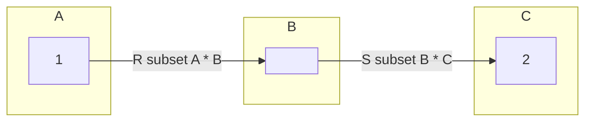
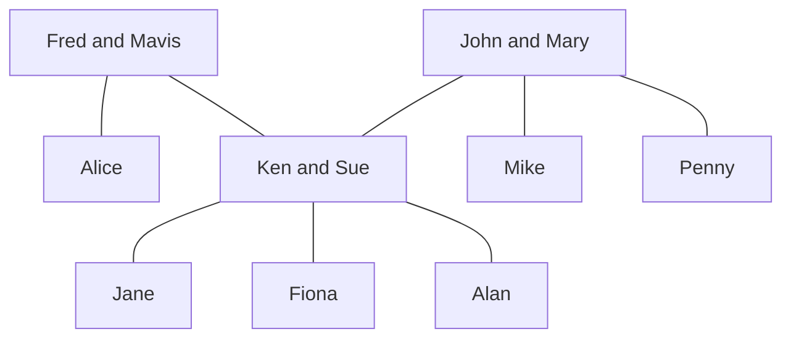
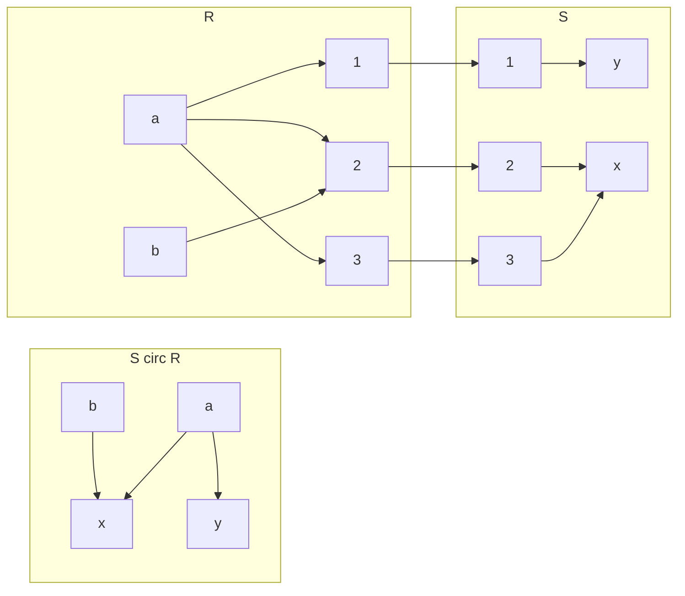
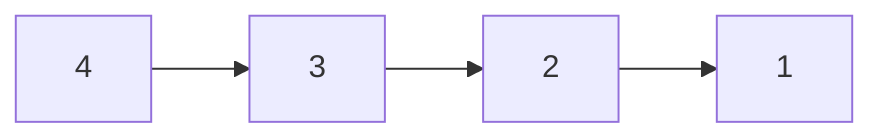
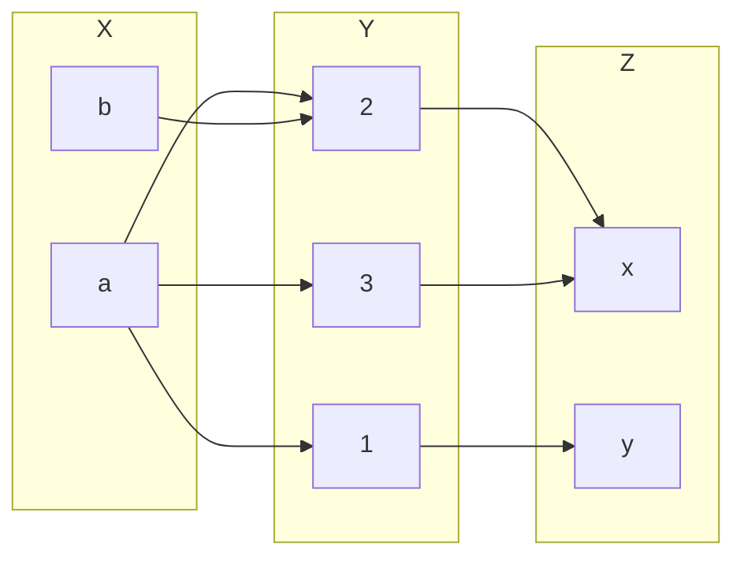
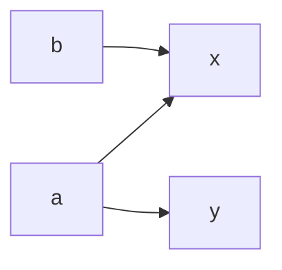

## Building New Relations from Given Ones
### Inverse Relation
Given a realtion <pre>\(R\subseteq A \times B\)</pre>. We define the inverse relation <pre>\(R^{-1}\subset B\times A\)</pre> by:

<pre>\[R^{-1}=\{(b,a)\vert (a,b) \in R\}\]</pre>

Example:

* The inverse of the relation *is a parent of* on the set of people is the relation *is a child of*.

In other words if you swap the elements of a given relation you should get the inverse relation.

#### Example
<pre>\(A=\{1,2,3,4\},R=\{(x,y)\vert x\leq y\}\)</pre>

Therefore: 

<pre>\(R=\{(1,1),(1,2),(1,3),(1,4),(2,2),(2,3),(2,4),(3,3),(3,4),(4,4)\}\)</pre>

And:

<pre>\(R=\{(1,1),(2,1),(3,1),(4,1),(2,2),(3,2),(4,2),(3,3),(4,3),(4,4)\}\)</pre>

You could also say:

<pre>\(R^{-1}=\{(y,x)\vert x \leq y\} = \{(u,v)\vert u\geq v\}\)</pre>

In these examples you either swap the predicate to denote the inverse or you swap the evaluation such that it produces the inverse.

### Composition of Relations
Let <pre>\(R\subseteq A\times b\)</pre> and <pre>\(s\subseteq B\times C\)</pre>. The (functional) composition of <pre>\(R\)</pre> and <pre>\(S\)</pre>, denoted by <pre>\(S\circ R\)</pre>, is the binary relation between <pre>\(A\)</pre> and <pre>\(C\)</pre> given by:

<pre>\[S\circ R = \{(a,c)\vert \text{ exists } b\in B \text{ such that } aRb \text{ and } bSc\}\]</pre>

The notation <pre>\(aRb\)</pre> is another way of writing <pre>\((a,b)\in R\)</pre>.
{:.info}

Example:

* If <pre>\(R\)</pre> is the relation *is a sister of* and <pre>\(S\)</pre> is the relation *is a parent of* then:
	* <pre>\(S\circ R\)</pre> is the relation *is an aunt of*.
	* <pre>\(S\circ S\)</pre> is the relation *is a grandparent of*.
	
#### Example

* <pre>\(R:\)</pre> is a sister of
* <pre>\(S:\)</pre> is a parent of
* <pre>\(S\circ R=\{(a,c)\vert\text{ exists } b\in B\text{ such that } aRb \text{ and } bSc\}\)</pre>

* Alice <pre>\(R\)</pre> Ken and Ken <pre>\(S\)</pre> Alan so Alice <pre>\(S\circ R\)</pre> Alan.
	* This can also be written as <pre>\((\text{Alice, Alan})\in S\circ R\)</pre>
	
#### Diagraph Representation of Compositions

For this diagram <pre>\(A=\{a,b\},B=\{1,2,3\},C=\{x,y\}\)</pre>:

## Computer Friendly Representation of Binary Relations - Matrices

Let <pre>\(A=\{a_1,\ldots,a_n\},B=\{b_1,\ldots,b_m\}\)</pre> and <pre>\(R\subseteq A\times B\)</pre>.

We represent <pre>\(R\)</pre> by an array <pre>\(M\)</pre> of <pre>\(n\)</pre> rows and <pre>\(m\)</pre> columns. Such an array is called an <pre>\(n\)</pre> by <pre>\(m\)</pre> matrix.

The entry in row <pre>\(i\)</pre> and column <pre>\(j\)</pre> of this matrix is given by <pre>\(M(i,j)\)</pre> where:

<pre>\[
M(i,j)=\begin{cases}
1 & \text{ if } (a_i,b_j)\in R\\
0 & \text{ if } (a_1,b_j)\notin R
\end{cases}
\]</pre>

### Example 1
Let <pre>\(A=\{1,3,5,7\}, B=\{2,4,6\}\)</pre> and:

<pre>\[U=\{(x,y)\in A\times B\vert x + y = 9\}\]</pre>

Assume an enumeration <pre>\(a_1=1,a_2=3,a_3=5,a_4=7\)</pre> and <pre>\(b_1=2,b_2=4,b_3=6\)</pre>. Then <pre>\(M\)</pre> represents <pre>\(U\)</pre>, where:

<pre>\[
M = \begin{bmatrix}
0 & 0 & 0\\
0 & 0 & 1\\
0 & 1 & 0\\
1 & 0 & 0
\end{bmatrix}
\]</pre>

When representing in a matrix the rows are the items in set <pre>\(A\)</pre> going down and the columns are the items in set <pre>\(B\)</pre> going across.
{:.info}

You can then read the answers from the matrix as: <pre>\(U=\{(7,2),(5,4),(4,6)\}\)</pre>.

### Example 2
The binary relation <pre>\(R\)</pre> on <pre>\(A=\{1,2,3,4\}\)</pre> has the following digraph representation:

1. What are the ordered pairs?
	
	<pre>\(R=\{(4,3),(3,2),(2,1)\}\)</pre>
1. Draw the matrix.
	
	<pre>\[
	\begin{bmatrix}
	0&0&0&0\\
	1&0&0&0\\
	0&1&0&0\\
	0&0&1&0
	\end{bmatrix}
	\]</pre>
1. Explain the relation.

	<pre>\(x\)</pre> is 1 larger than <pre>\(y\)</pre>.

### Matrices and Composition
This is working on the same relation as was seen in the section [Diagraph Representation of Compositions](#diagraph-representation-of-compositions).

This result in the following for the composition of <pre>\(S\circ R\)</pre>:

From these graphs we can deduce that <pre>\(R\subseteq X\times Y, S\subseteq Y\times Z\)</pre>.

Given the matrices of <pre>\(R\)</pre> and <pre>\(S\)</pre>:

<pre>\[
R: \begin{bmatrix}
1&1&1\\
0&1&0
\end{bmatrix}
S: \begin{bmatrix}
0&1\\
1&0\\
1&0
\end{bmatrix}
\]</pre>

Calculate the binary relation matrix of <pre>\(S\circ R\)</pre>:

If you transpose the row <pre>\(a\)</pre> in the matrix <pre>\(R\)</pre> on the column <pre>\(x\)</pre> in the matrix <pre>\(S\)</pre> you can compare to see of <pre>\(a\)</pre> is a subset of <pre>\(y\)</pre>. If it is then you put a 1 in the resultant matrix and if not you put a zero:

<pre>\[
S\circ R:\begin{bmatrix}
1&1\\
1&0
\end{bmatrix}
\]</pre>

#### Boolean Matrix Product
Given two matrices with entries 1 and 0 representing the relations we can form the matrix representing the composition. This is called the logical (Boolean) matrix product.

Let <pre>\(A=\{a_1,\ldots,a_n\},B=\{b_1,\ldots,b_m\}\)</pre> and <pre>\(C=\{c_1,\ldots,c_p\}\)</pre>.

The logical matrix <pre>\(M\)</pre> representing <pre>\(R\)</pre> is given by:

<pre>\[
M(i,j)=\begin{cases}
1 & \text{ if } (a_i,b_j)\in R\\
0 & \text{ if } (a_1,b_j)\notin R
\end{cases}
\]</pre>

The logical matrix <pre>\(N\)</pre> representing <pre>\(S\)</pre> is given by:

<pre>\[
N(i,j)=\begin{cases}
1 & \text{ if } (b_i,c_j)\in S\\
0 & \text{ if } (b_1,c_j)\notin S
\end{cases}
\]</pre>

Then the entries <pre>\(P(i,)\)</pre> of the logical matrix <pre>\(P\)</pre> representing <pre>\(S\circ R\)</pre> are given by:

* <pre>\(P(i,j)=1\)</pre> if there existsw <pre>\(l\)</pre> with <pre>\(1\leq l\leq m\)</pre> such that <pre>\(M(i,l)=1\)</pre> and <pre>\(N(i,j)=1\)</pre>.
* <pre>\(P(i,j)=0\)</pre>, otherwise.

This is the same as a product of matrices, <pre>\(P=MN\)</pre>. Instead of addition and multiplication we use logical OR and AND.
