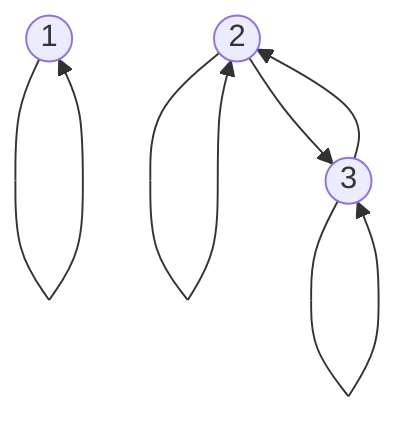
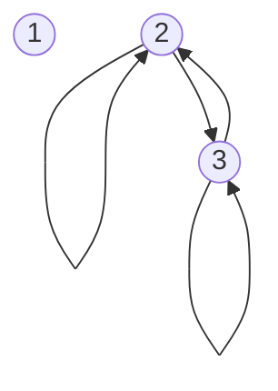
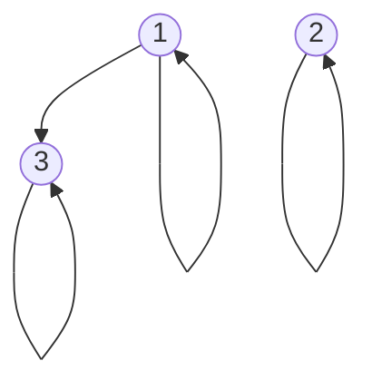
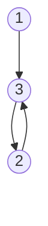
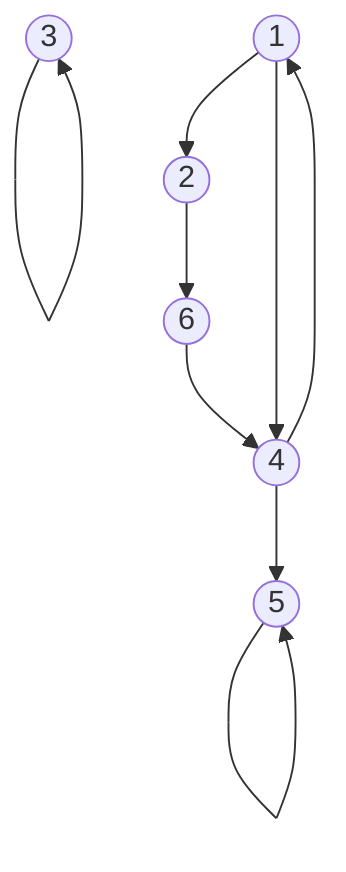

## Digraph Representation
In the directed graph representation, <pre>\(R\)</pre> is:

* **Reflexive** if there is always an arrow from every vertex to itself.
* **Symmetric** if whenever there is an arrow from <pre>\(x\)</pre> to <pre>\(y\)</pre> there is also an arrow from <pre>\(y\)</pre> to <pre>\(x\)</pre>.
* **Antisymmetric** if  whenever there is an arrow from <pre>\(x\)</pre> to <pre>\(y\)</pre> and <pre>\(x\neq y\)</pre>, then there is no arrow from <pre>\(y\)</pre> to <pre>\(x\)</pre>.
* **Transitive** if whenever there is an arrow from <pre>\(x\)</pre> to <pre>\(y\)</pre> and from <pre>\(y\)</pre> to <pre>\(z\)</pre> there is also an arrow from <pre>\(x\)</pre> to <pre>\(z\)</pre>.

### Example 1
Let <pre>\(A=\{1,2,3\},R_1=\{(1,1),(2,2),(3,3),(2,3),(3,2)\}\)</pre>

* Reflective <pre>\(\forall x:xRx\)</pre>
	* True
* Symmetric <pre>\(\forall x,y: xRy\Rightarrow yRx\)</pre>
	* True
		
	If two items, such as 1 and 2, are not connected they are not obligated to connect back. The lack of a connection doesn't break this property.
	{:.info}
* Antisymmetric <pre>\(\forall x,y:xRy,yRx\Rightarrow x=y\)</pre>
	* False
* Transitive <pre>\(\forall x,y,z:xRy,yRz\Rightarrow xRz\)</pre>
	* True

### Example 2
Let <pre>\(A=\{1,2,3\},R_1=\{(2,2),(2,3),(3,2),(3,3)\}\)</pre>

* Reflective <pre>\(\forall x:xRx\)</pre>
	* False
* Symmetric <pre>\(\forall x,y: xRy\Rightarrow yRx\)</pre>
	* True
* Antisymmetric <pre>\(\forall x,y:xRy,yRx\Rightarrow x=y\)</pre>
	* False
	
	If there are two nodes with a double arrow then this property is automatically broken.
	{:.info}
* Transitive <pre>\(\forall x,y,z:xRy,yRz\Rightarrow xRz\)</pre>
	* True
	
### Example 3
Let <pre>\(A=\{1,2,3\},R_1=\{(1,1),(2,2),(3,3),(1,3)\}\)</pre>

* Reflective <pre>\(\forall x:xRx\)</pre>
	* True
* Symmetric <pre>\(\forall x,y: xRy\Rightarrow yRx\)</pre>
	* False
* Antisymmetric <pre>\(\forall x,y:xRy,yRx\Rightarrow x=y\)</pre>
	* True
* Transitive <pre>\(\forall x,y,z:xRy,yRz\Rightarrow xRz\)</pre>
	* True
	
### Example 3
Let <pre>\(A=\{1,2,3\},R_1=\{(1,3),(3,2),(2,3)\}\)</pre>

* Reflective <pre>\(\forall x:xRx\)</pre>
	* False
* Symmetric <pre>\(\forall x,y: xRy\Rightarrow yRx\)</pre>
	* False
* Antisymmetric <pre>\(\forall x,y:xRy,yRx\Rightarrow x=y\)</pre>
	* False
* Transitive <pre>\(\forall x,y,z:xRy,yRz\Rightarrow xRz\)</pre>
	* False
	
### Example - Reachability
Consider some roads in a city. Some may be private and not link up, some may be one way, some may have no stopping. This is represented on the following graph:

Say you start at `1` and end at `5` are you able to make this path?

If there was a transitive relation from the source to the destination then you would be able to get there in one hop.

This will be continued in the next lecture.
