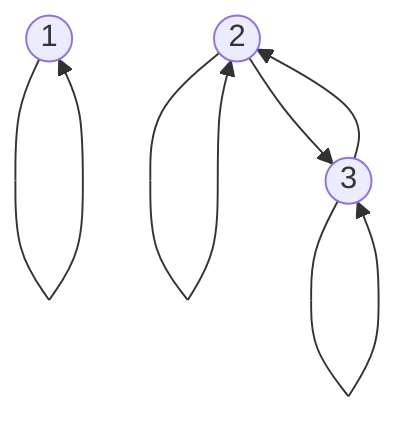
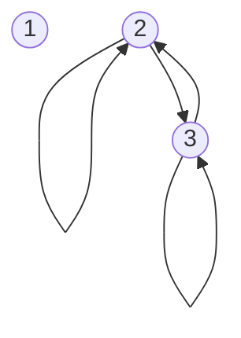
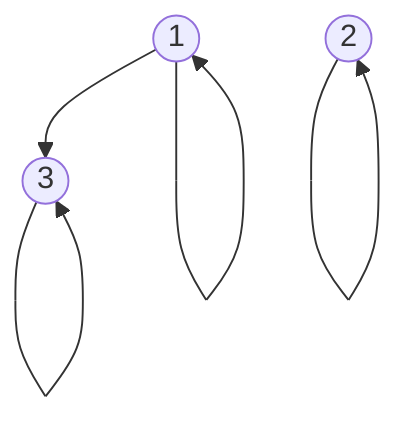
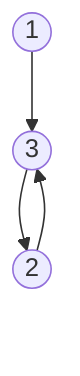
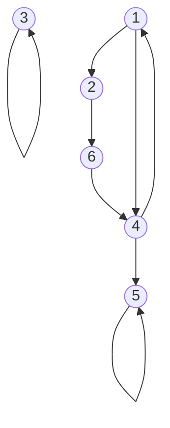

## Digraph Representation
In the directed graph representation, \\\(R\\\) is:

* **Reflexive** if there is always an arrow from every vertex to itself.
* **Symmetric** if whenever there is an arrow from \\\(x\\\) to \\\(y\\\) there is also an arrow from \\\(y\\\) to \\\(x\\\).
* **Antisymmetric** if  whenever there is an arrow from \\\(x\\\) to \\\(y\\\) and \\\(x\neq y\\\), then there is no arrow from \\\(y\\\) to \\\(x\\\).
* **Transitive** if whenever there is an arrow from \\\(x\\\) to \\\(y\\\) and from \\\(y\\\) to \\\(z\\\) there is also an arrow from \\\(x\\\) to \\\(z\\\).

### Example 1
Let \\\(A=\{1,2,3\},R_1=\{(1,1),(2,2),(3,3),(2,3),(3,2)\}\\\)

* Reflective \\\(\forall x:xRx\\\)
	* True
* Symmetric \\\(\forall x,y: xRy\Rightarrow yRx\\\)
	* True
		
	If two items, such as 1 and 2, are not connected they are not obligated to connect back. The lack of a connection doesn't break this property.
	{:.info}
* Antisymmetric \\\(\forall x,y:xRy,yRx\Rightarrow x=y\\\)
	* False
* Transitive \\\(\forall x,y,z:xRy,yRz\Rightarrow xRz\\\)
	* True

### Example 2
Let \\\(A=\{1,2,3\},R_1=\{(2,2),(2,3),(3,2),(3,3)\}\\\)

* Reflective \\\(\forall x:xRx\\\)
	* False
* Symmetric \\\(\forall x,y: xRy\Rightarrow yRx\\\)
	* True
* Antisymmetric \\\(\forall x,y:xRy,yRx\Rightarrow x=y\\\)
	* False
	
	If there are two nodes with a double arrow then this property is automatically broken.
	{:.info}
* Transitive \\\(\forall x,y,z:xRy,yRz\Rightarrow xRz\\\)
	* True
	
### Example 3
Let \\\(A=\{1,2,3\},R_1=\{(1,1),(2,2),(3,3),(1,3)\}\\\)

* Reflective \\\(\forall x:xRx\\\)
	* True
* Symmetric \\\(\forall x,y: xRy\Rightarrow yRx\\\)
	* False
* Antisymmetric \\\(\forall x,y:xRy,yRx\Rightarrow x=y\\\)
	* True
* Transitive \\\(\forall x,y,z:xRy,yRz\Rightarrow xRz\\\)
	* True
	
### Example 3
Let \\\(A=\{1,2,3\},R_1=\{(1,3),(3,2),(2,3)\}\\\)

* Reflective \\\(\forall x:xRx\\\)
	* False
* Symmetric \\\(\forall x,y: xRy\Rightarrow yRx\\\)
	* False
* Antisymmetric \\\(\forall x,y:xRy,yRx\Rightarrow x=y\\\)
	* False
* Transitive \\\(\forall x,y,z:xRy,yRz\Rightarrow xRz\\\)
	* False
	
### Example - Reachability
Consider some roads in a city. Some may be private and not link up, some may be one way, some may have no stopping. This is represented on the following graph:

Say you start at `1` and end at `5` are you able to make this path?

If there was a transitive relation from the source to the destination then you would be able to get there in one hop.

This will be continued in the next lecture.
