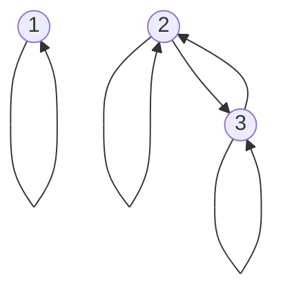
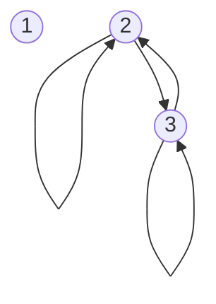
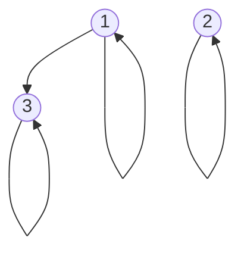
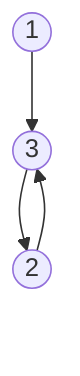
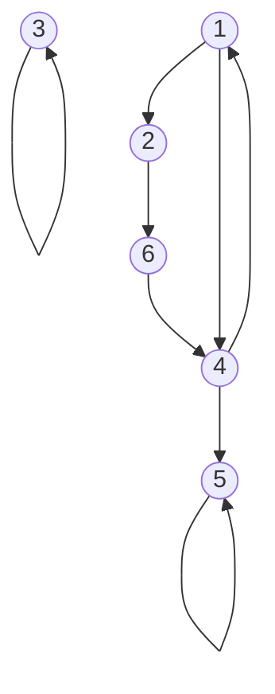

## Digraph Representation
In the directed graph representation, &#92;(R&#92;) is:

* **Reflexive** if there is always an arrow from every vertex to itself.
* **Symmetric** if whenever there is an arrow from &#92;(x&#92;) to &#92;(y&#92;) there is also an arrow from &#92;(y&#92;) to &#92;(x&#92;).
* **Antisymmetric** if  whenever there is an arrow from &#92;(x&#92;) to &#92;(y&#92;) and &#92;(x\neq y&#92;), then there is no arrow from &#92;(y&#92;) to &#92;(x&#92;).
* **Transitive** if whenever there is an arrow from &#92;(x&#92;) to &#92;(y&#92;) and from &#92;(y&#92;) to &#92;(z&#92;) there is also an arrow from &#92;(x&#92;) to &#92;(z&#92;).

### Example 1
Let &#92;(A=\{1,2,3\},R_1=\{(1,1),(2,2),(3,3),(2,3),(3,2)\}&#92;)

* Reflective &#92;(\forall x:xRx&#92;)
	* True
* Symmetric &#92;(\forall x,y: xRy\Rightarrow yRx&#92;)
	* True
		
	If two items, such as 1 and 2, are not connected they are not obligated to connect back. The lack of a connection doesn't break this property.
	{:.info}
* Antisymmetric &#92;(\forall x,y:xRy,yRx\Rightarrow x=y&#92;)
	* False
* Transitive &#92;(\forall x,y,z:xRy,yRz\Rightarrow xRz&#92;)
	* True

### Example 2
Let &#92;(A=\{1,2,3\},R_1=\{(2,2),(2,3),(3,2),(3,3)\}&#92;)

* Reflective &#92;(\forall x:xRx&#92;)
	* False
* Symmetric &#92;(\forall x,y: xRy\Rightarrow yRx&#92;)
	* True
* Antisymmetric &#92;(\forall x,y:xRy,yRx\Rightarrow x=y&#92;)
	* False
	
	If there are two nodes with a double arrow then this property is automatically broken.
	{:.info}
* Transitive &#92;(\forall x,y,z:xRy,yRz\Rightarrow xRz&#92;)
	* True
	
### Example 3
Let &#92;(A=\{1,2,3\},R_1=\{(1,1),(2,2),(3,3),(1,3)\}&#92;)

* Reflective &#92;(\forall x:xRx&#92;)
	* True
* Symmetric &#92;(\forall x,y: xRy\Rightarrow yRx&#92;)
	* False
* Antisymmetric &#92;(\forall x,y:xRy,yRx\Rightarrow x=y&#92;)
	* True
* Transitive &#92;(\forall x,y,z:xRy,yRz\Rightarrow xRz&#92;)
	* True
	
### Example 3
Let &#92;(A=\{1,2,3\},R_1=\{(1,3),(3,2),(2,3)\}&#92;)

* Reflective &#92;(\forall x:xRx&#92;)
	* False
* Symmetric &#92;(\forall x,y: xRy\Rightarrow yRx&#92;)
	* False
* Antisymmetric &#92;(\forall x,y:xRy,yRx\Rightarrow x=y&#92;)
	* False
* Transitive &#92;(\forall x,y,z:xRy,yRz\Rightarrow xRz&#92;)
	* False
	
### Example - Reachability
Consider some roads in a city. Some may be private and not link up, some may be one way, some may have no stopping. This is represented on the following graph:

Say you start at `1` and end at `5` are you able to make this path?

If there was a transitive relation from the source to the destination then you would be able to get there in one hop.

This will be continued in the next lecture.
