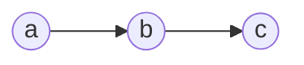
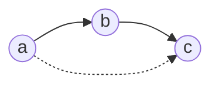
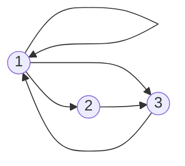
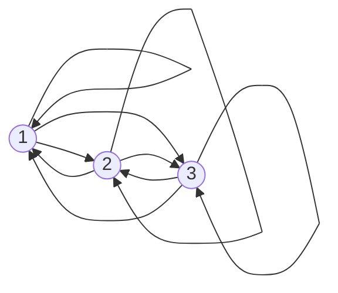

## Transitive Closure
Given a binary relation `\(R\)` on a set `\(A\)` the transitive closure `\(R^*\)` of `\(R\)` is the (uniquely determined) relation on `\(A\)` with the following properties:

* `\(R^*\)` is transitive.
* `\(R\subseteq R^*\)`.

	All links you find in `\(R\)` you should also find in `\(R^*\)`.
	{:.info}
* If `\(S\)` is a transitive relation on `\(A\)` and `\(R\subseteq S\)`, then `\(R^*\subseteq S\)`.

### Simple Example
You are given the following links. What links are missing to make the relation transitive.

As there is an arrow from `\(a\)` to `\(b\)` and an arrow from `\(b\)` to `\(c\)` there should be and arrow from `\(a\)` to `\(c\)` to make this transitive.

### Example 1
Let `\(A=\{1,2,3\}\)`. Find the transitive closure of:

`\[R=\{(1,1),(1,2),(1,3),(2,3),(3,1)\}\]`

This relation has the following graph:

You should add the following links:

## Transitivity and Composition
A relation `\(S\)` is transitive if and only if `\(S\circ S\subseteq S\)`. This is because:

`\[S\circ S=\{(a,c)\vert \text{ exists } b \text{ such that } aSb \text{ and } bSc\}\]`

This is the definition of what the composition of a relation is.
{:.info}

Let `\(S\)` be a relation. Set `\(S^1=S,S^2=S\circ S,S^3=S\circ S\circ S\circ S\)` and so on.

### Theorem
Denote by `\(S^*\)` the transitive closure of `\(S\)`. Then `\(xS^*y\)` if and only if there exists `\(n>0\)` such that `\(xS^ny\)`.

This theorem states that by repeating Warshall's algorithm on your matrix until there is no change then you will reach transitive closure for that relational matrix.
{:.info}

## Transitive Closure in Matrix Form
The relation `\(R\)` on the set `\(A=\{1,2,3,4,5\}\)` is represented by the matrix:

`\[
\begin{bmatrix}
1&0&0&1&0\\
0&1&0&0&1\\
0&0&1&0&0\\
1&0&1&0&0\\
0&1&0&1&0
\end{bmatrix}
\]`

Determine the matrix `\(R\circ R\)` and hence explain why `\(R\)` is not transitive.

To compute this we transpose the row `\(i\)` onto the column `\(j\)` and see if there are two ones in the same position. If this is the case then the resultant matrix has a 1 in row `\(i\)` and column `\(j\)`. If not then there is a zero:

`\[
\begin{bmatrix}
1&0&0&1&0\\
0&1&0&0&1\\
0&0&1&0&0\\
1&0&1&0&0\\
0&1&0&1&0
\end{bmatrix}
\begin{bmatrix}
1&0&0&1&0\\
0&1&0&0&1\\
0&0&1&0&0\\
1&0&1&0&0\\
0&1&0&1&0
\end{bmatrix}=
\begin{bmatrix}
1&0&1&1&0\\
0&1&0&1&1\\
0&0&1&0&0\\
1&0&1&1&0\\
1&1&1&0&1
\end{bmatrix}
\]`

`\(R\)` is not transitive as `\(R^2\neq R\)`

This is the same as Warshall's Algorithm. In this algorithm you iterate through every item in each column and row and each column and row. If there is a match you put a `1` in the resultant matrix and if there is not then you put a `0`.
{:.info}
