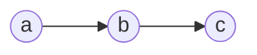
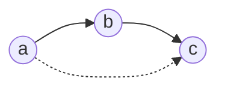
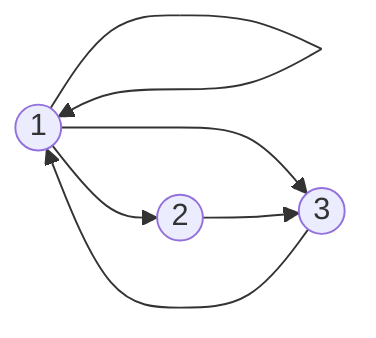
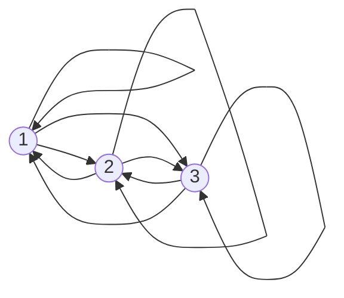

## Transitive Closure
Given a binary relation \(R\) on a set \(A\) the transitive closure \(R^*\) of \(R\) is the (uniquely determined) relation on \(A\) with the following properties:

* \(R^*\) is transitive.
* \(R\subseteq R^*\).

	All links you find in \(R\) you should also find in \(R^*\).
	{:.info}
* If \(S\) is a transitive relation on \(A\) and \(R\subseteq S\), then \(R^*\subseteq S\).

### Simple Example
You are given the following links. What links are missing to make the relation transitive.

As there is an arrow from \(a\) to \(b\) and an arrow from \(b\) to \(c\) there should be and arrow from \(a\) to \(c\) to make this transitive.

### Example 1
Let \(A=\{1,2,3\}\). Find the transitive closure of:

\[R=\{(1,1),(1,2),(1,3),(2,3),(3,1)\}\]

This relation has the following graph:

You should add the following links:

## Transitivity and Composition
A relation \(S\) is transitive if and only if \(S\circ S\subseteq S\). This is because:

\[S\circ S=\{(a,c)\vert \text{ exists } b \text{ such that } aSb \text{ and } bSc\}\]

This is the definition of what the composition of a relation is.
{:.info}

Let \(S\) be a relation. Set \(S^1=S,S^2=S\circ S,S^3=S\circ S\circ S\circ S\) and so on.

### Theorem
Denote by \(S^*\) the transitive closure of \(S\). Then \(xS^*y\) if and only if there exists \(n>0\) such that \(xS^ny\).

This theorem states that by repeating Warshall's algorithm on your matrix until there is no change then you will reach transitive closure for that relational matrix.
{:.info}

## Transitive Closure in Matrix Form
The relation \(R\) on the set \(A=\{1,2,3,4,5\}\) is represented by the matrix:

\[
\begin{bmatrix}
1&0&0&1&0\\
0&1&0&0&1\\
0&0&1&0&0\\
1&0&1&0&0\\
0&1&0&1&0
\end{bmatrix}
\]

Determine the matrix \(R\circ R\) and hence explain why \(R\) is not transitive.

To compute this we transpose the row \(i\) onto the column \(j\) and see if there are two ones in the same position. If this is the case then the resultant matrix has a 1 in row \(i\) and column \(j\). If not then there is a zero:

\[
\begin{bmatrix}
1&0&0&1&0\\
0&1&0&0&1\\
0&0&1&0&0\\
1&0&1&0&0\\
0&1&0&1&0
\end{bmatrix}
\begin{bmatrix}
1&0&0&1&0\\
0&1&0&0&1\\
0&0&1&0&0\\
1&0&1&0&0\\
0&1&0&1&0
\end{bmatrix}=
\begin{bmatrix}
1&0&1&1&0\\
0&1&0&1&1\\
0&0&1&0&0\\
1&0&1&1&0\\
1&1&1&0&1
\end{bmatrix}
\]

\(R\) is not transitive as \(R^2\neq R\)

This is the same as Warshall's Algorithm. In this algorithm you iterate through every item in each column and row and each column and row. If there is a match you put a `1` in the resultant matrix and if there is not then you put a `0`.
{:.info}
