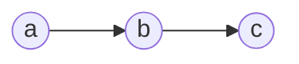
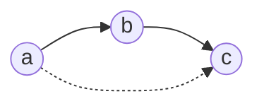
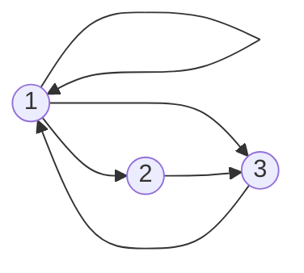
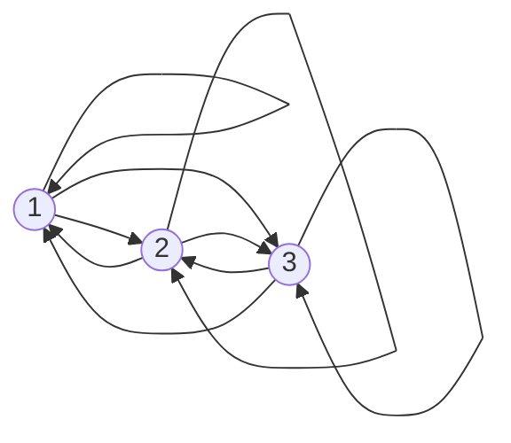

## Transitive Closure
Given a binary relation <pre>\(R\)</pre> on a set <pre>\(A\)</pre> the transitive closure <pre>\(R^*\)</pre> of <pre>\(R\)</pre> is the (uniquely determined) relation on <pre>\(A\)</pre> with the following properties:

* <pre>\(R^*\)</pre> is transitive.
* <pre>\(R\subseteq R^*\)</pre>.

	All links you find in <pre>\(R\)</pre> you should also find in <pre>\(R^*\)</pre>.
	{:.info}
* If <pre>\(S\)</pre> is a transitive relation on <pre>\(A\)</pre> and <pre>\(R\subseteq S\)</pre>, then <pre>\(R^*\subseteq S\)</pre>.

### Simple Example
You are given the following links. What links are missing to make the relation transitive.

As there is an arrow from <pre>\(a\)</pre> to <pre>\(b\)</pre> and an arrow from <pre>\(b\)</pre> to <pre>\(c\)</pre> there should be and arrow from <pre>\(a\)</pre> to <pre>\(c\)</pre> to make this transitive.

### Example 1
Let <pre>\(A=\{1,2,3\}\)</pre>. Find the transitive closure of:

<pre>\[R=\{(1,1),(1,2),(1,3),(2,3),(3,1)\}\]</pre>

This relation has the following graph:

You should add the following links:

## Transitivity and Composition
A relation <pre>\(S\)</pre> is transitive if and only if <pre>\(S\circ S\subseteq S\)</pre>. This is because:

<pre>\[S\circ S=\{(a,c)\vert \text{ exists } b \text{ such that } aSb \text{ and } bSc\}\]</pre>

This is the definition of what the composition of a relation is.
{:.info}

Let <pre>\(S\)</pre> be a relation. Set <pre>\(S^1=S,S^2=S\circ S,S^3=S\circ S\circ S\circ S\)</pre> and so on.

### Theorem
Denote by <pre>\(S^*\)</pre> the transitive closure of <pre>\(S\)</pre>. Then <pre>\(xS^*y\)</pre> if and only if there exists <pre>\(n>0\)</pre> such that <pre>\(xS^ny\)</pre>.

This theorem states that by repeating Warshall's algorithm on your matrix until there is no change then you will reach transitive closure for that relational matrix.
{:.info}

## Transitive Closure in Matrix Form
The relation <pre>\(R\)</pre> on the set <pre>\(A=\{1,2,3,4,5\}\)</pre> is represented by the matrix:

<pre>\[
\begin{bmatrix}
1&0&0&1&0\\
0&1&0&0&1\\
0&0&1&0&0\\
1&0&1&0&0\\
0&1&0&1&0
\end{bmatrix}
\]</pre>

Determine the matrix <pre>\(R\circ R\)</pre> and hence explain why <pre>\(R\)</pre> is not transitive.

To compute this we transpose the row <pre>\(i\)</pre> onto the column <pre>\(j\)</pre> and see if there are two ones in the same position. If this is the case then the resultant matrix has a 1 in row <pre>\(i\)</pre> and column <pre>\(j\)</pre>. If not then there is a zero:

<pre>\[
\begin{bmatrix}
1&0&0&1&0\\
0&1&0&0&1\\
0&0&1&0&0\\
1&0&1&0&0\\
0&1&0&1&0
\end{bmatrix}
\begin{bmatrix}
1&0&0&1&0\\
0&1&0&0&1\\
0&0&1&0&0\\
1&0&1&0&0\\
0&1&0&1&0
\end{bmatrix}=
\begin{bmatrix}
1&0&1&1&0\\
0&1&0&1&1\\
0&0&1&0&0\\
1&0&1&1&0\\
1&1&1&0&1
\end{bmatrix}
\]</pre>

<pre>\(R\)</pre> is not transitive as <pre>\(R^2\neq R\)</pre>

This is the same as Warshall's Algorithm. In this algorithm you iterate through every item in each column and row and each column and row. If there is a match you put a `1` in the resultant matrix and if there is not then you put a `0`.
{:.info}
