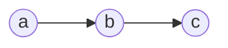
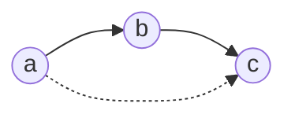
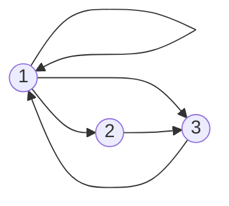
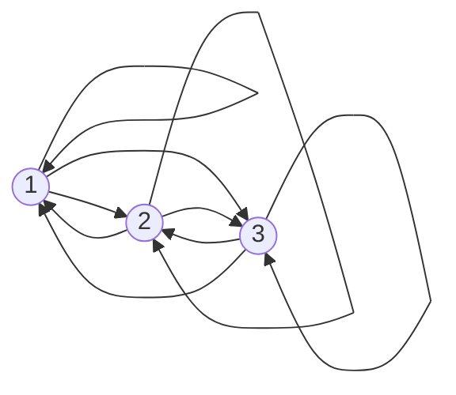

## Transitive Closure
Given a binary relation &#92;(R&#92;) on a set &#92;(A&#92;) the transitive closure &#92;(R^*&#92;) of &#92;(R&#92;) is the (uniquely determined) relation on &#92;(A&#92;) with the following properties:

* &#92;(R^*&#92;) is transitive.
* &#92;(R&#92;subseteq R^*&#92;).

	All links you find in &#92;(R&#92;) you should also find in &#92;(R^*&#92;).
	{:.info}
* If &#92;(S&#92;) is a transitive relation on &#92;(A&#92;) and &#92;(R&#92;subseteq S&#92;), then &#92;(R^*&#92;subseteq S&#92;).

### Simple Example
You are given the following links. What links are missing to make the relation transitive.

As there is an arrow from &#92;(a&#92;) to &#92;(b&#92;) and an arrow from &#92;(b&#92;) to &#92;(c&#92;) there should be and arrow from &#92;(a&#92;) to &#92;(c&#92;) to make this transitive.

### Example 1
Let &#92;(A=&#92;{1,2,3&#92;}&#92;). Find the transitive closure of:

&#92;[R=&#92;{(1,1),(1,2),(1,3),(2,3),(3,1)&#92;}&#92;]

This relation has the following graph:

You should add the following links:

## Transitivity and Composition
A relation &#92;(S&#92;) is transitive if and only if &#92;(S&#92;circ S&#92;subseteq S&#92;). This is because:

&#92;[S&#92;circ S=&#92;{(a,c)&#92;vert &#92;text{ exists } b &#92;text{ such that } aSb &#92;text{ and } bSc&#92;}&#92;]

This is the definition of what the composition of a relation is.
{:.info}

Let &#92;(S&#92;) be a relation. Set &#92;(S^1=S,S^2=S&#92;circ S,S^3=S&#92;circ S&#92;circ S&#92;circ S&#92;) and so on.

### Theorem
Denote by &#92;(S^*&#92;) the transitive closure of &#92;(S&#92;). Then &#92;(xS^*y&#92;) if and only if there exists &#92;(n>0&#92;) such that &#92;(xS^ny&#92;).

This theorem states that by repeating Warshall's algorithm on your matrix until there is no change then you will reach transitive closure for that relational matrix.
{:.info}

## Transitive Closure in Matrix Form
The relation &#92;(R&#92;) on the set &#92;(A=&#92;{1,2,3,4,5&#92;}&#92;) is represented by the matrix:

&#92;[
&#92;begin{bmatrix}
1&0&0&1&0&#92;&#92;
0&1&0&0&1&#92;&#92;
0&0&1&0&0&#92;&#92;
1&0&1&0&0&#92;&#92;
0&1&0&1&0
&#92;end{bmatrix}
&#92;]

Determine the matrix &#92;(R&#92;circ R&#92;) and hence explain why &#92;(R&#92;) is not transitive.

To compute this we transpose the row &#92;(i&#92;) onto the column &#92;(j&#92;) and see if there are two ones in the same position. If this is the case then the resultant matrix has a 1 in row &#92;(i&#92;) and column &#92;(j&#92;). If not then there is a zero:

&#92;[
&#92;begin{bmatrix}
1&0&0&1&0&#92;&#92;
0&1&0&0&1&#92;&#92;
0&0&1&0&0&#92;&#92;
1&0&1&0&0&#92;&#92;
0&1&0&1&0
&#92;end{bmatrix}
&#92;begin{bmatrix}
1&0&0&1&0&#92;&#92;
0&1&0&0&1&#92;&#92;
0&0&1&0&0&#92;&#92;
1&0&1&0&0&#92;&#92;
0&1&0&1&0
&#92;end{bmatrix}=
&#92;begin{bmatrix}
1&0&1&1&0&#92;&#92;
0&1&0&1&1&#92;&#92;
0&0&1&0&0&#92;&#92;
1&0&1&1&0&#92;&#92;
1&1&1&0&1
&#92;end{bmatrix}
&#92;]

&#92;(R&#92;) is not transitive as &#92;(R^2&#92;neq R&#92;)

This is the same as Warshall's Algorithm. In this algorithm you iterate through every item in each column and row and each column and row. If there is a match you put a `1` in the resultant matrix and if there is not then you put a `0`.
{:.info}
