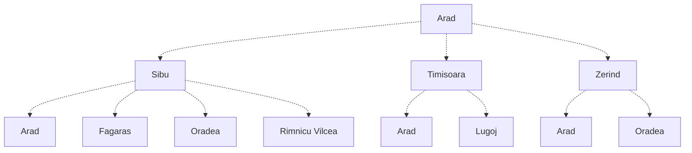
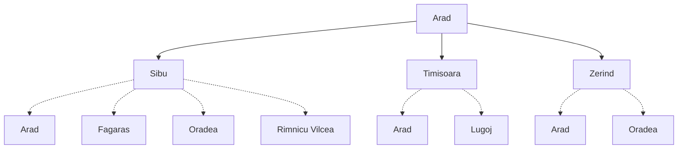
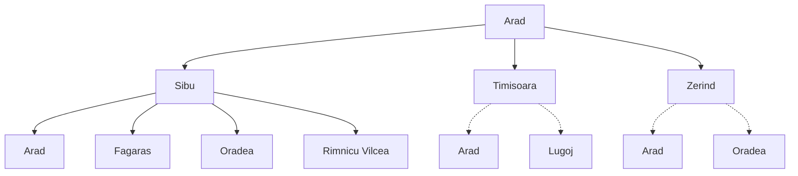

In real search problems the state space is huge e.g. Rubik's Cube - \(10^{18}\) which will take 68,000 years to brute force at 10 million states/sec. This is an example of the combinatorial explosion. In addition, we cannot store all of the states.

Instead, given the start state. We can describe the actions and compute the successor states. A description of the goal states can be given to check whether the goal is reached.

Search is the systematic exploration of the search tree consisting of all possible paths of states starting with the start state using the action available until a path to a goal state is reached.
{:.info}

## Search Tree for Holiday in Romania

* Arad
* Arad, Sibiu and Arad, Timisoara and Arad, Zerind

Thus we have a Single path of length 0 and three paths of length 1. Later on going back is a valid path e.g. Arad, Sibiu, Arad.

The search algorithm says how to reach the nodes of the tree. Applying actions longer paths are generated by adding up successor states. This is called **expanding** the path/state.

*The initial state.*

*After expanding Arad.*

*After expanding Sibiu.*
