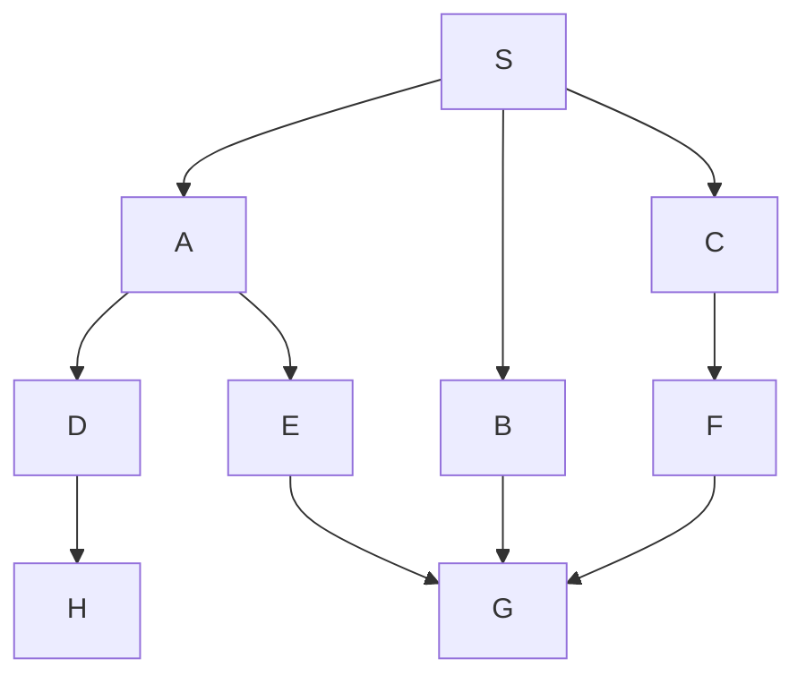

1. Select and expand start state to give a tree of depth 1.
1. Select and expand all paths that resulted from previous step to give a tree of depth 2.
1. and so on.

In general select adn expand all paths of depth \#92;(n\#92;) before depth \#92;(n + 1\#92;)

## Maze example

First explore paths of length 1, then depth 2 then length three. This has the result of following all paths and then returning to the source via the shortest path.

## Example 1

*Example Graph.*

| Expanded Paths | Frontier|
| --- | --- |
| | S |
| S not goal | SA, SB, SC |
| SA not goal | SB, SC, SAD, SAE |
| SB not goal | SC, SAD, SAE, SBG |
| SC not goal | SAD, SAE, SBG, SCF |
| SAD not goal | SAE, SBG, SCF, SADH |
| SAE not goal | SBG, SCF, SADH, SAEG |
| SBG is goal | SCF, SADH, SAEG |

If the route was expanded at the same time then they are allowed to be added in any order. Otherwise they should be searched in the order that they were first added to the frontier. Choosing the first item in the frontier is always the right option as it is first in first out.
