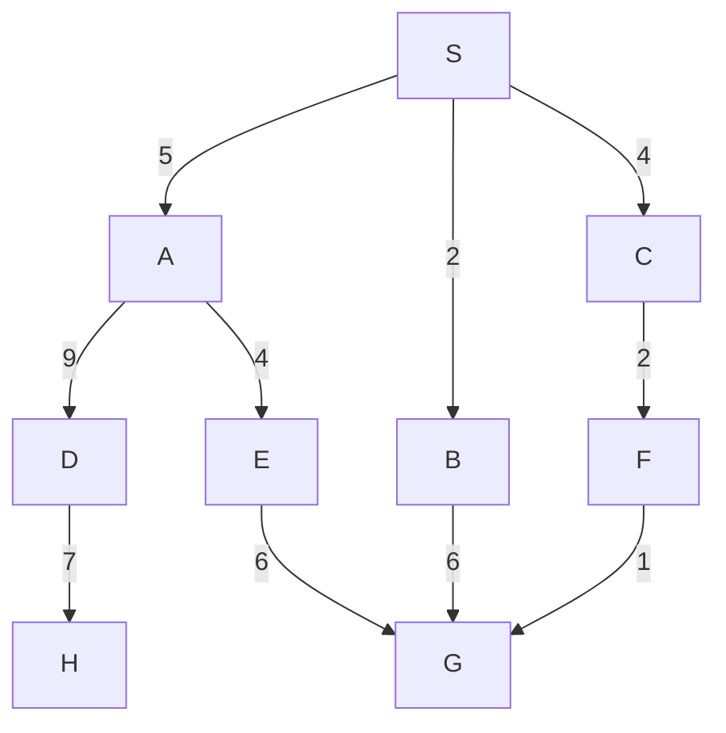

Basic problem solving techniques such as BFS and DFS are either incomplete, in the case of DFS or computationally expensive. 

You can make some tweaks to generate other uniform cost search algorithms or add more information to give an informed search algorithm. Either of these are an improvement

* **Uniform cost search** is similar to a BFS but including cost.
* Heuristic searches include rules of thumb and can include:
	* Greedy search
	* A* search
		* This is the most easiest and most popular search method made in 1968.

## Search Graph with Costs
A path cost function,
\] g:\text{Paths}\rightarrow\text{real numbers}\]
gives a cost to each path. We assume that the cost of a path is the sum over the costs of the steps in the path.

### Uniform Cost Search
* Why not expand the cheapest path first?
* Intuition: cheapest is likely to be best.
* Performance is like BFS but we select the minimum cost path rather than the shortest path.
* Uniform cost search behaves in exactly the same way as BFS if the cost of every step is the same.

```
Input: a start state s_0
		for each state s the successors of s
		a test goal(s) checking whether s is a goal state
		g(s_0...s_k) for every path s_0...s_k
		
Set frontier := {s_0}
while frontier is not empty do
		select and remove from the frontier the path s_0...s_k
		with g(s_0...s_k) minimal
		if goal(s_k) then
			return s_0...s_k (and terminate)
		else for every successor s of s_k add s0...s_ks to frontier
		end if
end while
```

#### Example
A uniform cost search is completed on the following graph:



| Expanded Paths | Frontier |
| --- | --- |
| | {S:0} |
| S not goal | SA:5, SB:2, SC:4 |
| SB not goal | SA:5, SC:4, SBG:8 |
| SC not goal | SA:5, SBG:8, SCF:6 |
| SA not goal | SABG:8, SCF:6, SAD:14, SAE:9 |
| SCF not goal | SABG:8, SAD:14, SAE:9, SCFG,7 |
| SCFG is goal | SABG:8, SAD:14, SAE:9 |

* In this graph you always choose the frontier with the shortest path length.
* Carry on other tasks the same as BFS.

#### Properties of Uniform Cost Search

* Complete and optimal
	* Provided that the path costs grow monotonically
* Only works provided that each step makes the path more costly
* If the path doesn't grow monotonically, then exhaustive search is required
* Time and space complexity
	* Same as BFS

##### Real Life problems
* Whatever search technique we use, exponential time complexity.
* Tweaks to the algorithm will not reduce this to polynomial.
* We need a problem specific knowledge to guide the search.
* Simplest from of problem specific knowledge is heuristic.
* Standard implementation in search is via an evaluation function which indicates desirability of selecting a state.
