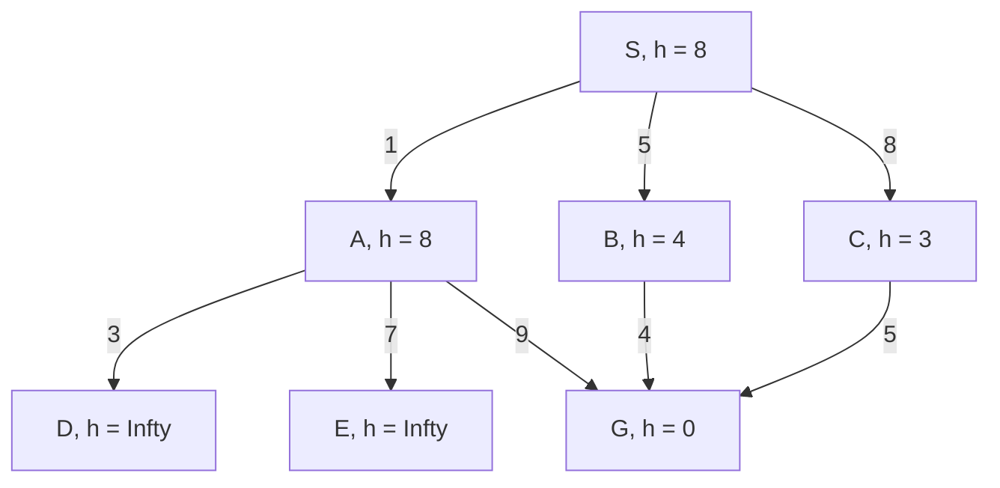

* Use problem-specific knowledge to make the search more efficient.
* Based on your knowledge, select the most promising path first.
* Rather than trying all possible search paths, you try to focus on paths  that get you nearer to the goal state according to your estimate.

## Heuristics
* They estimate the oct of cheapest path form a state to a goal state
* We have a **heuristic function** <![CDATA[\[ h:\text{States}\rightarrow\text{real numbers}\]]]> which estimates the cost of going form that state to the goal. <![CDATA[\(h\)]]> can be any function by <![CDATA[\(h(s) = 0\)]]> if <![CDATA[\(s\)]]> is a goal.
* In route finding, heuristic might be straight line distance from node to destination. Hence:
	* Greedy search expands the path that appears to be closest to the goal.

### Greedy Search
```
Input: a start state s_0
		for each state s the successors of s
		a test goal(s) checking whether s is a goal state
		g(s_0...s_k) for every path s_0...s_k
		
Set frontier := {s_0}
while frontier is not empty do
		select and remove from the frontier the path s_0...s_k
		with h(s_k) minimal
		if goal(s_k) then
			return s_0...s_k (and terminate)
		else for every successor s of s_k and s_0...s_ks to frontier
		end if
end while
```

#### Example
A greedy search is completed on the following graph:



| Expanded Paths | Frontier |
| --- | --- |
| | S:8 |
| S is not goal | SA:8, SB:4, SC:3 |
| SC is not goal | SA:8, SB:4, SCG:0 |
| SCG is goal | SA:8, SB:4 |

* Always expand the state which is closest to the goal as estimated by the heuristic function.
* This uses much less iterations that the uniform cost search but it is not the shortest path.

#### Properties of Greedy Search
* Sometimes find solutions quickly
* Doesn't always find the best solution
* May not fins a solution if the is one
	* Incomplete
* Susceptible to false starts
* Only looking at current state
	* Only takes into account estimates which are based on how close they are to the destination and not how long the path to the next step is.
	* Ignores past states.
