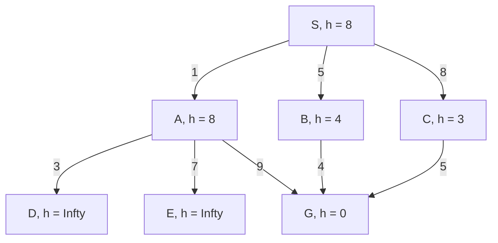

It was made in 1968 in Stanford by the team that constructed Shaky, the robot.

* The basic idea was to combine uniform cost search and greedy search
* We look at the cost so far and the estimated cost to goal
* Thus  we use the **heuristic** \$$f:\$$ $$f(s_0\ldots s_k)=g(s_0\ldots s_k)+ h(s_k)$$ where:
	* \$$g(s_0\ldots s_k)\$$ is the path cost of \$$s_0\ldots s_k\$$
		* Not heuristic
	* \$$h(s_k)\$$ is expected cost of cheapest solution from \$$s_k\$$
		* Is heuristic
* Aims to reduce the **overall cost**.

## General Algorithm for A* Search
```
Input: a start state s_0
		for each state s the successors of s
		a test goal(s) checking whether s is a goal state
		g(s_0...s_k) for every path s_0...s_k
		h(s) for every state s
		
Set frontier := {s_0}
while frontier is not empty do
		select and remove from the frontier the path s_0...s_k
		with g(s_0...s_k) + h(s_k) minimal
		if goal(s_k) then
			return s_0...s_k (and terminate)
		else for every successor s of s_k and s_0...s_ks to frontier
		end if
end while
```

### Example
An A* search is completed on the following graph:



| Expanded Paths | Frontier |
| --- | --- |
| | S:8 |
| S not goal | SA:9, SB:9, SC:11 |
| SA not goal | SB:9, SC:11, SAD:Infty, SAE:Infty, SAG:10 |
| SB not goal | SC:11, SAD:Infty, SAE:Infty, SAG:10, SBG:9 |
| SGB is goal | SC:11, SAD:Infty, SAE:Infty, SAG:10 |

* Chose the value which has the lowest value
	* If the two values are the same it is non-deterministic.
	
## Properties of A* Search

* Complete and optimal under minor conditions
	* If an **admissible** heuristic \$$h\$$ is used: $$h(s)\leq h^*(s)$$ where \$$h^*\$$ is the true cost form \$$s\$$ to goal.
	* Thus, a heuristic \$$h\$$ is admissible if it never overestimates the distance to the goal (is optimistic).
	
## Summary
* Heuristic functions estimate costs of shortest paths.
	* These can be obtained via computer learning to find better heuristic functions. 
* Good heuristics can dramatically reduce search cost.
* Greedy best-first search expands lowest \$$h\$$.
	* Incomplete and not always optimal.
* A* search expands lowest \$$g+h\$$.
	* Complete and optimal.
	* Optimally efficient.
