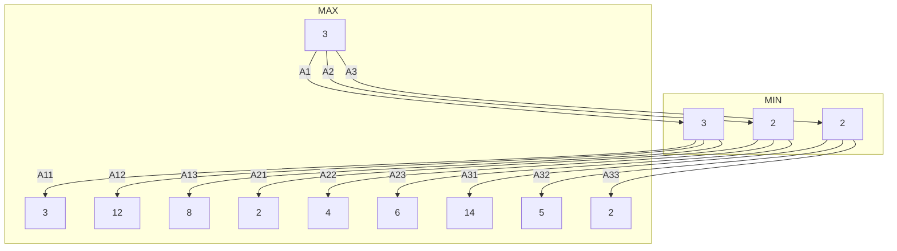

Adversarial search is a method of reaching a goal while making moves against another player. This allows the agent to react to the moves of another player.

In search we make all moves. In games we play against an unpredictable opponent:

* Solution is a strategy  specifying a move for every possible move of the opponent.
* A method is need for selecting good moves that stand a good chance of achieving a winning state whatever the opponent does.
* Because of combinatorial explosion, in practice we must approximate using heuristics.

## Types of Games

* Information
	* In some games we have fully observable environment. These are called games with prefect information.
	* In others we have partially observable environments. These are called games with imperfect information.
* Determinism
	* Some games are deterministic
	* Other games have an element of chance.

In addition we will limit ourselves to two-player games, with a zero-sum. This means:

* The utility values at the end are equal and opposite
* If one player wins then the other player loses.

As a result we can calculate a perfect strategy for the player.

## Problem Formulation
The difference between single player searches and adversarial search is that the set of goal states are replace by the **utility function**.

* Initial state \\\(S_{start}\\\)
	*  Initial board position. Which player moves first.
* Successor function
	* Provides for every state \\\(s\\\) and move the new state after the move.
* Terminal test
	* Determines when the game is over.
* Utility function
	* Numeric value for terminal states
		* E.g. chess \\\(+1,-1,0\\\)
		
### Game Tree
* Each level labelled with player to move.
* Each level represents a ply.
	* Half a turn.
* Represents whit happen with competing agents.

## minimax Algorithm 
MIN and MAX are two players

* MAX want to win (maximise utility)
* Min wants to MAX to lose (minimise utility for MAX)
* MIN is the opponent

Both players will play to the best of their ability

* MAX wants a strategy for maximising utility assuming MIN will do best to minimise MAX's utility.
* Considers the minimax value of each state
	* The utility of a state given that both players play optimally.
	
### minimax Value

* The utility (=minimax value) of a **terminal state** is given by its utility already (as an input).
* The utility (=minimaxvalue) of a **MAX-state** (when MAX moves) is the maximum of the utilities of its successor states.
* The utility (=minimax value) of **MIN-state** (when MIN moves) is the minimum of the utilities of its successor states.

Thus we can compute the minimax value recursively starting from the terminal states.

Formally, let \\\(\text{Succ}(s)\\\) denote the set of successor state of state \\\(s\\\). Define the function \\\(\text{MinimaxV}(s)\\\) recursively as follows:

\\\[
\text{MinimaxV}(s)=
\begin{cases}
	\text{Utility}(s) & s\ \text{is terminal}\\
	\max_{n\in\text{Succ}(s)}\text{MinimaxV}(n) & \max\text{moves in}\ s\\
	\min_{n\in\text{Succ}(s)}\text{MinimaxV}(n) & \min\text{moves in}\ s
\end{cases}
\\\]

* Calculate minimax value of each state using the equation above starting from the terminal states.
* Games tree as minimax tree
	* \\\(\bigtriangleup\\\) max node, \\\(\bigtriangledown\\\) min node
	

### Properties of minimax
Assuming MAX always moves to the state with the maximal minimax value.

* Optimal 
	* Against an optimal opponent. Otherwise MAX will do even better. There may however, be better strategies against suboptimal opponents.
* Time complexity
	* Can be implemented DFS so that space complexity is \\\(b^m\\\) (branching factor \\\(b\\\), depth \\\(m\\\)).
* Space complexity
	* can be implemented DFS so that space complexity is \\\(bm\\\).

For chess, \\\(b\approx 35,\ m\approx 100\\\) for reasonable games.

* 10^154 paths to explore
* Infeasible

But do we need to explore every path?
