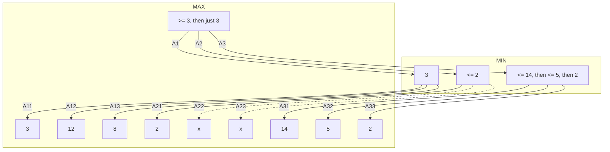

If you know half way through a calculation that it will succeed or fail, then there is no point in doing the rest of it. This removes redundant information.

From the example we can see from the subparagraph for `MIN` that the MAX value can only get larger than three. Hence, we can make assumptions and ignore paths based on what we have found already.

This can be seen on the path `A21`. As there is such a low value we don't have to search the other items in the tree as we already have a greater value on `A1`.

The essence is that we can prune redundant states.

## Cutoffs and Heuristics
As it is not always possible to explore the full tree to evaluate the move you can cut off the end of the tree to speed up calculation at the cost of getting potentially lower quality moves.

* Problem
	* Utilities are defines only at terminal states
* Solution
	* Evaluate the pre-terminal leaf states using **heuristic evaluation function** rather than using the actual utility  function.
	
### Cutoff Value

Instead of &#92;(\text{MiniMaxV}(s)&#92;) we compute &#92;(\text{CutOffV}(s)&#92;).

Assume that we con compute a function &#92;(\text{Evaluation}(s)&#92;) which gives us a utility value for any state &#92;(s&#92;) which we do not want explored (every cutoff state). 

Then define &#92;(\text{CutOffV}(s)&#92;) recursively:

&#92;[
\text{CutOffV}(s)=
\begin{cases}
	\text{Utility}(s) & s\ \text{is terminal}&#92;&#92;
	\text{Evaluation}(s) & s\ \text{is CutOff} &#92;&#92;
	\max&#95;{n\in\text{Succ}(s)}\text{CutOffV}(n) & s\ \text{is}\max&#92;&#92;
	\min&#95;{n\in\text{Succ}(s)}\text{CutOffV}(n) & s\ \text{is}\min
\end{cases}
&#92;]

How good this is depends crucially on how good the heuristic evaluation function is.

## Summary

* Minimax algorithm (with &#92;(\alpha - \beta&#92;) pruning) fundamental for game playing.
* Not efficient enough for games such as chess, go, etc.
* Evaluation function are needed to replace terminal states by cutoff states.
* Various approaches to define evaluation function.
* Most successful approach: machine learning. Evaluate position using experience  from previous games.
