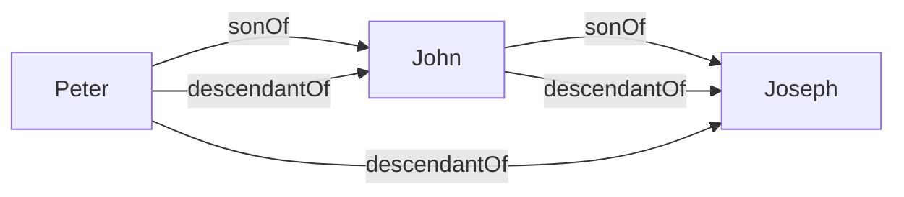
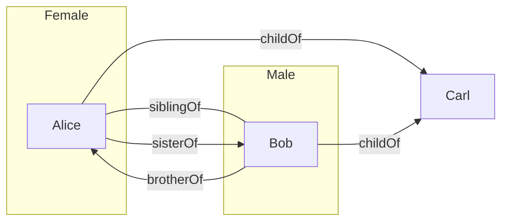

You cannot express relations between objects using the concepts we have learned so far. **Relations** are expressed as such: 

* A **relation name** \(R\) denotes a set of **pairs** of individual object. Relation names are also called **binary predicates**: 
	* \(\text{sonOf}\)
	* \(\text{grandsonOf}\)
	* These call also be denotes by upper case letters \(R,S,R_1,R_2\) and so on.
	
To express that an individual object \(a\) is in the relation \(R\) to an individual object \(b\) we write \(R(a,b)\). \(R(a,b)\) is *also* called an **atomic assertion**. This can also be read as \(a\) is in relation \(R\) to \(b\):

* \(\text{sonOf(Peter, John)}\), where \(\text{Peter}\) is the son of \(\text{John}\).

## Rule-Based Systems
A rule has the form:
\]R_1(x_1,y_1)\wedge\ldots\wedge R_n(x_n,y_n)\wedge A_1(x_{n+1})\wedge\ldots\wedge A_m(x_{n+m})\rightarrow R(x,y)\]
or
\]R_1(x_1,y_1)\wedge\ldots\wedge R_n(x_n,y_n)\wedge A_1(x_{n+1})\wedge\ldots\wedge A_m(x_{n+m})\rightarrow A(x)\]
Where:

* \(R_1,\ldots,R_n\) and \(R\) are relation names.
* \(A_1,\ldots,A_n\) and \(A\) are class names.
* \(x_1,y_1,\ldots,x_n,y_n,x_{n+1},\ldots,x_{n+m},x,y\) are individual variables.

A rule-based knowledge base \(K\) is a collection \(K_a\) of atomic assertions and \(K_r\) of rules.

### Example

Consider the following set \(K_a\) of atomic assertions:

* \(\text{sonOf(Peter, John)}\)
* \(\text{sonOf(John, Joseph)}\)

Consider the following set \(K_r\) of rules:

* \(\text{sonOf}(x,y)\wedge\text{sonOf}(y,z)\rightarrow\text{grandsonOf}(x,z)\)

Then \(\text{grandsonOf(Peter, Joseph)}\) follows from \(K\), in symbols:
\]K\models\text{grandsonOf(Peter, Joseph)}\]

## Knowledge Graphs

Binary predicates allow us to talk about graphs.

Let \(K_r\) contain:

* \(\text{sonOf}(x,y)\rightarrow\text{descendantOf}(x,y)\)
* \(\text{sonOf}(x,y)\wedge\text{descendantOf}(y,z)\rightarrow\text{descendantOf}(x,z)\)

Let \(K_A\) be \(\{\text{sonOf(Peter, John), sonOf(John, Joseph)}\}\)

\(K_a\) can be seen as the following graph  (individual names = nodes, relations = edges):

*Labeled Graph.*

Computing \(\text{DerivedAssertions}\) corresponds to graph completion.

### Example

Let \(K_r\) contain:

* \(\text{childOf}(x,y)\wedge\text{childOf}(z,y)\rightarrow\text{siblingOf}(x,z)\)
* \(\text{Female}(x)\wedge\text{siblingOf}(x,y)\rightarrow\text{sisterOf}(x,y)\)
* \(\text{Male}(x)\wedge\text{siblingOf}(x,y)\rightarrow\text{brotherOf}(x,y)\)

Let \(K_a\) be:
\]\{\text{Female(Alice),Male(Bob),childOf(Alice,Carl),childOf(Bob,Carl)}\}\]

We assume different variable are replace by different individuals. This statement means that people can't be their own siblings.

