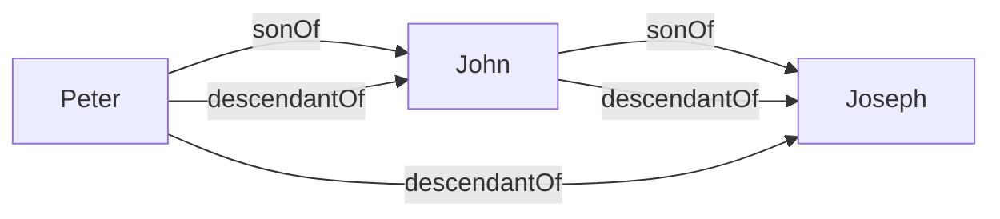
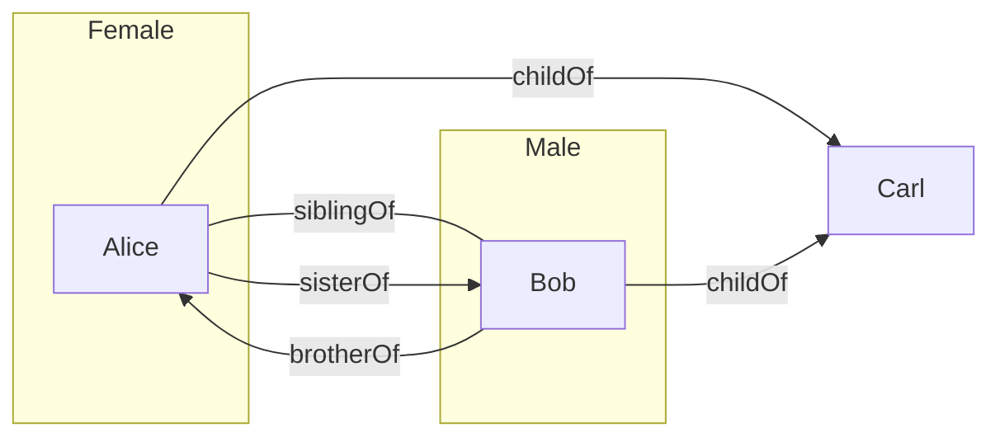

You cannot express relations between objects using the concepts we have learned so far. **Relations** are expressed as such: 

* A **relation name** <![CDATA[\(R\)]]> denotes a set of **pairs** of individual object. Relation names are also called **binary predicates**: 
	* <![CDATA[\(\text{sonOf}\)]]>
	* <![CDATA[\(\text{grandsonOf}\)]]>
	* These call also be denotes by upper case letters <![CDATA[\(R,S,R_1,R_2\)]]> and so on.
	
To express that an individual object <![CDATA[\(a\)]]> is in the relation <![CDATA[\(R\)]]> to an individual object <![CDATA[\(b\)]]> we write <![CDATA[\(R(a,b)\)]]>. <![CDATA[\(R(a,b)\)]]> is *also* called an **atomic assertion**. This can also be read as <![CDATA[\(a\)]]> is in relation <![CDATA[\(R\)]]> to <![CDATA[\(b\)]]>:

* <![CDATA[\(\text{sonOf(Peter, John)}\)]]>, where <![CDATA[\(\text{Peter}\)]]> is the son of <![CDATA[\(\text{John}\)]]>.

## Rule-Based Systems
A rule has the form:
<![CDATA[\[R_1(x_1,y_1)\wedge\ldots\wedge R_n(x_n,y_n)\wedge A_1(x_{n+1})\wedge\ldots\wedge A_m(x_{n+m})\rightarrow R(x,y)\]]]>
or
<![CDATA[\[R_1(x_1,y_1)\wedge\ldots\wedge R_n(x_n,y_n)\wedge A_1(x_{n+1})\wedge\ldots\wedge A_m(x_{n+m})\rightarrow A(x)\]]]>
Where:

* <![CDATA[\(R_1,\ldots,R_n\)]]> and <![CDATA[\(R\)]]> are relation names.
* <![CDATA[\(A_1,\ldots,A_n\)]]> and <![CDATA[\(A\)]]> are class names.
* <![CDATA[\(x_1,y_1,\ldots,x_n,y_n,x_{n+1},\ldots,x_{n+m},x,y\)]]> are individual variables.

A rule-based knowledge base <![CDATA[\(K\)]]> is a collection <![CDATA[\(K_a\)]]> of atomic assertions and <![CDATA[\(K_r\)]]> of rules.

### Example

Consider the following set <![CDATA[\(K_a\)]]> of atomic assertions:

* <![CDATA[\(\text{sonOf(Peter, John)}\)]]>
* <![CDATA[\(\text{sonOf(John, Joseph)}\)]]>

Consider the following set <![CDATA[\(K_r\)]]> of rules:

* <![CDATA[\(\text{sonOf}(x,y)\wedge\text{sonOf}(y,z)\rightarrow\text{grandsonOf}(x,z)\)]]>

Then <![CDATA[\(\text{grandsonOf(Peter, Joseph)}\)]]> follows from <![CDATA[\(K\)]]>, in symbols:
<![CDATA[\[K\models\text{grandsonOf(Peter, Joseph)}\]]]>

## Knowledge Graphs

Binary predicates allow us to talk about graphs.

Let <![CDATA[\(K_r\)]]> contain:

* <![CDATA[\(\text{sonOf}(x,y)\rightarrow\text{descendantOf}(x,y)\)]]>
* <![CDATA[\(\text{sonOf}(x,y)\wedge\text{descendantOf}(y,z)\rightarrow\text{descendantOf}(x,z)\)]]>

Let <![CDATA[\(K_A\)]]> be <![CDATA[\(\{\text{sonOf(Peter, John), sonOf(John, Joseph)}\}\)]]>

<![CDATA[\(K_a\)]]> can be seen as the following graph  (individual names = nodes, relations = edges):

*Labeled Graph.*

Computing <![CDATA[\(\text{DerivedAssertions}\)]]> corresponds to graph completion.

### Example

Let <![CDATA[\(K_r\)]]> contain:

* <![CDATA[\(\text{childOf}(x,y)\wedge\text{childOf}(z,y)\rightarrow\text{siblingOf}(x,z)\)]]>
* <![CDATA[\(\text{Female}(x)\wedge\text{siblingOf}(x,y)\rightarrow\text{sisterOf}(x,y)\)]]>
* <![CDATA[\(\text{Male}(x)\wedge\text{siblingOf}(x,y)\rightarrow\text{brotherOf}(x,y)\)]]>

Let <![CDATA[\(K_a\)]]> be:
<![CDATA[\[\{\text{Female(Alice),Male(Bob),childOf(Alice,Carl),childOf(Bob,Carl)}\}\]]]>

We assume different variable are replace by different individuals. This statement means that people can't be their own siblings.

