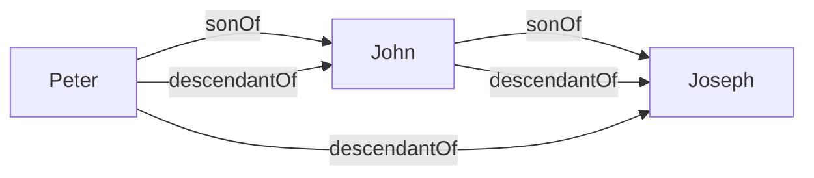
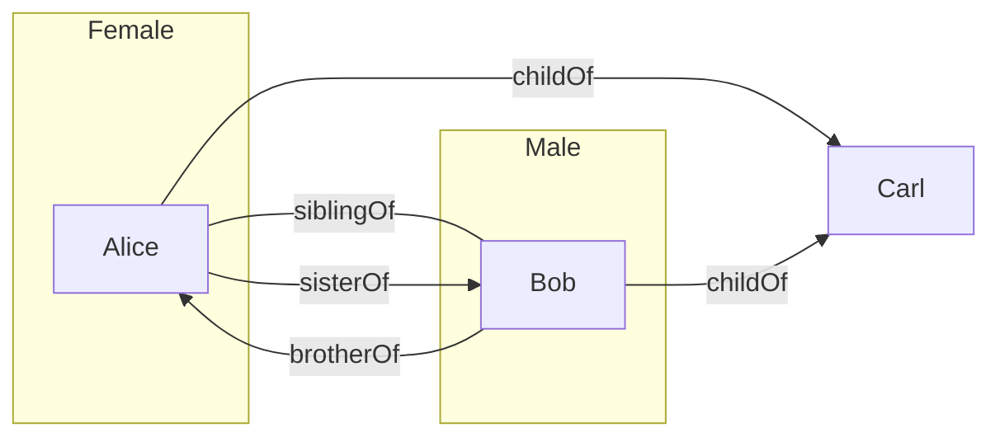

You cannot express relations between objects using the concepts we have learned so far. **Relations** are expressed as such: 

* A **relation name** &#92;(R&#92;) denotes a set of **pairs** of individual object. Relation names are also called **binary predicates**: 
	* &#92;(\text{sonOf}&#92;)
	* &#92;(\text{grandsonOf}&#92;)
	* These call also be denotes by upper case letters &#92;(R,S,R_1,R_2&#92;) and so on.
	
To express that an individual object &#92;(a&#92;) is in the relation &#92;(R&#92;) to an individual object &#92;(b&#92;) we write &#92;(R(a,b)&#92;). &#92;(R(a,b)&#92;) is *also* called an **atomic assertion**. This can also be read as &#92;(a&#92;) is in relation &#92;(R&#92;) to &#92;(b&#92;):

* &#92;(\text{sonOf(Peter, John)}&#92;), where &#92;(\text{Peter}&#92;) is the son of &#92;(\text{John}&#92;).

## Rule-Based Systems
A rule has the form:
&#92;[R_1(x_1,y_1)\wedge\ldots\wedge R_n(x_n,y_n)\wedge A_1(x&#95;&#123;n+1})\wedge\ldots\wedge A_m(x&#95;&#123;n+m})\rightarrow R(x,y)&#92;]
or
&#92;[R_1(x_1,y_1)\wedge\ldots\wedge R_n(x_n,y_n)\wedge A_1(x&#95;&#123;n+1})\wedge\ldots\wedge A_m(x&#95;&#123;n+m})\rightarrow A(x)&#92;]
Where:

* &#92;(R_1,\ldots,R_n&#92;) and &#92;(R&#92;) are relation names.
* &#92;(A_1,\ldots,A_n&#92;) and &#92;(A&#92;) are class names.
* &#92;(x_1,y_1,\ldots,x_n,y_n,x&#95;&#123;n+1},\ldots,x&#95;&#123;n+m},x,y&#92;) are individual variables.

A rule-based knowledge base &#92;(K&#92;) is a collection &#92;(K_a&#92;) of atomic assertions and &#92;(K_r&#92;) of rules.

### Example

Consider the following set &#92;(K_a&#92;) of atomic assertions:

* &#92;(\text{sonOf(Peter, John)}&#92;)
* &#92;(\text{sonOf(John, Joseph)}&#92;)

Consider the following set &#92;(K_r&#92;) of rules:

* &#92;(\text{sonOf}(x,y)\wedge\text{sonOf}(y,z)\rightarrow\text{grandsonOf}(x,z)&#92;)

Then &#92;(\text{grandsonOf(Peter, Joseph)}&#92;) follows from &#92;(K&#92;), in symbols:
&#92;[K\models\text{grandsonOf(Peter, Joseph)}&#92;]

## Knowledge Graphs

Binary predicates allow us to talk about graphs.

Let &#92;(K_r&#92;) contain:

* &#92;(\text{sonOf}(x,y)\rightarrow\text{descendantOf}(x,y)&#92;)
* &#92;(\text{sonOf}(x,y)\wedge\text{descendantOf}(y,z)\rightarrow\text{descendantOf}(x,z)&#92;)

Let &#92;(K_A&#92;) be &#92;(&#92;{\text{sonOf(Peter, John), sonOf(John, Joseph)}&#92;}&#92;)

&#92;(K_a&#92;) can be seen as the following graph  (individual names = nodes, relations = edges):

*Labeled Graph.*

Computing &#92;(\text{DerivedAssertions}&#92;) corresponds to graph completion.

### Example

Let &#92;(K_r&#92;) contain:

* &#92;(\text{childOf}(x,y)\wedge\text{childOf}(z,y)\rightarrow\text{siblingOf}(x,z)&#92;)
* &#92;(\text{Female}(x)\wedge\text{siblingOf}(x,y)\rightarrow\text{sisterOf}(x,y)&#92;)
* &#92;(\text{Male}(x)\wedge\text{siblingOf}(x,y)\rightarrow\text{brotherOf}(x,y)&#92;)

Let &#92;(K_a&#92;) be:
&#92;[&#92;{\text{Female(Alice),Male(Bob),childOf(Alice,Carl),childOf(Bob,Carl)}&#92;}&#92;]

We assume different variable are replace by different individuals. This statement means that people can't be their own siblings.

