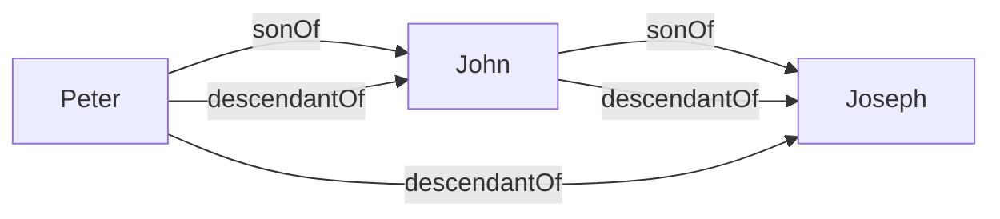
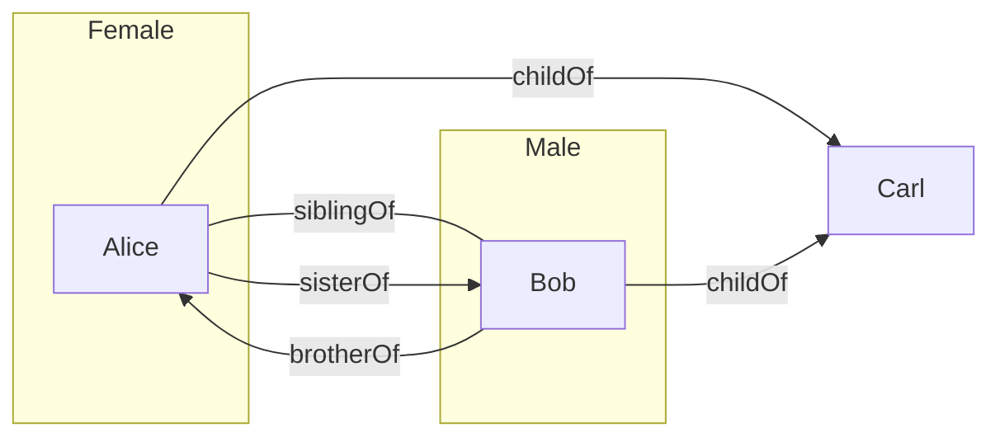

You cannot express relations between objects using the concepts we have learned so far. **Relations** are expressed as such: 

* A **relation name** <pre>\(R\)</pre> denotes a set of **pairs** of individual object. Relation names are also called **binary predicates**: 
	* <pre>\(\text{sonOf}\)</pre>
	* <pre>\(\text{grandsonOf}\)</pre>
	* These call also be denotes by upper case letters <pre>\(R,S,R_1,R_2\)</pre> and so on.
	
To express that an individual object <pre>\(a\)</pre> is in the relation <pre>\(R\)</pre> to an individual object <pre>\(b\)</pre> we write <pre>\(R(a,b)\)</pre>. <pre>\(R(a,b)\)</pre> is *also* called an **atomic assertion**. This can also be read as <pre>\(a\)</pre> is in relation <pre>\(R\)</pre> to <pre>\(b\)</pre>:

* <pre>\(\text{sonOf(Peter, John)}\)</pre>, where <pre>\(\text{Peter}\)</pre> is the son of <pre>\(\text{John}\)</pre>.

## Rule-Based Systems
A rule has the form:
<pre>\[R_1(x_1,y_1)\wedge\ldots\wedge R_n(x_n,y_n)\wedge A_1(x_{n+1})\wedge\ldots\wedge A_m(x_{n+m})\rightarrow R(x,y)\]</pre>
or
<pre>\[R_1(x_1,y_1)\wedge\ldots\wedge R_n(x_n,y_n)\wedge A_1(x_{n+1})\wedge\ldots\wedge A_m(x_{n+m})\rightarrow A(x)\]</pre>
Where:

* <pre>\(R_1,\ldots,R_n\)</pre> and <pre>\(R\)</pre> are relation names.
* <pre>\(A_1,\ldots,A_n\)</pre> and <pre>\(A\)</pre> are class names.
* <pre>\(x_1,y_1,\ldots,x_n,y_n,x_{n+1},\ldots,x_{n+m},x,y\)</pre> are individual variables.

A rule-based knowledge base <pre>\(K\)</pre> is a collection <pre>\(K_a\)</pre> of atomic assertions and <pre>\(K_r\)</pre> of rules.

### Example

Consider the following set <pre>\(K_a\)</pre> of atomic assertions:

* <pre>\(\text{sonOf(Peter, John)}\)</pre>
* <pre>\(\text{sonOf(John, Joseph)}\)</pre>

Consider the following set <pre>\(K_r\)</pre> of rules:

* <pre>\(\text{sonOf}(x,y)\wedge\text{sonOf}(y,z)\rightarrow\text{grandsonOf}(x,z)\)</pre>

Then <pre>\(\text{grandsonOf(Peter, Joseph)}\)</pre> follows from <pre>\(K\)</pre>, in symbols:
<pre>\[K\models\text{grandsonOf(Peter, Joseph)}\]</pre>

## Knowledge Graphs

Binary predicates allow us to talk about graphs.

Let <pre>\(K_r\)</pre> contain:

* <pre>\(\text{sonOf}(x,y)\rightarrow\text{descendantOf}(x,y)\)</pre>
* <pre>\(\text{sonOf}(x,y)\wedge\text{descendantOf}(y,z)\rightarrow\text{descendantOf}(x,z)\)</pre>

Let <pre>\(K_A\)</pre> be <pre>\(\{\text{sonOf(Peter, John), sonOf(John, Joseph)}\}\)</pre>

<pre>\(K_a\)</pre> can be seen as the following graph  (individual names = nodes, relations = edges):

*Labeled Graph.*

Computing <pre>\(\text{DerivedAssertions}\)</pre> corresponds to graph completion.

### Example

Let <pre>\(K_r\)</pre> contain:

* <pre>\(\text{childOf}(x,y)\wedge\text{childOf}(z,y)\rightarrow\text{siblingOf}(x,z)\)</pre>
* <pre>\(\text{Female}(x)\wedge\text{siblingOf}(x,y)\rightarrow\text{sisterOf}(x,y)\)</pre>
* <pre>\(\text{Male}(x)\wedge\text{siblingOf}(x,y)\rightarrow\text{brotherOf}(x,y)\)</pre>

Let <pre>\(K_a\)</pre> be:
<pre>\[\{\text{Female(Alice),Male(Bob),childOf(Alice,Carl),childOf(Bob,Carl)}\}\]</pre>

We assume different variable are replace by different individuals. This statement means that people can't be their own siblings.

