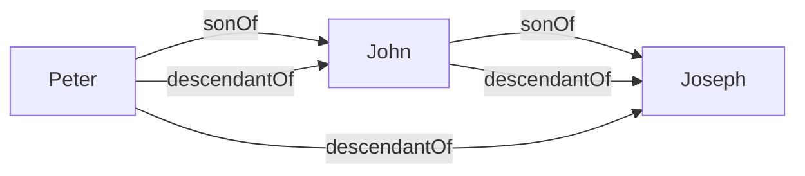
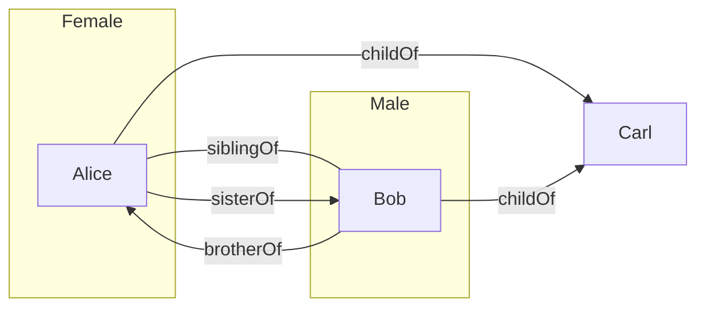

You cannot express relations between objects using the concepts we have learned so far. **Relations** are expressed as such: 

* A **relation name** \$$R\$$ denotes a set of **pairs** of individual object. Relation names are also called **binary predicates**: 
	* \$$\text{sonOf}\$$
	* \$$\text{grandsonOf}\$$
	* These call also be denotes by upper case letters \$$R,S,R_1,R_2\$$ and so on.
	
To express that an individual object \$$a\$$ is in the relation \$$R\$$ to an individual object \$$b\$$ we write \$$R(a,b)\$$. \$$R(a,b)\$$ is *also* called an **atomic assertion**. This can also be read as \$$a\$$ is in relation \$$R\$$ to \$$b\$$:

* \$$\text{sonOf(Peter, John)}\$$, where \$$\text{Peter}\$$ is the son of \$$\text{John}\$$.

## Rule-Based Systems
A rule has the form:
$$R_1(x_1,y_1)\wedge\ldots\wedge R_n(x_n,y_n)\wedge A_1(x_{n+1})\wedge\ldots\wedge A_m(x_{n+m})\rightarrow R(x,y)$$
or
$$R_1(x_1,y_1)\wedge\ldots\wedge R_n(x_n,y_n)\wedge A_1(x_{n+1})\wedge\ldots\wedge A_m(x_{n+m})\rightarrow A(x)$$
Where:

* \$$R_1,\ldots,R_n\$$ and \$$R\$$ are relation names.
* \$$A_1,\ldots,A_n\$$ and \$$A\$$ are class names.
* \$$x_1,y_1,\ldots,x_n,y_n,x_{n+1},\ldots,x_{n+m},x,y\$$ are individual variables.

A rule-based knowledge base \$$K\$$ is a collection \$$K_a\$$ of atomic assertions and \$$K_r\$$ of rules.

### Example

Consider the following set \$$K_a\$$ of atomic assertions:

* \$$\text{sonOf(Peter, John)}\$$
* \$$\text{sonOf(John, Joseph)}\$$

Consider the following set \$$K_r\$$ of rules:

* \$$\text{sonOf}(x,y)\wedge\text{sonOf}(y,z)\rightarrow\text{grandsonOf}(x,z)\$$

Then \$$\text{grandsonOf(Peter, Joseph)}\$$ follows from \$$K\$$, in symbols:
$$K\models\text{grandsonOf(Peter, Joseph)}$$

## Knowledge Graphs

Binary predicates allow us to talk about graphs.

Let \$$K_r\$$ contain:

* \$$\text{sonOf}(x,y)\rightarrow\text{descendantOf}(x,y)\$$
* \$$\text{sonOf}(x,y)\wedge\text{descendantOf}(y,z)\rightarrow\text{descendantOf}(x,z)\$$

Let \$$K_A\$$ be \$$\{\text{sonOf(Peter, John), sonOf(John, Joseph)}\}\$$

\$$K_a\$$ can be seen as the following graph  (individual names = nodes, relations = edges):

*Labeled Graph.*

Computing \$$\text{DerivedAssertions}\$$ corresponds to graph completion.

### Example

Let \$$K_r\$$ contain:

* \$$\text{childOf}(x,y)\wedge\text{childOf}(z,y)\rightarrow\text{siblingOf}(x,z)\$$
* \$$\text{Female}(x)\wedge\text{siblingOf}(x,y)\rightarrow\text{sisterOf}(x,y)\$$
* \$$\text{Male}(x)\wedge\text{siblingOf}(x,y)\rightarrow\text{brotherOf}(x,y)\$$

Let \$$K_a\$$ be:
$$\{\text{Female(Alice),Male(Bob),childOf(Alice,Carl),childOf(Bob,Carl)}\}$$

We assume different variable are replace by different individuals. This statement means that people can't be their own siblings.

