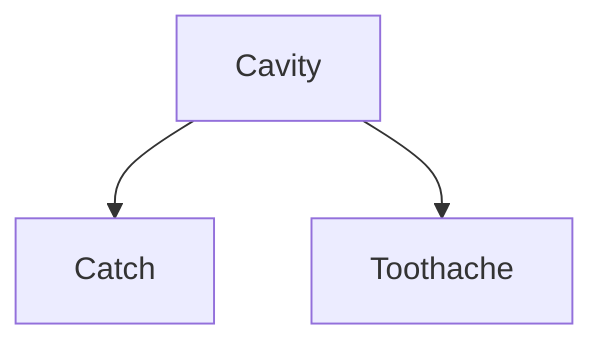
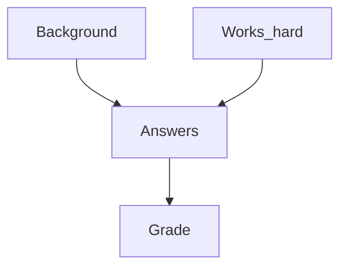
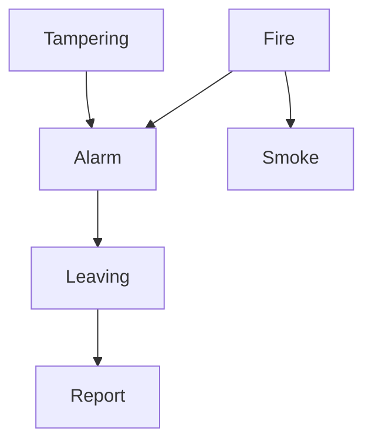

## Conditional Independence
Random variable &#92;(G,F&#92;) are conditionally independent given &#92;(H_1,\ldots,H_n&#92;) if:

&#92;[\mathbf{P} (G,F\vert H_1,\ldots,H_n)=\mathbf{P}(G\vert H_1,\ldots,H_n)\times \mathbf{P}(F\vert H_1,\ldots,H_n)&#92;]

or, equivalently:

&#92;[\mathbf{P} (G\vert F, H_1,\ldots,H_n)=\mathbf{P}(G\vert H_1,\ldots,H_n)&#92;]

This is using the multiplication rule.
{:.info}

### Example - Dentistry
In the dentist domain it seems reasonable to assert conditional independence of the variables &#92;(\text{Toothache}&#92;) and &#92;(\text{Catch}&#92;), given &#92;(\text{Cavity}&#92;):

&#92;[\mathbf{P}(\text{Toothache,Catch}\vert \text{Cavity})=\mathbf{P}(\text{Toothache}\vert \text{Cavity})\mathbf{P}(\text{Catch}\vert\text{Cavity})&#92;]

or, equivalently:

&#92;[\mathbf{P}(\text{Toothache}\vert \text{Cavity})=\mathbf{P}(\text{Toothache}\vert\text{Catch, Cavity})&#92;]

This means that the cavity causes the toothache and if you have a cavity it is more likely that the steel probe catches. The lack of the arrow between toothache and catch mean that given that they have a cavity there is no relation between catching and the toothache.
{:.info}

Using conditional independence of &#92;(\text{Catch}&#92;) and &#92;(\text{Toothache}&#92;) given &#92;(\text{Cavity}&#92;) we can compute the joint probability distribution:

&#92;[\mathbf{P}(\text{Toothache, Catch, Cavity})&#92;]

using **only** the probability distributions:

&#92;[\mathbf{P}(\text{Toothache}\vert \text{Cavity}), \mathbf{P}(\text{Catch}\vert\text{Cavity}),\mathbf{P}(\text{Cavity})&#92;]

The computation is as follows (using first multiplication rule and the conditional independence):

&#92;[
\begin{aligned}
&\mathbf{P}(\text{Toothache, Catch, Cavity})&#92;&#92;
=& \mathbf{P}(\text{Toothache,Catch}\vert \text{Cavity})\times \mathbf{P}(\text{Cavity})&#92;&#92;
=& \mathbf{P}(\text{Toothache}\vert \text{Cavity})\times \mathbf{P}(\text{Catch}\vert\text{Cavity})\times\mathbf{P}(\text{Cavity})
\end{aligned}
&#92;]

The number of probabilities needed is reduces to 5. Moreover, these probabilities can often be learned form data.

## Towards Belief Networks
Conditional independence can be used to give concise representations of many domains.

A **belief network** (Bayesian network) is a graphical probabilistic model of domain in which nodes represent random variable and arc probabilistic dependence (often causality).

Informally, if there is an arc from a random variable &#92;(F&#92;) to another random variable &#92;(G&#92;) then &#92;(G&#92;) depends on &#92;(F&#92;). &#92;(F&#92;) is called a parent of &#92;(G&#92;). It is assumed that there are not cycles and that any random variable &#92;(G&#92;) is conditionally independent of any non-parent variable &#92;(G'&#92;) given the parents of &#92;(G&#92;) if &#92;(G'&#92;) cannot be reached by a sequence of arcs from &#92;(G&#92;). For example, the graph above.

The full joint probability distribution is then given as:

&#92;[\prod_{F\text{ in the network}} \mathbf{P}(F\vert \text{parents}(F))&#92;]

The &#92;(\prod&#92;) symbol means "the product of".
{:.info}

In the example:

&#92;[\mathbf{P}(\text{Toothache}\vert \text{Cavity})\times \mathbf{P}(\text{Catch}\vert\text{Cavity})\times\mathbf{P}(\text{Cavity})&#92;]

As cavity has no parents then we can just take it's probability.
{:.info}

### Example - Student Exam Domain
Variables: &#92;(\text{Grade, Answers, Background, Works\_hard}&#92;)

Then is seems reasonable to assume that:

* &#92;(\text{Works\_hard}&#92;) and &#92;(\text{Background}&#92;) are independent.
* &#92;(\text{Grade}&#92;) and &#92;(\text{Works\_hard}&#92;) are independent given &#92;(\text{Answers}&#92;) and &#92;(\text{Grade}&#92;).
* &#92;(\text{Background}&#92;) are independent given &#92;(\text{Answers}&#92;).

We represent this modelling of the domain using the Belief Network:

### Example - Fire Alarm Domain
The fire alarm domain can be represented in the following graph:

