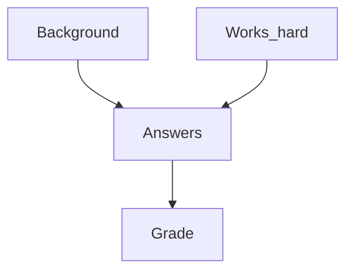
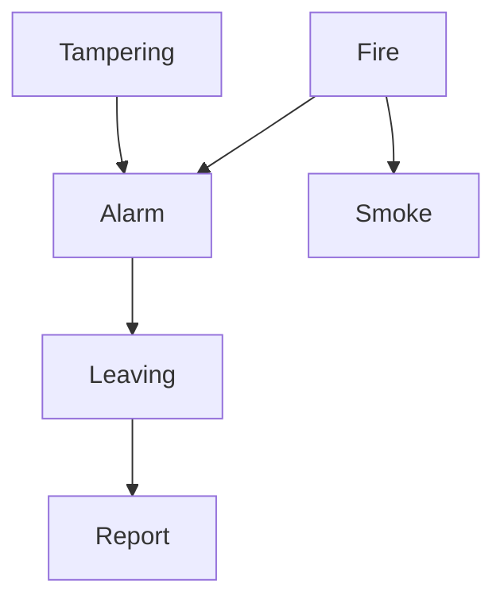

## Joint Probability Distribution
We want to know the joint probability distribution from: 

&#92;[\mathbf{P}(F\vert \text{parents}(F))&#92;]

Given a Belief Network, we can always assume an ordering:

&#92;[F_1,\ldots,F_n&#92;]

of its random variables such that for all &#92;(i,j&#92;):

&#92;[F_i\rightarrow F_j \text{ implies } i<j&#92;]

Using the examples we can order the random variables as follows:

1. The student exam domain:
    
    ```mermaid
    graph TD
    Background --> Answers
    w[Works_hard] --> Answers
    Answers --> Grade
    ```

    &#92;(\text{Background, Works\_hard, Answers, Grade}&#92;)
1. The fire alarm domain:

    ```mermaid
    graph TD
    Tampering --> Alarm
    Fire --> Alarm
    Fire --> Smoke
    Alarm --> Leaving
    Leaving --> Report
    ```

    &#92;(\text{Tampering, Fire, Alarm, Smoke, Leaving, Report}&#92;)
    
    In these examples we can see that there are no return/backward dependencies from items in the right of the list to items in the left of the list.
    {:.info}
    
According to the chain rule, given &#92;(F_1,\ldots,F_n&#92;) we have for all &#92;(r_1,\ldots r_n&#92;):

&#92;[
\begin{aligned}
P(F_1=r_1,\ldots,F_n=r_n)=&P(F_1=r_1)\times&#92;&#92;
& P(F_2=r_2\vert F_1=r_1)\times&#92;&#92;
& P(F_3=r_3\vert F_1=r_1,F_2=r_2)\times&#92;&#92;
& \cdots&#92;&#92;
& P(F_n=r_n\vert F_1=r_1,\ldots,F&#95;&#123;n-1}=r&#95;&#123;n-1})
\end{aligned}
&#92;]

Using bold &#92;(\mathbf{P}&#92;) notation this reads:

&#92;[
\begin{aligned}
\mathbf{P}(F_1,\ldots,F_n)=&\mathbf{P}(F_1)\times&#92;&#92;
& \mathbf{P}(F_2\vert F_1)\times&#92;&#92;
& \mathbf{P}(F_3\vert F_1,F_2)\times&#92;&#92;
& \cdots&#92;&#92;
& \mathbf{P}(F_n\vert F_1,\ldots,F&#95;&#123;n-1})
\end{aligned}
&#92;]

This also means that &#92;(F_1&#92;) must have no parents as it is first in the list. This further means that if there are cycles they must start without a parent.
{:.info}

As parents &#92;((F_i)\subseteq&#92;{F_1,\ldots,F&#95;&#123;i-1}&#92;}&#92;) conditional independence implies:

&#92;[\mathbf{P}(F_i\vert F_1,\ldots F&#95;&#123;i-1})=\mathbf{P}(F_i\vert\text{parents}(F_i))&#92;]

This is to say that only the parent of the values of &#92;(F_i&#92;) are required in order to calculate the probability of &#92;(F_i&#92;) given it's parents.

This means that we can rewrite the equation before as:

&#92;[
\begin{aligned}
\mathbf{P}(F_1,\ldots,F_n)=&\mathbf{P}(F_1)\times&#92;&#92;
& \mathbf{P}(F_2\vert \text{parents}(F_2))\times&#92;&#92;
& \mathbf{P}(F_3\vert \text{parents}(F_3))\times&#92;&#92;
& \cdots&#92;&#92;
& \mathbf{P}(F_n\vert \text{parents}(F_n))
\end{aligned}
&#92;]

### Example - Student Exam Domain



This graph gives the full joint probability distribution of:

&#92;[\mathbf{P}(\text{Background, Works\_hard, Answers, Grade})&#92;]

This can then be computed with:

&#92;[
\begin{aligned}
&\mathbf{P}(\text{Background})\times&#92;&#92;
& \mathbf{P}(\text{Works\_hard})\times&#92;&#92;
& \mathbf{P}(\text{Answers}\vert \text{Background, Works\_hard})\times&#92;&#92;
& \mathbf{P}(\text{Grade}\vert \text{Answers})
\end{aligned}
&#92;]

This method gives significantly less entries than calculating using a full joint probability table. E.g. in the fire alarm example we go from &#92;(2^6-1&#92;) entries to 12 by using conditional probabilities.
{:.info}

### Example - Fire Alarm Domain



In this set we are using the following abbreviations:

* &#92;(P(A\vert B)=P(A=1\vert B=1)&#92;)
* &#92;(P(\neg A \vert B ) = P(A=0\vert B=1)&#92;)
* and so on.

Assume the following (conditional) probabilities:

* &#92;(P(\text{Tampering})=0.02&#92;)
* &#92;(P(\text{Fire})=0.01&#92;)
* &#92;(P(\text{Smoke} \vert \text{Fire})=0.9&#92;)
* &#92;(P(\text{Smoke} \vert \neg\text{Fire})=0.01&#92;)
* &#92;(P(\text{Alarm} \vert \text{Fire}\wedge\text{Tampering})=0.5&#92;)
* &#92;(P(\text{Alarm} \vert \text{Fire}\wedge\neg\text{Tampering})=0.99&#92;)
* &#92;(P(\text{Alarm} \vert \neg\text{Fire}\wedge\text{Tampering})=0.85&#92;)
* &#92;(P(\text{Alarm} \vert \neg\text{Fire}\wedge\neg\text{Tampering})=0.0001&#92;)
* &#92;(P(\text{Leaving} \vert \text{Alarm})=0.88&#92;)
* &#92;(P(\text{Leaving} \vert \neg\text{Alarm})=0.001&#92;)
* &#92;(P(\text{Report} \vert \text{Leaving})=0.75&#92;)
* &#92;(P(\text{Report} \vert \neg\text{Leaving})=0.01&#92;)

#### Querying
If a report is observed, then the probability of fire and tampering go up:

* &#92;(P(\text{Fire})=0.01&#92;) and &#92;(P(\text{Fire}\vert\text{Report})=0.2305&#92;)
* &#92;(P(\text{Tampering})=0.02&#92;) and &#92;(P(\text{Tampering}\vert\text{Report})=0.399&#92;)

If, in addition, Smoke is observed, then probability of Fire goes up further but Tampering goes down:

* &#92;(P(\text{Fire}\vert \text{Report}\wedge\text{Smoke})=0.964&#92;)
    
    If you have two independent sources of information related to a subject in conjunction then you can expect the probability to increase dramatically.
    {:.info}
* &#92;(P(\text{Tampering}\vert \text{Report}\wedge\text{Smoke})=0.0284&#92;)

If, however, &#92;(\neg&#92;)Smoke is observed, then the probability of Fire goes down:

* &#92;(P(\text{Fire}\vert \text{Report}\wedge\neg\text{Smoke})=0.0294&#92;)
* &#92;(P(\text{Tampering}\vert \text{Report}\wedge\neg\text{Smoke})=0.501&#92;)

We can see from this that independent sources of evidence to make decisions are crucial.
{:.info}

For worked examples on querying see [these videos](https://liverpool.instructure.com/courses/17569/pages/additional-videos-on-querying-the-alarm-system-belief-network?module_item_id=317996).
{:.info}

### Summary
* Belief network are representations of **conditional independence** in probabilistic models.
* Querying can often be done using exact inference.
* Sometimes exact inference is too hard. There are also approximate algorithms.
* Lots of research on **learning** belief networks from data. Either learning the conditional probabilities or even the structure of a belief network.
