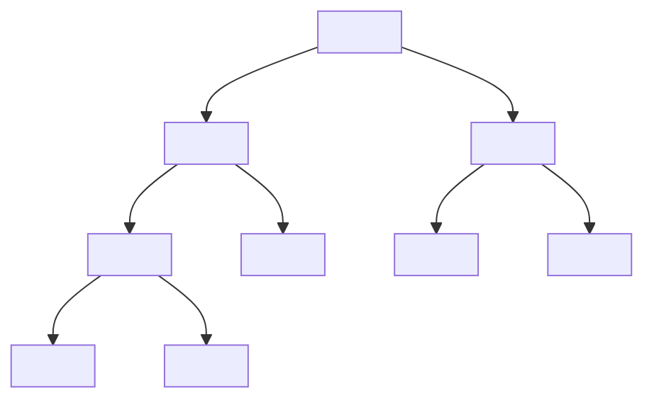
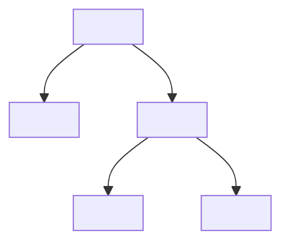
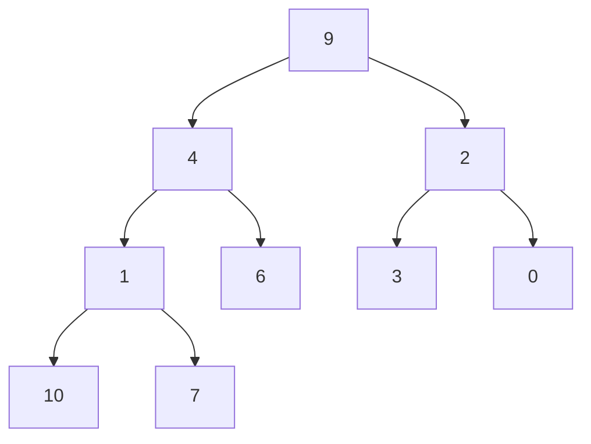
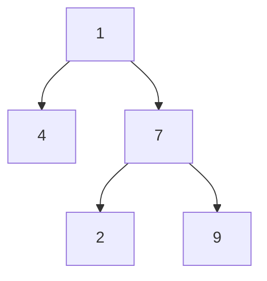
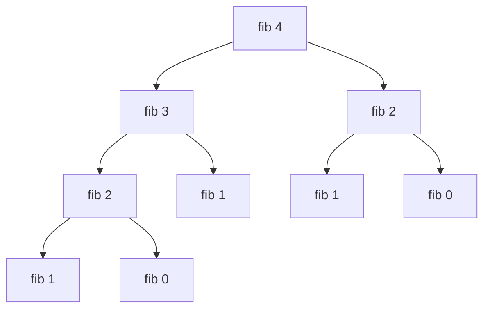
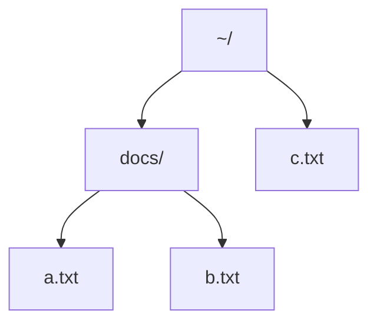

## Trees



A tree is composed of:

* Leaf nodes.
    * Leaves have no children.
* Branch nodes.
    * Has a child which is a leaf.
    
### A Tree Type in Haskell
Any binary tree can be represented in this data type.

```haskell
data Tree = Leaf | Branch Tree Tree deriving(Show)
```



```haskell
Branch Leaf (Branch Leaf Leaf)
```

### Recursion on Trees
We can write recursive function that process tress.

* Usually the recursive case will process both branches.

This function counts all the nodes in a tree:

```haskell
size :: Tree -> Int

size (Leaf) = 1
size (Branch x y) = 1 +size x + size y
```

For trees usually the base case is the `Leaf` and the recursive rule operates on the two sub-trees of the branch node.
{:.info}

```haskell
> size (Branch Leaf (Branch Leaf Leaf))
5
```

## Trees with Data
Nodes in a tree often hold data.



### Type of Trees with Data
This type allows each branch and leaf to have data of a single type associated with it:

```haskell
data DTree a = DLeaf a
             | DBranch a (DTree a) (DTree a)
             deriving (Show)
```



```haskell
DBranch 1 (DBranch 7 (DLeaf 2) (DLeaf 9)) (DLeaf 4)
```

### Recursion on Trees with Data
This function adds together the numbers from all the branches and leaves in a tree with data.

```haskell
tree_sum :: Num a => DTree a -> a

tree_sum (DLeaf x)       = x
tree_sum (DBranch x 1 l) = x + tree_sum l + tree_sum r
```

```haskell
> tree_sum (DBranch 1 (DBranch 7 (DLeaf 2) (DLeaf 9)) (DLeaf 4))
22
```

#### Example - Fibonacci Numbers
Before we used this code to calculate the Fibonacci numbers. This is slow due to the large amount of branching:

```haskell
fib 0 = 0
fib 1 = 1
fib n = fib (n-1) + fib (n-2)
```



##### How many recursive calls does the code make?
We can make a function to build the call tree.

```haskell
fib_tree :: Int -> Tree

fib_tree 0 = Leaf
fib_tree 1 = Leaf
fib_tree n = Branch (fib_tree (n-1)) (fib_tree (n-2))
```

```haskell
> fib_tree 4
Branch (Branch (Branch Leaf Leaf) Leaf) (Branch Leaf Leaf)
```

This is the same structure  as the tree at the top of the example.

To count the nodes in this tree we can use the function `size` from earlier:

```haskell
fib_calls n = size (fib_tree n)
```

```haskell
> fib_calls 10
177
> fib_calls 20
21891
>fib_calls 30
2692537
```

As we can see multiple recursion can be very slow if used incorrectly.

#### Example - Finding a File
Suppose that we have a directory structure:



Write a function that, given a filename, finds the path to that file.

We can formulate the files as a data tree:

```haskell
let fs =
    DBranch "~/"
        (DBranch "docs/" (DLeaf "a.txt" ) (DLeaf "b.txt"))
        (DLeaf "c.txt")
```

This is the same as the `DTree` above.
{:.info}

Note that the file might not exist:
    
* So we will use the maybe type.

```haskell
> find_file "a.txt" fs
Just "home/docs/a.txt"

> find_file "d.txt" fs
Nothing
```

##### Implementation

```haskell
find_file file (Dleaf x)
    | x == file = Just file
    | otherwise = Nothing
    
find_file file (DBranch x l r) =
    let
        left  = find_file l
        right = find_file r
    in
        case (left, right) of
            (Just y, _) -> Just (x ++ y)
            (_, Just y) -> Just (x ++ y)
            (_, _)      -> Nothing
```

This implementation has two cases, one for the leaf and one for the branch.

## Exercises
1. ```haskell
    leafSum :: DTree Int -> Int
    leafSum (DLeaf x)       = x
    leafSum (DBranch _ l r) = leafSum l + leafSum r
    ```
    
1. ```haskell
    treeElem :: Eq a => a -> DTree a -> Bool
    treeElem x (DLeaf y) = x == y
    treeElem x (DBranch y l r) = (x == y) || treeElem x l || treeElem x r
    ```
