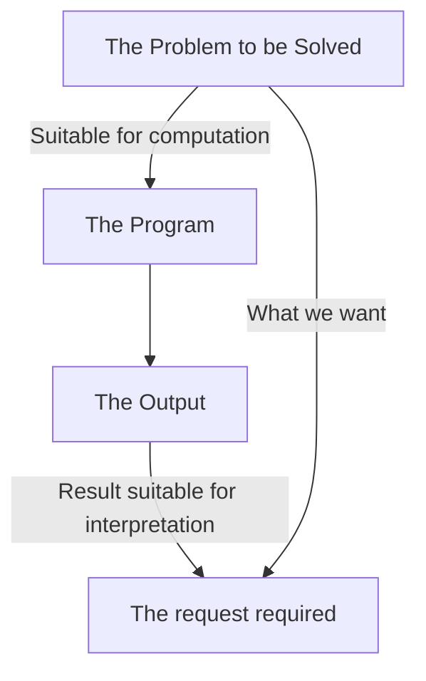
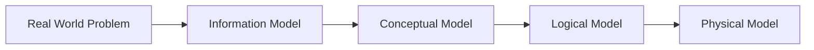

## System design as Modelling

## Modelling Process

An example of this process:

* Problem in the real world.
* A plain English description of the input, output and main components.
* Entity Relationship model of the data in a database.
* The definition of the table of a relational database.
	* The technical details of the model such as the database format and table definitions.
* MySQL or Oracle database.

The purpose of the modelling process is so you can give your design to another person in a team and they know how to implement it.

# Assignment 1
Produce a wiki-style report (between 2000 and 2500 words) introducing an innovative system/application you would like to implement.

This system will not be implemented as you can write the proposal with little concern of whether it it realisable.
{:.info}

## Things to include
* The domain of the system.
	* In which context is it useful?
* What makes the solution important?
	* Requires references as to why it is an important problem to solve.
* What makes it new?
	* Research 3 - 5 direct competitors in the market and describe why yours is better.
* The purpose of the new system.
* What different categories of users will the system have?
	* Envisaging how they will utilise the system.
* Main benefits and shortcomings of the system and the main obstacles and shortcomings of the system.
	* Also the main invectives for uptake of the system.
* Include a high level description of that data and what the users will use the data for.
	* Include a description of each of the user categories you have identified.

Any outside meeting should be recorded on canvas in the form of minutes.
