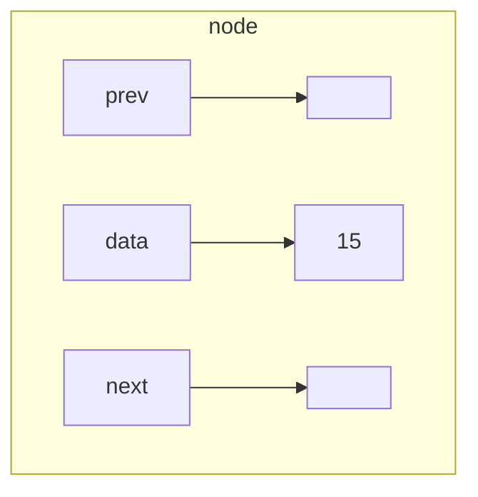
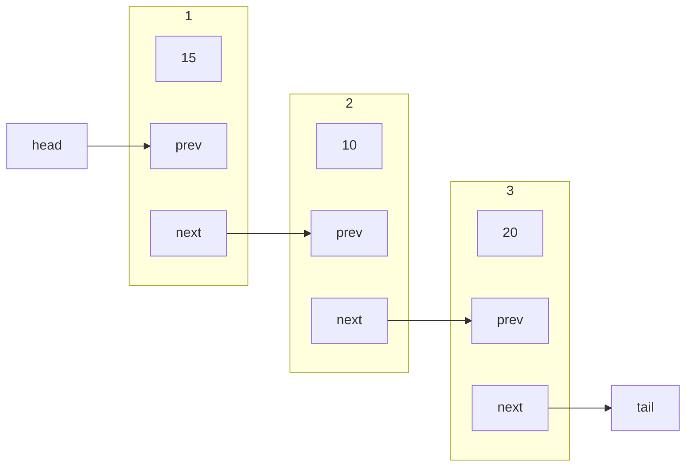

Linked lists are lists in which elements are arranges in a linear order. The order is determined by a pointer (rather than array indices).
## Structure
Each **node** has a data field and one/two pointers linking to the next/previous element in the list.

Nodes with one pointer are called **singly linked** and ones with two are called **doubly linked**.
{:.info}



We refer to the three objects as: `node.data`, `node.next` and `node.prev`:

* If node is the last element, then `node.next` is `NIL`.
* If node is the first element, then `node.prev` is `NIL`.
* `head` points to the first node
* `tail` points to the last node.

The difference between linked lists and arrays is that you must follow the pointers to get to the data and can't just go straight to a particular index.
{:.info}



## Traversing
Traversing and outputting each element of a linked list:

```
node = head
while node =/= NIL do
begin
	output node.data # output the data from this node
	node = node.next # go to next node
end
```

## Searching
Searching if the value `key` is in a linked list:

```
node = head
found = false
while node =/= NIL AND found == false do
begin
	if node.data == "key" then
		found = true
	else # this keeps the node in the case that the element is found.
		node = node.next
end 
if found == true then
	output "Found!"
else output "Not found!"
```

### Alternative

```
node = head
while node =/= NIL AND node.data =/= "key" do
	node = node.next
if node == NIL then
	output "Not found!"
else output "Found!"
```

### Time Complexity
The time complexity of these two algorithms are:

$$O(n)$$

### Searching Sorted Lists
We are unable to use a binary search to find elements in a linked list as we have to walk the list. We are able to end the search if the data overshoots the requested data:

```
node = head
while node =/= NIL AND node.data < "key" do
	node = node.next
if node == NIL then # must check for NIL to avoid reading empty node
	output "Not found!"
else if node.data == "key" then
	output "Found!"
else output "Not found!"
```

#### Time Complexity
The time complexity of this algorithm is:

$$O(n)$$