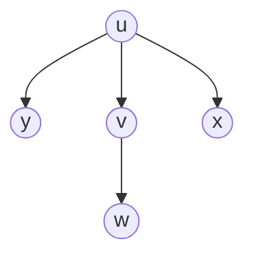
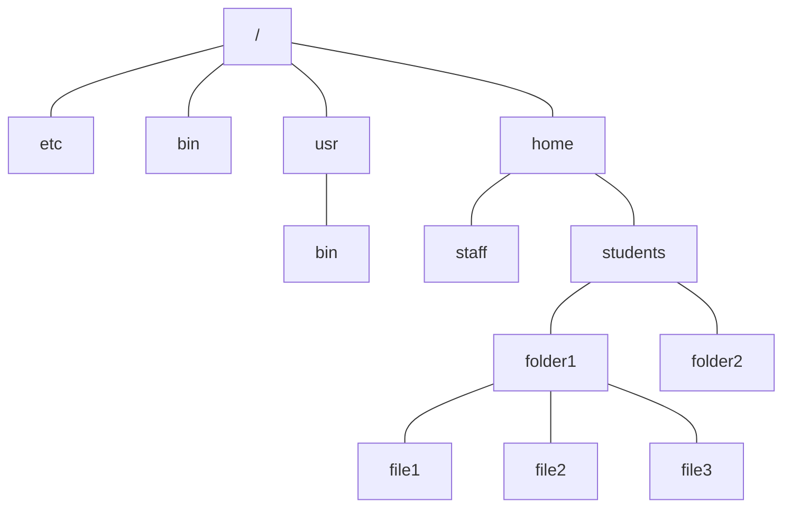

Trees are linked lists with branches.

## Definition
A tree $T=(V,E)$ consists of a set of vertices $V$ and a set of edges $E$ such that for any pair of vertices $u,v\in V$ there is exactly **one** path between $u$ and $v$:



### Equivalent Statements

1. There is exactly one path between two vertices in $T$.
1. $T$ is connected (there is at least one path between any two vertices in $T$) and there is no cycle (acyclic) in $T$.
1. $T$ is connected and removal of one edge disconnects $T$.
1. $T$ is acyclic and adding one edge creates a cycle.
1. $T$ is connected and $m=n-1$ (where $n\equiv \vert V\vert,m\equiv \vert E\vert$).
	
	This statement is proven next.
	{:.info}

#### Statement 5 Proof
$P(n):$ If a tree $T$ has $n$ vertices and $m$ edges, then $m=n-1$.

By induction on the number of vertices.

##### Base Case
A tree with single vertex does not have an edge.


$n=1$ and $m=0$ therefore $m=n-1$
{:.info}

##### Induction Step

$P(n-1)\Rightarrow P(n)$ for $n>1$?

1. Remove an edge from the tree $T$. By (3), $T$ becomes disconnected. Two connected components $T_1$ and $T_2$ are obtained, neither contains a cycle (otherwise the cycle is also present in $T$.
	
	```mermaid
	graph LR
	u((u)) ---|remove| v((v))
	```
	
	$u$ and $v$ are parts of two sub-trees ($T_1$ and $T_2$)that we are splitting.
	{:.info}

1. Therefore, both $T_1$ and $T_2$ are trees.
	
	Let $n_1$ and $n_2$ be the number of vertices in $T_1$ and $T_2$.
	
	$\Rightarrow n_1+n_2=n$
1. By the induction hypothesis, $T_1$ and $T_2$ contains $n_1-1$ and $n_2-1$ edges, respectively. 

	Therefore we can calculate that $m=(n_1-1)+(n_2-1)+1$. Simplified this is $m=n_1+n_2-1$. As $n=n_1+n_2$ we can simplify to $m=n-1$.
	{:.info}

1. Hence $T$ contains $(n_1-1)(n_2-1)+1=n-1$ edges.
	
## Rooted Trees
This is a tree with a hierarchical structure such as a file structure:



The degree of this tree is 4 as `/` has the largest degree.
{:.info}

* The topmost vertex is called the **root**.
* A vertex $u$ may have some **children** below it, $u$ is called the **parent** of its children
* **Degree of a vertex** is the number of children it has.
* **Degree of a tree** is the maximum degree of all vertices.
* Vertex with no child (degree 0) is called a **leaf**.
* Vertices other than leaves/root are called **internal vertices**.
* Each child is the root of its own **sub-tree**.