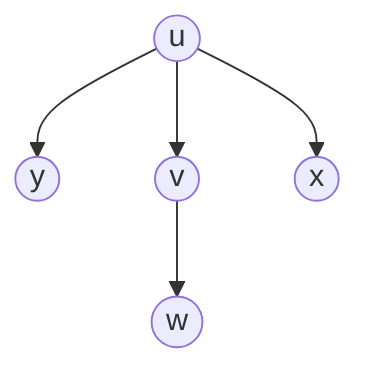
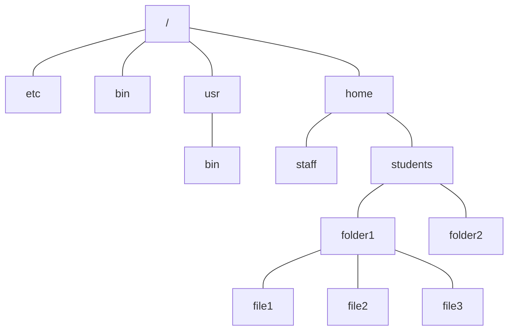

Trees are linked lists with branches.

## Definition
A tree &#92;(T=(V,E)&#92;) consists of a set of vertices &#92;(V&#92;) and a set of edges &#92;(E&#92;) such that for any pair of vertices &#92;(u,v\in V&#92;) there is exactly **one** path between &#92;(u&#92;) and &#92;(v&#92;):



### Equivalent Statements

1. There is exactly one path between two vertices in &#92;(T&#92;).
1. &#92;(T&#92;) is connected (there is at least one path between any two vertices in &#92;(T&#92;)) and there is no cycle (acyclic) in &#92;(T&#92;).
1. &#92;(T&#92;) is connected and removal of one edge disconnects &#92;(T&#92;).
1. &#92;(T&#92;) is acyclic and adding one edge creates a cycle.
1. &#92;(T&#92;) is connected and &#92;(m=n-1&#92;) (where &#92;(n\equiv \vert V\vert,m\equiv \vert E\vert&#92;)).
	
	This statement is proven next.
	{:.info}

#### Statement 5 Proof
&#92;(P(n):&#92;) If a tree &#92;(T&#92;) has &#92;(n&#92;) vertices and &#92;(m&#92;) edges, then &#92;(m=n-1&#92;).

By induction on the number of vertices.

##### Base Case
A tree with single vertex does not have an edge.


&#92;(n=1&#92;) and &#92;(m=0&#92;) therefore &#92;(m=n-1&#92;)
{:.info}

##### Induction Step

&#92;(P(n-1)\Rightarrow P(n)&#92;) for &#92;(n>1&#92;)?

1. Remove an edge from the tree &#92;(T&#92;). By (3), &#92;(T&#92;) becomes disconnected. Two connected components &#92;(T_1&#92;) and &#92;(T_2&#92;) are obtained, neither contains a cycle (otherwise the cycle is also present in &#92;(T&#92;).
	
	```mermaid
	graph LR
	u((u)) ---|remove| v((v))
	```
	
	&#92;(u&#92;) and &#92;(v&#92;) are parts of two sub-trees (&#92;(T_1&#92;) and &#92;(T_2&#92;))that we are splitting.
	{:.info}

1. Therefore, both &#92;(T_1&#92;) and &#92;(T_2&#92;) are trees.
	
	Let &#92;(n_1&#92;) and &#92;(n_2&#92;) be the number of vertices in &#92;(T_1&#92;) and &#92;(T_2&#92;).
	
	&#92;(\Rightarrow n_1+n_2=n&#92;)
1. By the induction hypothesis, &#92;(T_1&#92;) and &#92;(T_2&#92;) contains &#92;(n_1-1&#92;) and &#92;(n_2-1&#92;) edges, respectively. 

	Therefore we can calculate that &#92;(m=(n_1-1)+(n_2-1)+1&#92;). Simplified this is &#92;(m=n_1+n_2-1&#92;). As &#92;(n=n_1+n_2&#92;) we can simplify to &#92;(m=n-1&#92;).
	{:.info}

1. Hence &#92;(T&#92;) contains &#92;((n_1-1)(n_2-1)+1=n-1&#92;) edges.
	
## Rooted Trees
This is a tree with a hierarchical structure such as a file structure:



The degree of this tree is 4 as `/` has the largest degree.
{:.info}

* The topmost vertex is called the **root**.
* A vertex &#92;(u&#92;) may have some **children** below it, &#92;(u&#92;) is called the **parent** of its children
* **Degree of a vertex** is the number of children it has.
* **Degree of a tree** is the maximum degree of all vertices.
* Vertex with no child (degree 0) is called a **leaf**.
* Vertices other than leaves/root are called **internal vertices**.
* Each child is the root of its own **sub-tree**.
