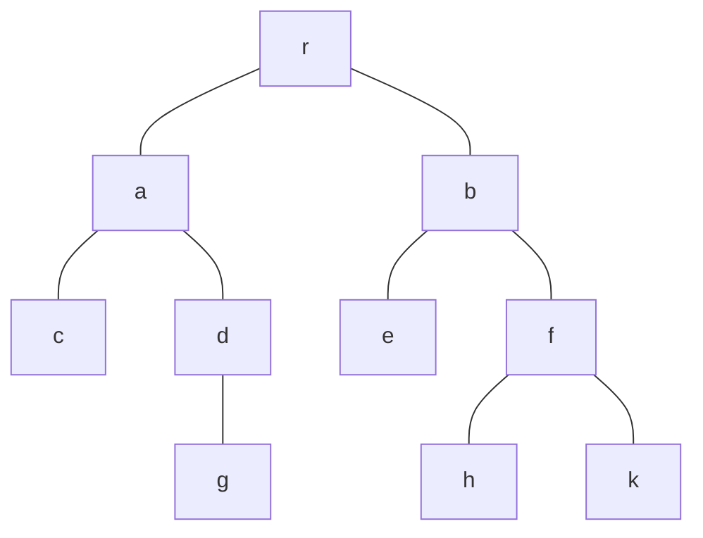

* A binary tree is a tree where the degree is at **most** two. 
* The two sub-trees are called left sub-tree and the right sub-tree (may be empty).

## Traversing
There are three common ways to traverse a binary tree:

* **Pre-order** traversal (VLR)
	* Vertex, left sub-tree, right sub-tree.
* **In-order** traversal (LVR)
	* Left sub-tree, vertex, right sub-tree.
* **Post-order** traversal (LRV)
	* Left sub-tree, right-subtree, vertex
	
The difference is where the V appears.
{:.info}

### Example
For the following tree you would gain the following traversals:



#### Pre-order

```
r, a, c, d, g, b, e, f, h, k
```

You can imagine this as following the left of the node.
{:.info}

#### In-order

```
c, a, g, d, r, e, b, h, f, k
```

You can imagine this as following the middle of the node.
{:.info}

#### Post-order

```
c, g, d, a, e, h, k, f, b, r
```

You can imagine this as following the right of the node.
{:.info}