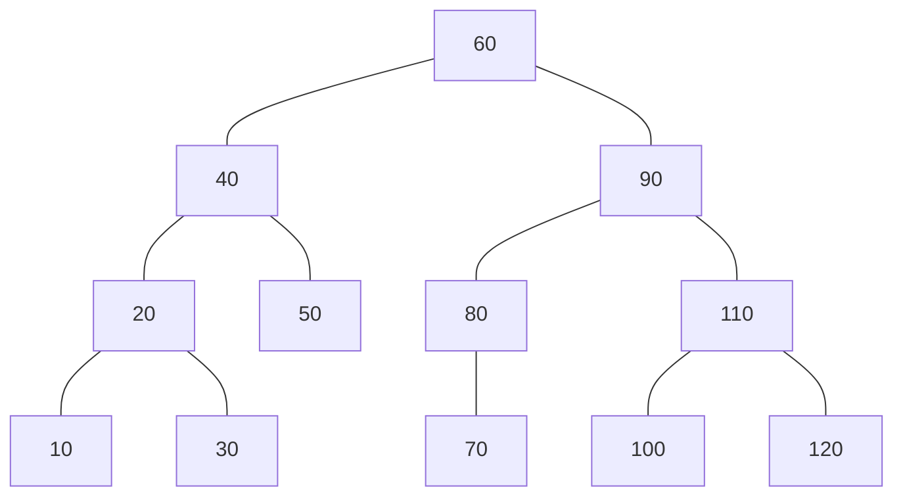
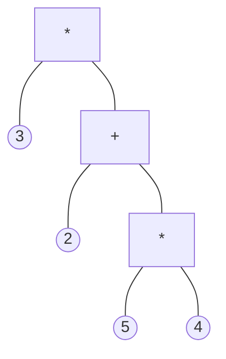

## Binary Search Tree
For a vertex with value $X$:

* Left child has value $\leq X$.
* Right child has value $> X$.

To search for a number go left if you want to go smaller and right if you want to go bigger.

In-order traversal gives the tree in ascending order.
{:.info}

## Expression Tree
This tree represents a mathematical expression.

For the following expression:

$$(2+5*4)\times3$$

In post-fix:

$$2\ 5\ 4 \times+\ 3\ \times$$

Post-order traversal will give the post-fix representation.
{:.info}