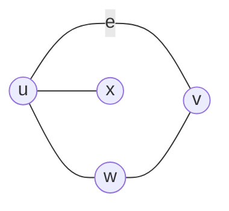
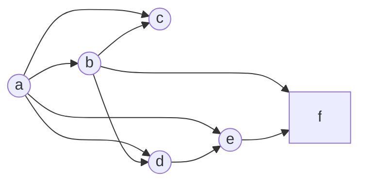

## Undirected Graphs
An undirected graph $G=(V,E)$ consists of a set of **vertices** $V$ and a set of **edges** $E$. Each edge is an **unordered** pair of vertices.

Unordered means that $\\{b,c\\}$ and $\\{c,b\\}$ refer to the same edge.
{:.info}

### Terminology
For the following graph:

* $u$ and $v$ are **adjacent** and are **neighbours** of each-other.
* $u$ and $v$ are **endpoints** of $e$.
* $e$ is said to be **incident** with $u$ and $v$.
* $e$ is said to **connect** $u$ and $v$.

The **degree of a vertex** $v$, denoted by $\deg(v)$, is the number of edges incident with it. 

A loop contributes twice to the degree.
{:.warning}

The **degree of a graph** is the **maximum** degree over all vertices.

### Simple Graphs
An undirected graph is simple if:

* There is at most one edge between two vertices.
	* No self loops.

### Multigraphs

* Allows more than one edge between two verices.

## Directed Graphs
A directed graph $G(V,E)$ consists of the same as a directed graph. Each edge is an ordered pair of vertices.

Ordered means that the order of each pair of vertices refers to their direction.
{:.info}

This can be useful in referring to one-way paths.
{:.info}

### Terminology

* A vertex is **connected** to another if there is a path from $a$ to $b$.
* **In-degree** of a vertex $v$ - The number of edges **leading to** $v$.
* **Out-degree** of a vertex $v$ - The number of edges **leading away** from $v$.

	The sum of the in and out degrees should always be equal and the same as two times the number of edges.
	{:.info}
	
## Example
There is an example on an undirected graph which proves:

The number of vertices with odd degree must be even.
{:.info}
