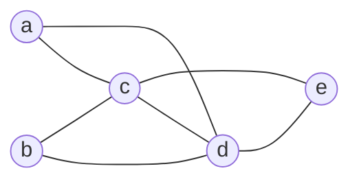
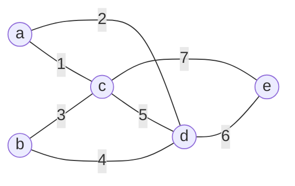
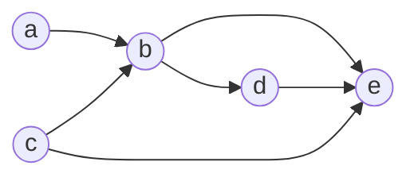
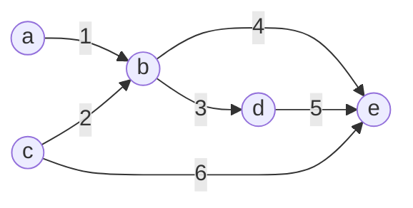

## Representation of Undirected Graphs
An undirected graph ca be represented by an adjacency matrix, adjacency list, incidence matrix or incidence list.

* Adjacency Matrix/List
	* The relationship between vertex adjacency (vertex vs vertex).
* Incidence Matrix/List
	* The relationship between edge incidence (vertex vs edge).

### Adjacency Matrix/List
**Adjacency matrix** $M$ for a simple undirected graph with $n$ vertices is an $n\times n$ matrix:

* $M(i,j)=1$ if vertex $i$ and vertex $j$ are adjacent.
* $M(i,j)=0$ otherwise.

**Adjacency list** - each vertex has a list of vertices to which it is adjacent.

The prior graph is represented in the following matrix:

$$
\begin{pmatrix}
0 & 0 & 1 & 1 & 0\\
0 & 0 & 1 & 1 & 0\\
1 & 1 & 0 & 1 & 1\\
1 & 1 & 1 & 0 & 1\\
0 & 0 & 1 & 1 & 0
\end{pmatrix}
$$

$a$ to $b$ are listed left to right and top to bottom.
{:.info}

* The diagonals are always 0 on a **simple graph**.
* There is also diagonal symmetry as this is an **undirected graph**.
* The row/column will always add to the degree of the vertex.

This can also be represented in this list:

* $a\rightarrow c\rightarrow d$
* $b\rightarrow c\rightarrow d$
* $c\rightarrow a\rightarrow b\rightarrow d\rightarrow e$
* $d\rightarrow a\rightarrow b\rightarrow c\rightarrow e$
* $e\rightarrow c\rightarrow d$

The length of the list is the same as the number of edges.
{:.info}

If the graph has few edges and space is of a concern then the list is better.
{:.info}

### Incidence Matrix/List
Incidence matrix $M$ for a simple undirected graph with $n$ vertices and $m$ edges is an $m\times n$ matrix:

* $M(i,j)=1$ if edge $i$ and vertex $j$ are incident.
* $M(i,j)=0$ otherwise.

**Incidence list** - each edge has a list of vertices to which it is incident with.

The prior graph is represented in the following matrix:

$$
\begin{pmatrix}
1 & 0 & 1 & 0 & 0\\
1 & 0 & 0 & 1 & 0\\
0 & 1 & 1 & 0 & 0\\
0 & 1 & 0 & 1 & 0\\
0 & 0 & 1 & 1 & 0\\
0 & 0 & 0 & 1 & 1\\
0 & 0 & 1 & 0 & 1
\end{pmatrix}
$$

Vertices $a$ to $b$ are left to right and edges 1 to 7 are top to bottom.
{:.info}

* The columns sum to the degree of the vertex.
* The rows should sum to two for the two ends of the edge.

This can also be represented in this list:

* $1\rightarrow a\rightarrow c$
* $2\rightarrow a\rightarrow d$
* $3\rightarrow b\rightarrow c$
* $4\rightarrow b\rightarrow d$
* $5\rightarrow c\rightarrow d$
* $6\rightarrow d\rightarrow e$
* $7\rightarrow c\rightarrow e$

## Representation of Directed Graphs
### Adjacency Matrix/List
**Adjacency matrix** $M$ for a simple directed graph with $n$ vertices is an $n\times n$ matrix:

* $M(i,j)=1$ if $(i,j)$ if $i$ **points to** $j$.
* $M(i,j)=0$ otherwise.

**Adjacency list** - each vertex $u$ has a list of vertices pointed to by an edge leading away from $u$.

The prior graph is represented in the following matrix:

$$
\begin{pmatrix}
0 & 1 & 0 & 0 & 0\\
0 & 0 & 0 & 1 & 1\\
0 & 1 & 0 & 0 & 1\\
0 & 0 & 0 & 0 & 1\\
0 & 0 & 0 & 0 & 0
\end{pmatrix}
$$

$a$ to $b$ are listed left to right and top to bottom.
{:.info}

* The diagonals are always 0 on a **simple graph**.
* There is **no** diagonal symmetry as this is an **directed graph**.
* The row/column will always add to the degree of the vertex.
* The sum of the matrix is the number of edges in the graph.

This can also be represented in this list:

* $a\rightarrow b$
* $b\rightarrow d\rightarrow e$
* $c\rightarrow b\rightarrow e$
* $d\rightarrow e$
* $e$

The length of the list is the same as the out-degree.
{:.info}

### Incidence Matrix/List
Incidence matrix $M$ for a directed graph with $n$ vertices and $m$ edges is an $m\times n$ matrix:

* $M(i,j)=1$ if edge $i$ is leading away from vertex $j$.
* $M(i,j)=-1$ if edge $i$ is leading to vertex $j$.
* $M(i,j)=0$ otherwise.

**Incidence list** -  each vertex $u$ has a list of vertices pointed to by an edge leading away from $u$.

The prior graph is represented in the following matrix:

$$
\begin{pmatrix}
1 & -1 & 0 & 0 & 0\\
0 & -1 & 1 & 0 & 0\\
0 & 1 & 0 & -1 & 0\\
0 & 1 & 0 & 0 & -1\\
0 & 0 & 0 & 1 & -1\\
0 & 0 & 1 & 0 & -1
\end{pmatrix}
$$

Vertices $a$ to $b$ are left to right and edges 1 to 7 are top to bottom.
{:.info}

* There should be a -1 and 1 in each row.

This can also be represented in this list:

* $1\rightarrow a\rightarrow b$
* $2\rightarrow c\rightarrow b$
* $3\rightarrow b\rightarrow d$
* $4\rightarrow b\rightarrow e$
* $5\rightarrow d\rightarrow e$
* $6\rightarrow c\rightarrow e$

The order is significant.
{:.warning}