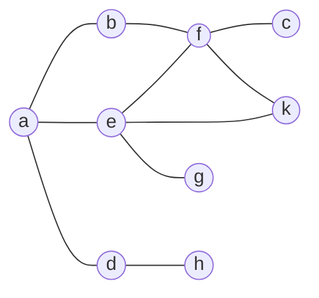

There are two main traversal algorithms: BFS and DFS. These have been covered in the following COMP111 lectures:

* [COMP111 - Breadth First Search]({{site.baseurl}}/comp111/lectures/2020/10/20/1)
* [COMP111 - Depth First Search]({{site.baseurl}}/comp111/lectures/2020/10/20/2)
* [COMP111 - Properties of Searches]({{site.baseurl}}/comp111/lectures/2020/10/20/3)

## BFS with a Queue/Linked List
### Example
Suppose $a$ is the starting vertex:



This would generate the following queues when searching with BFS:

1. $\text{head}\rightarrow a\leftarrow\text{tail}$
1. $\text{head}\rightarrow b\rightarrow d\rightarrow e\leftarrow\text{tail}$
1. $\text{head}\rightarrow d\rightarrow e\rightarrow f\leftarrow\text{tail}$
1. $\text{head}\rightarrow d\rightarrow e\rightarrow f\leftarrow\text{tail}$
1. $\text{head}\rightarrow f\rightarrow h\rightarrow g\rightarrow k\leftarrow\text{tail}$
1. $\text{head}\rightarrow h\rightarrow g\rightarrow k\rightarrow c\leftarrow\text{tail}$
1. $\text{head}\rightarrow g\rightarrow k\rightarrow c\leftarrow\text{tail}$
1. $\text{head}\rightarrow k\rightarrow c\leftarrow\text{tail}$
1. $\text{head}\rightarrow c\leftarrow\text{tail}$

Every time an element is removed from the queue, it is added to the traversal:

BFS: $a,b,d,e,f,h,g,k,c$

### Pseudo Code

```
unmark all vertices
choose some starting vertex s
mark s and insert s into tail of list L
while L is non-empty do
begin
	remove a vertex v from head of L
	visit v 	// print its data
	for each unmarked neighbour w of v do
		mark w and insert w into tail of list L
end
```

## DFS with Stack
### Example
Suppose $a$ is the starting vertex:


This would generate the following stacks when searching with DFS:

1. $\mathbf a\leftarrow \text{top}$
1. $e,d,\mathbf b\leftarrow \text{top}$
1. $e,d,\mathbf f\leftarrow \text{top}$
1. $e,d,k,e,\mathbf c\leftarrow \text{top}$
1. $e,d,k,\mathbf e\leftarrow \text{top}$
1. $e,d,k,k,\mathbf g\leftarrow \text{top}$
1. $e,d,k,\mathbf k\leftarrow \text{top}$
1. $e,d,k\leftarrow \text{top}$
	
	Not added to path as it already exists.
	{:.info}
1. $e,\mathbf d\leftarrow \text{top}$
1. $e,\mathbf h\leftarrow \text{top}$
1. $e\leftarrow\text{top}$
	
	Not added to path as it already exists.
	{:.info}


Every time a unique element is popped from the stack, it is added to the traversal:

DFS: $a,b,f,c,e,g,k$
### Pseudo Code

```
unmark all vertices
push starting vertex u onto top of stack S
while S is non-empty do
begin
	pop a vertex v from top of S
	if v is unmarked then
	begin
		visit and mark v
		for each unmarked neighbour w of v do
			push w onto top of S
	end
end
```