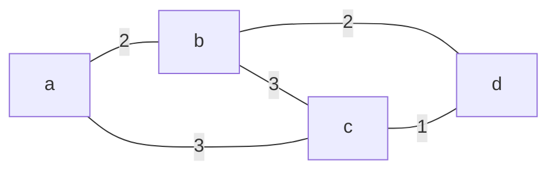
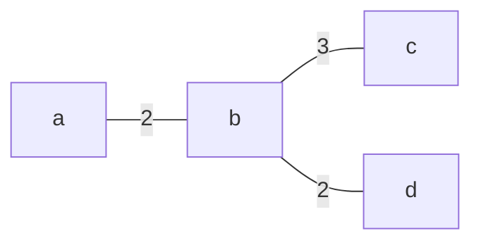
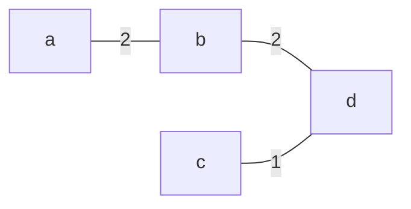
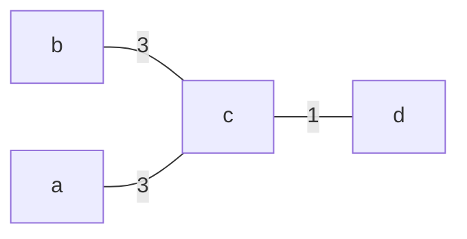
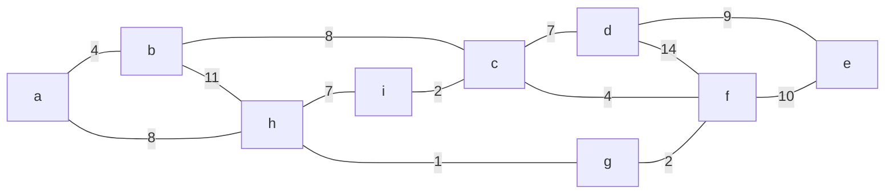
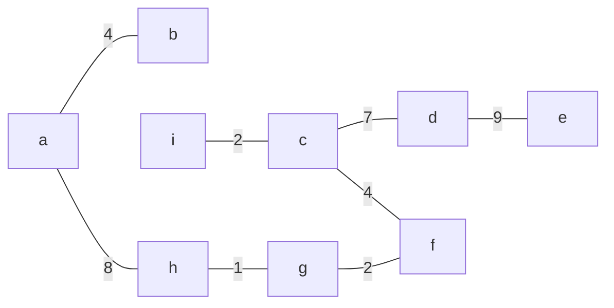

## Minimum Spanning Tree (MST)
Given an **undirected connected** graph $G$:

* The edges are labelled by weight

**Spanning tree** of $G$:

A tree containing all vertices in $G$.

**Minimum spanning tree** of $G$:

* A spanning tree of $G$ with minimum weight.

### Example
Undirected connected graph $G$:



#### Spanning trees of $G$:







There are $m\choose{n-1}$ (choose) possible spanning trees, where $m$ is the number of edges in the original graph and $n$ is the number of nodes.
{:.info}

#### Minimum spanning tree of $G$:


This tree has the smallest total weight.
{:.info}

## Kruskal's Algorithm
The idea is to select edges from smallest to largest weight until the MST is made.

### Example



1. Arrange edges from smallest to largest weight.
1. Select edges from smallest to largest, provided that they don't make a cycle.

| ✓ | (g, h) | 1 |
| :-: | :-: | :-: |
| ✓ | (c, i) | 2 |
| ✓ | (f, g) | 2 |
| ✓ | (a, b) | 4 |
| ✓ | (c, f) | 4 |
| ✓ | (c, d) | 7 |
| Makes cycle | (h, i) | 7 |
| ✓ | (a, h) | 8 |
| Makes cycle | (b, c) | 8 |
| ✓ | (d, e) | 9 |
| Makes cycle | (e, f) | 10 |
| Makes cycle | (b, h) | 11 |
| Makes cycle | (d, f) | 14 |

This gives the following tree:



Order of edges selected:

(g, h), (c, i), (f, g), (a, b), (c, f), (c, d), (a, h), (d, e)

This algorithm is **greedy** as it chooses the **smallest** wight edge to be included in the MST.
{:.info}

### Pseudo Code
Given an undirected connected graph $G=(V,E)$:

```
T = Ø
E' = E	// E' is the set of all edges
while E' != Ø do
begin
	pick an edge e in E' with minimum weight
	if adding e to T does not form cycle then
		add e to T	// This is the same as T = T ∪ {e}
	remove e from E'	// This is the same as E' = E' \ {e}
end
```

#### Determining Whether Cycles are Formed
When we consider a new edge $e=(u, v)$, there may be three cases:

1. At most one of $u$ and $v$ is end point of an already chosen edge.
	* No cycle
1. $u$ and $v$ both belong to the same partial tree that has been already chosen.
	* Cycle
1. $u$ and $v$ belong to two separate partial trees that have been already chosen.
	* No cycle
	
#### Time Complexity
The time complexity is:

$$m(m+n)$$

This will give a big-o notation of:

$$O(m^2)$$

#### Optimising Pseudo Code
* You can stop earlier if you know that you have the correct number of edges.
* You can also presort the edges. 

With these two the time complexity is:

$$O(m\log m)+O(mn)$$