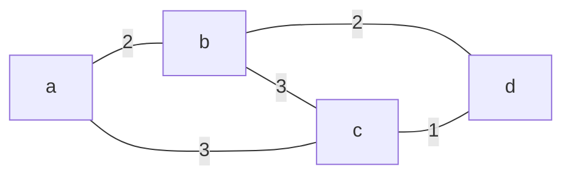
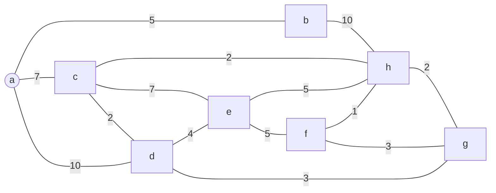
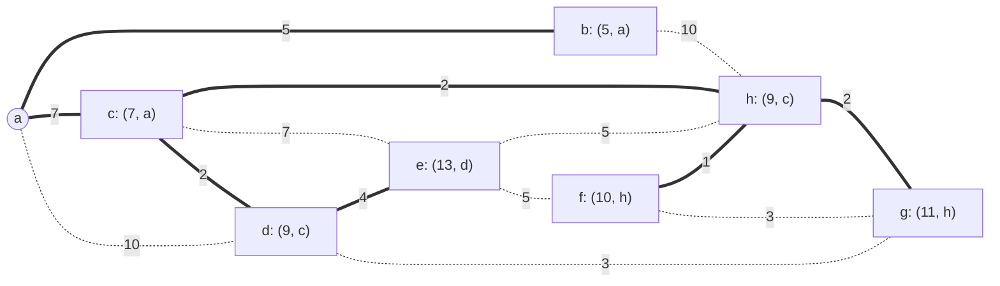

## Single-Source Shortest Paths
Consider a directed/undirected connected graph $G$:

* The edges are labelled by weight.

Given a particular vertex called the source:

* Find **shortest** paths from the **source** to all other vertices.

### Example
Undirected connected graph $G$:



#### Shortest Paths (Local Property)

* From $a$:
	
	```mermaid
	graph LR
	a((a)) ---|2| b
	a ---|3| c
	b ---|2| d
	```
* From $b$:

	```mermaid
	graph LR
	a ---|2| b
	b((b)) ---|3| c
	b ---|2| d
	```
* From $c$:

	```mermaid
	graph LR
	b ---|3| c
	a ---|3| c
	c((c)) ---|1| d
	```
* From $d$:

	```mermaid
	graph LR
	a ---|3| c
	b ---|2| d((d))
	c ---|1| d
	```

## Dijkstra's Algorithm

This algorithm assumes that the weight of edges are positive.
{:.warning}

The idea is to choose the edge adjacent to any chosen vertices such that the cost of the part to the source is minimum.

### Example
Suppose that $a$ is the source:



1. Every vertex keeps 2 labels, initially as $(\infty, -)$:
	1. The weight of the current shortest path from $a$.
	1. The vertex preceding $v$ on that path.
	
	```mermaid
	graph LR
	a((a)) ---|5| b["b: (∞, -)"]
	a ---|7| c["c: (∞, -)"]
	b ---|10| h["h: (∞, -)"]
	c ---|2| h
	c ---|7| e["e: (∞, -)"]
	e ---|5| h
	e ---|5| f["f: (∞, -)"]
	f ---|1| h
	c ---|2| d["d: (∞, -)"]
	a ---|10| d
	d ---|4| e
	f ---|3| g["g: (∞, -)"]
	d ---|3| g
	h ---|2| g
	```
1. Each round:
	1. A vertex is picked, neighbours' labels updated.
	1. Pick from **all un-chosen vertices** the one with smallest weight for the next round.
	
	```mermaid
	graph LR
	a((a)) ===|5| b["b: (5, a)"]
	a -.-|7| c["c: (7, a)"]
	b ---|10| h["h: (∞, -)"]
	c ---|2| h
	c ---|7| e["e: (∞, -)"]
	e ---|5| h
	e ---|5| f["f: (∞, -)"]
	f ---|1| h
	c ---|2| d["d: (10, a)"]
	a -.-|10| d
	d ---|4| e
	f ---|3| g["g: (∞, -)"]
	d ---|3| g
	h ---|2| g
	```
	
	Followed paths are shown as *dotted*.
	{:.info}
	
	$a\rightarrow b$ has the minimum weight so is chosen in **bold**.
	{:.info}
	
This continues until the following graph is reached:



You should record the history of label changes.
{:.warning}

In the case of a tie there is no difference. You may want to go alphabetically.
{:.info}

#### Table Presentation

| $b$ | $c$ | $d$ | $e$ | $f$ | $g$ | $h$ | Chosen |
| :-: | :-: | :-: | :-: | :-: | :-: | :-: | :-: |
| $(\infty,-)$ | $(\infty,-)$ | $(\infty,-)$ | $(\infty,-)$ | $(\infty,-)$ | $(\infty,-)$ | $(\infty,-)$ | $(\infty,-)$ |
| $(5,a)$ | $(7,a)$ | $(10,a)$ |  $(\infty,-)$ | $(\infty,-)$ | $(\infty,-)$ | $(\infty,-)$ | $(a,b)$ |
| | $(7,a)$ | $(10,a)$ |  $(\infty,-)$ | $(\infty,-)$ | $(\infty,-)$ | $(15,b)$ | $(a,c)$ |
| | | $(9,c)$ |  $(14,c)$ | $(\infty,-)$ | $(\infty,-)$ | $(9,c)$ | $(c,d)$ |
| | | |  $(13,d)$ | $(\infty,-)$ | $(12,d)$ | $(9,c)$ | $(c,h)$ |
| | | |  $(13,d)$ | $(10,h)$ | $(11,h)$ | | $(h,f)$ |
| | | |  $(13,d)$ | | $(11,h)$ | | $(h,g)$ |
| | | |  $(13,d)$ | | | | $(d,e)$ |

### Pseudo Code
Each vertex $v$ is labelled with two labels:

* A **numeric label** $d(v)$ indicates the length of the shortest path from the source to $v$ found so far.
* Another label $p(v)$ indicates the next-to-last vertex on such a path.
	* This is the vertex immediately preceding $v$ on that shortest path.

Given a graph $G=(V,E)$ and a source vertex $s$.

```
for every vertex v in the graph do
	set d(v) = ∞ and p(v) = null
set d(s) = 0 and V_t = Ø and E_t = Ø
while V \ V_t != Ø do	// there is still some vertex left
begin
	choose the vertex v in V \ V_t with minimum d(u)
	set V_t = V_t ∪ {u} and E_t = E_t ∪ {(p(u), u)}
	for every vertex v in V \ V_t that is a neighbour of u do
		if d(u) + w(u, v) < d(v) then	// a shorter path is found
			set d(v) = d(u) + w(u, v) and p(v) = v
end
```

$V_T$ and $E_T$ are the immediate sub-trees of $V$ and $V$ respectively.
{:.info}

#### Time Complexity
The time complexity is:

$$v+n(n+n)$$

This gives an overall big-o notation of:

$$O(n^2)$$