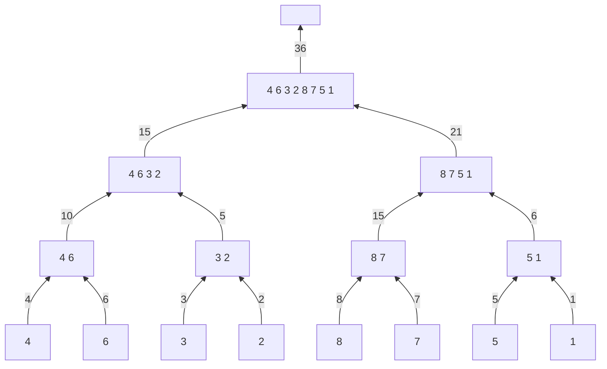

The idea of **divide and conquer** is to divide a problem into several **smaller** instances of ideally the same size.

* The smaller instances are solved, typically **recursively**.
* The solutions for the smaller instances are **combined** to get a solution to the large instance.

## Sum Example
Find the sum of all the numbers in an array. Suppose we have 8 numbers:

$$\{4,6,3,2,8,7,5,1\}$$

We can apply the following:



### Pseudo Code
For simplicity, assume that $n$ is a power of 2. We can then call the following algorithm by `RecSum(A, 1, n)`:

```
Algorithm RecSum(A[], p, q)
	if p == q then
		return A[p]	// this is the base case, there is one value
	else
	begin	// this is the iterative step
		sum1 = RecSum(A, p, (p+q-1)/2)	// this finds the two sides of the midpoint
		sum2 = RecSum(A, (p+q+1)/2, q)
		return sum1 + sum2
	end
```

## Minimum Example
This finds the minimum number in an array.

### Pseudo Code
For simplicity, assume that $n$ is a power of 2. We can call the following algorithm by `RecMin(A, 1, n)`:

```
Algorithm RecMin(A[], p, q)
	if p == q then
		return A[p]	// pointing to the same value
	else
	begin
		answer1 = RecMin(A, p, (p+q-1)/2)	// divide the array
		answer2 = RecMin(A, (p+q+1)/2, q)
		if answer2 <= answer2 then	// find minimum of returned values
			return answer1
		else
			return answer2
	end
```

## Time Complexity of Divide and Conquer
The time complexity is:

$$O(n)$$

This is as there are $n$ order 1 comparisons completed.
{:.info}