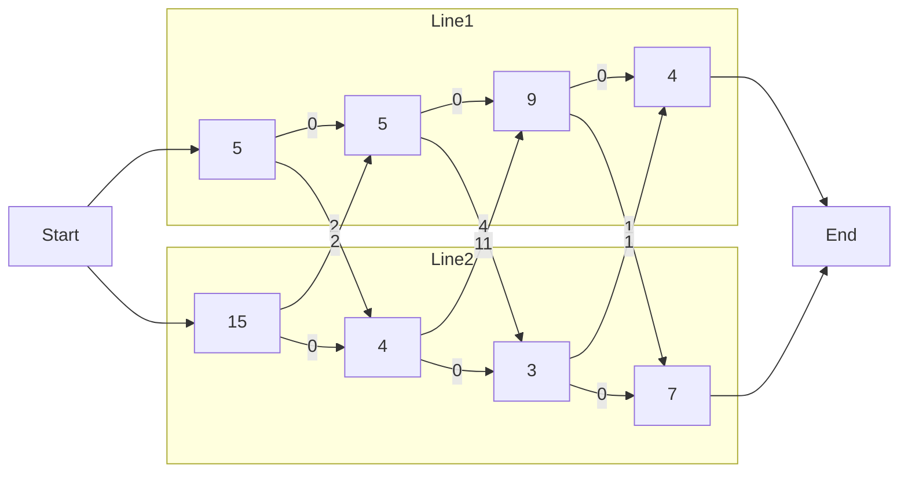

Consider the following assembly line:

* 2 assembly lines, each with $n$ stations ($S_{i,j}$: line $i$ station $j$).
* $S_{i,j}$ and $S_{2,j}$ perform the same task by time taken is different.
* $a_{i,j}$ - Assembly time at $S_{i,j}$.
	* On the node.
* $t_{i,j}$ - Transfer time from $S_{i,j}$.
	* On the arrow.



Determine which stations to go in **order** to while **minimising** the total time through the $n$ stations.

## Trees
You can represent all the possible paths in a tree structure:

* The nodes are labelled with the assembly time.
* The edges are labelled with the transfer time.

You can then minimise for time while removing branches from the tree.

## Dynamic Programming
To avoid populating the entire tree you can use a dynamic programming approach. This is because we don't need to try all the possible choices.

1. If we know that fastest way to get to $S_{1,n}$ and $S_{2,n}$.
	* The faster of these two is overall the fastest.
1. To find the fastest way to  $S_{1,n}$ we need to know the fastest way to $S_{1,n-1}$ and $S_{2,n-1}$.
1. Similarly for $S_{2,n}$.
1. Generalising, we want the fastest way to get though $S_{1,j}$ and $S_{2,j}$ for all $j$.

### Sub-Problems

* Given $j$, what is the fastest way to get to $S_{1,j}$?
* Given $j$, what is the fastest way to get to $S_{2,j}$?

Definitions:

* $f_1[j]$ - The fastest time to get to $S_{1,j}$.
* $f_2[j]$ - The fastest time to get to $S_{2,j}$.

The final solution is:

$$\min\\{f_1[n],f_2[n]\\}$$

#### Sub-Problem 1
Given $j$, what is the fastest way to get to $S_{1,j}$:

* The fastest way to $S_{1,j-1}$, then directly to $S_{1,j}$:
	
	$$f_1[j-1]+a_{1,j}$$
* The fastest way to $S_{2,j-1}$, a transfer from line 2 to line 1 then to $S_{1,j}$:
	
	$$f_2[j-1]+t_{2,j-1}+a_{1,j}$$
	
Therefore we want:

$$f_1[j]=\min\\{f_1[j-1]+a_{1,j}, f_2[j-1]+t_{2,j-1}+a_{1,j}\\}$$

Boundary case:

$$f_1[1]=a_{1,1}$$

#### Sub-Problem 2
Given $j$, what is the fastest way to get to $S_{2,j}$:

* The fastest way to $S_{1,j-1}$, a transfer from line 2 to line 1 then to $S_{2,j}$:
	
	$$f_1[j-1]+t_{1,j-1}+a_{2,j}$$
* The fastest way to $S_{2,j-1}$, then directly to $S_{2,j}$:
	
	$$f_2[j-1]+a_{2,j}$$
	
Therefore we want:

$$f_2[j]=\min\\{f_2[j-1]+a_{2,j}, f_1[j-1]+t_{1,j-1}+a_{2,j}\\}$$

Boundary case:

$$f_2[1]=a_{2,1}$$

### Example
For an example on two assembly lines view [slide 15 onwards]({{site.baseurl}}/assets/comp108/lectures/2021-05-06-1.pdf).

The summary is that you go from the beginning of the line to the end, keeping track of **both** sides, and choosing the **least cost** as you progress.
{:.info}

The expected table form would be like this:

| $j$ | $f_1[j]$ | $f_2[j]$ |
| :-: | :-: | :-: |
| 1 | 5 | 15 |
| 2 | 10 | 11 |
| 3 | 19 | 14 |
| 4 | 20 | 21 |

$f_1[j]$ and $f_2[j]$ are the shortest paths to each respective node.
{:.info}

### Pseudo Code

```
f1[1] = a11
f2[1] = a21
for j = 2 to n do
begin
	f1[j] = min{f1[j-1] + a1j, f2[j-1] + t2(j-1) + a1j}
	f2[j] = min{f2[j-1] + a2j, f1[j-1] + t1(j-1) + a2j}
end
f* = min{f1[n], f2[n]}
```

### Time Complexity
The time complexity is:

$$O(n)$$

as it loops through each node once and completes some $O(1)$ tasks.

For more assembly lines this time complexity is the same.
{:.info}