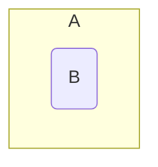

## Subsets
A set $B$ is called a subset of a set $A$ if every element of $B$ is an element of $A$. This is denoted by $B\subseteq A$.

### Examples
$$
\begin{aligned}
\{3,4,5\}&\subseteq\{1,5,4,2,1,3\}\\
\{3,3,5\}&\subseteq\{3,5\}\\
\{5,3\}&\subseteq\{3,5\}
\end{aligned}
$$



*Venn diagram of $B$ subset $A$.*

Therefore, $\forall$ sets $A$, $A\subseteq A$
{:.info}

Furthermore, $\emptyset\subseteq A$ is always true. This is as the empty set is always a subset of any other set including the empty set itself.

#### Subsets in Python
In programming languages such as python you can save on writing out a function to fund whether a set is a subset of another set. To do this you can use the `<` symbol in place of the $\subseteq$ symbol:

```python
print n<m
```

Where `n` and `m` are both sets.

### Subsets and Bit Vectors Example
Let $S=\langle1,2,3,4,5\rangle,A=\\{1,3,5\\}$ and $B=\\{3,4\\}$.

* Is $A\subseteq B$?

	$x_a=[1,0,1,0,1]$  
	$x_b=[0,0,1,1,0]$
	
	Therefore $A\nsubseteq B$. As you can see from the aligned bits. Not all the bits present in $x_b$ are present in $x_a$.

* Is the set $C$, represented by $[1,0,0,0,1]$, a subset  of the set $D$, represented by $[1,1,0,0,1]$?
	
	$C\subseteq D$ as all bits present in the bit vector of $C$ are also present in the bit vector of $D$.
	
## Equality
As covered before a set $A$ is called equal to a set $B$ if $A\subseteq B$ and $B\subseteq A$. This is denoted by $A=B$.

This is to say that if two sets are subsets of each other then they are equal.

### Confirming Equality
Let $S=\langle1,2,3,4,5\rangle,A=\\{1,3,5\\}$ and $B=\\{3,4\\}$.

#### Is $A=B$?
$x_a=[1,0,1,0,1]$  
$x_b=[0,0,1,1,0]$

Therefore $A\neq B$ as the bit vectors do not match.
