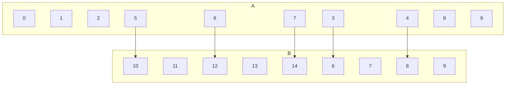

## Digraph Representation of Relations

Recall that a function &#92;(f&#92;) from a set &#92;(A&#92;) to a set &#92;(B&#92;) assigns exactly one element of &#92;(B&#92;) to each element of &#92;(A&#92;).

* Gives rise to the relation &#92;(R_f=&#92;{(a,b)\in A\times B \vert b =f(a)&#92;}&#92;)

If a relation &#92;(S\subseteq A\times B&#92;) is such that for every &#92;(a\in A&#92;) there exists at most one &#92;(b\in B&#92;) with &#92;((a,b)\in S&#92;), relation &#92;(S&#92;) is **functional**.

Sometimes in the literature, functions are introduces through functional relations.

### Example
&#92;(A&#92;{i\in \Bbb{N}\vert i<10&#92;},B=&#92;{i\in\Bbb{N}\vert 5<i<15&#92;},&#92;)&#92;(\ R=&#92;{((x,y)\in A\times B\vert y =2x)&#92;}&#92;)

As this is a relation there are allowed to be values in the set &#92;(A&#92;) which don't have a mapping to a value in the set &#92;(B&#92;). If this was a function and not a relation that wouldn't be allowed.
{:.info}

This is a functional relation as each item in  &#92;(A&#92;) only has **one** mapping to &#92;(B&#92;).
{:.info}
