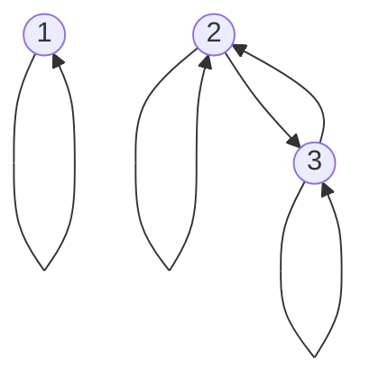
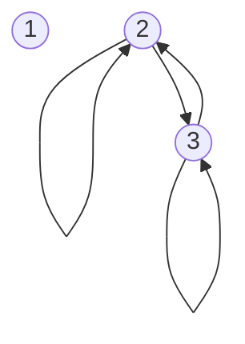
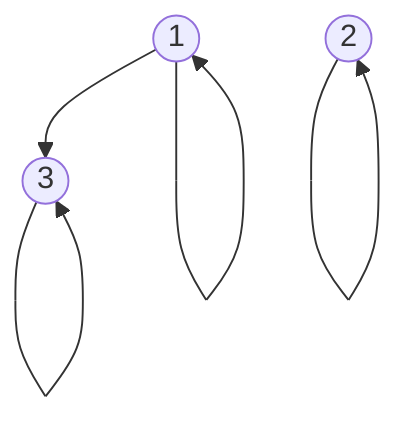
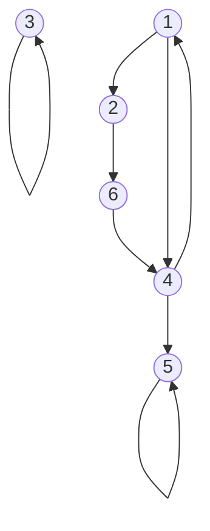

## Digraph Representation
In the directed graph representation, $R$ is:

* **Reflexive** if there is always an arrow from every vertex to itself.
* **Symmetric** if whenever there is an arrow from $x$ to $y$ there is also an arrow from $y$ to $x$.
* **Antisymmetric** if  whenever there is an arrow from $x$ to $y$ and $x\neq y$, then there is no arrow from $y$ to $x$.
* **Transitive** if whenever there is an arrow from $x$ to $y$ and from $y$ to $z$ there is also an arrow from $x$ to $z$.

### Example 1
Let $A=\{1,2,3\},\)\(R_1=\{(1,1),(2,2),(3,3),(2,3),(3,2)\}$

* Reflective $\forall x:xRx$
	* True
* Symmetric $\forall x,y: xRy\Rightarrow yRx$
	* True
		
	If two items, such as 1 and 2, are not connected they are not obligated to connect back. The lack of a connection doesn't break this property.
	{:.info}
* Antisymmetric $\forall x,y:xRy,yRx\Rightarrow x=y$
	* False
* Transitive $\forall x,y,z:xRy,yRz\Rightarrow xRz$
	* True

### Example 2
Let $A=\{1,2,3\},R_1=\{(2,2),(2,3),(3,2),(3,3)\}$

* Reflective $\forall x:xRx$
	* False
* Symmetric $\forall x,y: xRy\Rightarrow yRx$
	* True
* Antisymmetric $\forall x,y:xRy,yRx\Rightarrow x=y$
	* False
	
	If there are two nodes with a double arrow then this property is automatically broken.
	{:.info}
* Transitive $\forall x,y,z:xRy,yRz\Rightarrow xRz$
	* True
	
### Example 3
Let $A=\{1,2,3\},R_1=\{(1,1),(2,2),(3,3),(1,3)\}$

* Reflective $\forall x:xRx$
	* True
* Symmetric $\forall x,y: xRy\Rightarrow yRx$
	* False
* Antisymmetric $\forall x,y:xRy,yRx\Rightarrow x=y$
	* True
* Transitive $\forall x,y,z:xRy,yRz\Rightarrow xRz$
	* True
	
### Example 3
Let $A=\{1,2,3\},R_1=\{(1,3),(3,2),(2,3)\}$

* Reflective $\forall x:xRx$
	* False
* Symmetric $\forall x,y: xRy\Rightarrow yRx$
	* False
* Antisymmetric $\forall x,y:xRy,yRx\Rightarrow x=y$
	* False
* Transitive $\forall x,y,z:xRy,yRz\Rightarrow xRz$
	* False
	
### Example - Reachability
Consider some roads in a city. Some may be private and not link up, some may be one way, some may have no stopping. This is represented on the following graph:

Say you start at `1` and end at `5` are you able to make this path?

If there was a transitive relation from the source to the destination then you would be able to get there in one hop.

This will be continued in the next lecture.