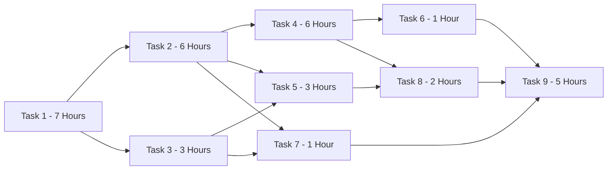
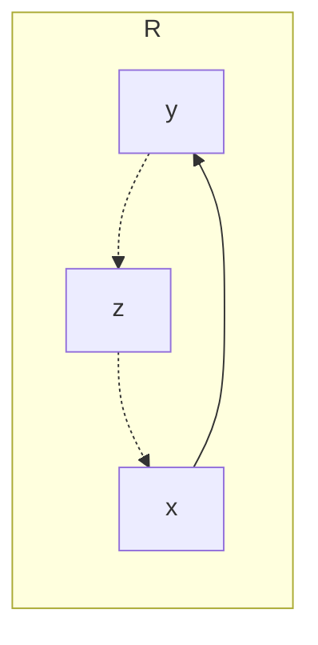
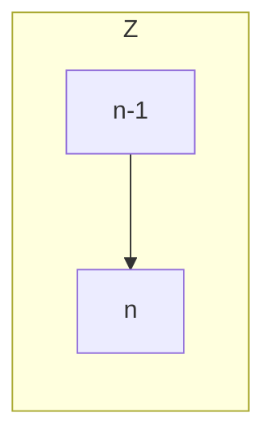
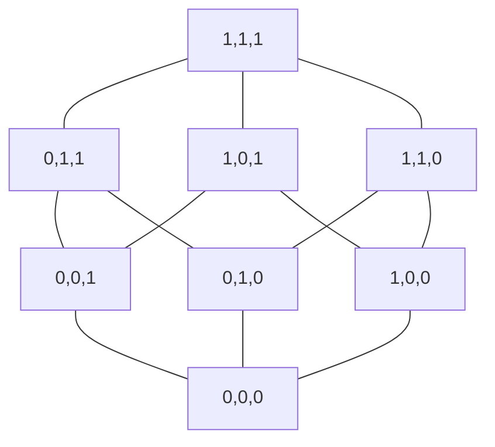

## Partial Orders
A binary relation &#92;(R&#92;) on set &#92;(A&#92;) which is reflexive, transitive and antisymmetric is called  a partial order.

Partial orders are important in situations where we wish to characterise precedence.

### Examples
* The relation &#92;(\leq&#92;) on the set of &#92;(\Bbb{R}&#92;) of real numbers.
* The relation &#92;(\subseteq&#92;) on &#92;(\text{Pow}(A)&#92;).
* "Is a divisor of" on the set &#92;(\Bbb{Z^+}&#92;) of positive integers.

### Example - Job Scheduling

| Task | Immediate Dependencies |
| :-: | :-: |
| 1 |  |
| 2 | 1 |
| 3 | 1 |
| 4 | 2 | 
| 5 | 2, 3 |
| 6 | 4 |
| 7 | 2, 3 |
| 8 | 4, 5 |
| 9 | 6, 7, 8 |

### Predecessors in Partial Orders
if &#92;(R&#92;) is a partial order on a set &#92;(A&#92;) and &#92;(xRy, x\neq y&#92;) we call &#92;(x&#92;) a **predecessor** of &#92;(y&#92;).

If &#92;(x&#92;) is a predecessor of &#92;(y&#92;) and there is no &#92;(z\in&#92;{x,y&#92;}&#92;) for which &#92;(xRy&#92;) and &#92;(zRy&#92;), we call &#92;(x&#92;) and **immeditate predecessor** of &#92;(y&#92;).

In this graph if you can see no &#92;(z&#92;) in-between &#92;(x&#92;) and &#92;(y&#92;) then &#92;(y&#92;) is an immediate predecessor of &#92;(x&#92;).
{:.info}

#### Integer Example
For the function &#92;(\leq&#92;) on the set &#92;(\Bbb{Z}&#92;) the immediate predecessor of a number &#92;(n&#92;) is &#92;(n-1&#92;).

#### Hasse Diagram
The Hasse Diagram of a partial order is a digraph. The vertices of the digraph are the elements of the partial order, and the edges of the digraph are given by the "immediate predecessor" relation.

This is an example for the bit vector representation of a set containing 3 elements. Each relation is a subset relation:

It is typical to assume that the arrow pointing upwards.
{:.info}

This diagram notation saves us from having to draw all the reflexive links and also all of the dependency links by just drawing the **immediate dependency**.

## Total Orders
A binary relation &#92;(R&#92;) on a set &#92;(A&#92;) is a total order if it is a partial order such that any &#92;(x,y\in A,xRy&#92;) or &#92;(yRx&#92;).

This means that for any relation you can always compare them.
{:.info}

The Hasse diagram of a total order is a chain.

This means that there are no splits as splits mean that they aren't comparable.
{:.info}

### Examples
* The relation &#92;(\leq&#92;) on the set &#92;(\Bbb{R}&#92;) of real numbers.
* The usual lexicographical ordering on words in a dictionary.
* The relation "is a divisor of" is **not** a total order.
