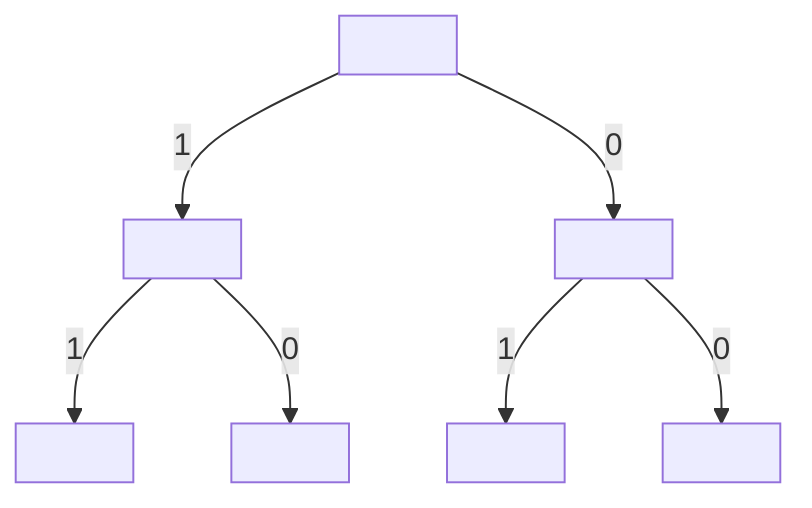

## Developing Ideas
### Chairs
All the chairs in a room are labelled with a single digit followed by a lower-case letter. What is the largest number of differently numbered chairs?

Generally, to do this you would multiply the base of each digit together.

### Bits
How many different bit strings of length 8 are there?

You can model this as a binary search tree of length 8 as each bit can either be zero of one.

You can see that the the number of options are given by the base:

$$2\times 2\times 2\times 2\times 2\times 2\times 2\times 2=2^8$$

You can visualise this as the number of options doubling at each branch.
{:.info}

### Students
How many was are there to select 3 students for a prospectus photo (order matters) from a group of 5?

You can view this as having 5 possibilities to fill position one, four for position two, and 3 for position three.

By using the same tree philosophy from the last algorithm you can work this out by doing $5\times 4\times 3$.

## The Product Rule
If there is a sequence of $k$ events with $n_1,\ldots,n_k$ possible outcomes, then the total number of outcomes for the sequence of $k$ events is:

$$n_1\times n_2\times\ldots\times n_k$$

### Example 1
How many distinct car licence plates are there consisting of six character, the first three of which are letters and the last three of which are digits?

From this you would calculate:

$$26\times26\times26\times10\times10\times10$$

### Example 2
How many ways are there to select a male and female student for a prospectus photograph (order matters) from a group of 2 male and 3 female students?

For this example you could start with the female on the left or the right. This will result in $3\times2$ and $2\times3$. You would then add these together to get:

$$2\times2\times3$$

This is an example of two disjoint events.
{:.info}

## Disjoint Events
Two events are said to be disjoint (or mutually exclusive) if they can't occur simultaneously.

If you have 3 pair of blue jeans and 2 pairs of black jeans, then there are $3+2=5$ different pairs of jeans for you to wear.

### The Sum Rule
If $A$ and $B$ are disjoint events and there are $n_1$ possible outcomes for event $A$ and $n_2$ possible outcomes for event $B$ then there are $n_1+n_2$ possible outcomes for the event either $A$ or $B$.

#### Examples
1. How many three-digit numbers begin with 3 or 4.

	Here you can separate the events as numbers beginning with 3 or 4. From this you would get:

	$$10\times10+10\times10$$

	Or you could say that the first value could take two values (3 or 4) giving:

	$$2\times10\times10$$
1. I wish to take two pieces of fruit with me for lunch. I have three banana, four apples and two pears. How many ways can I select two pieces fo fruit of different type? (order doesn't matter)
	
	From this you can generate three disjoint groups:
	
	* Apple, Banana
	* Apple, Pear
	* Banana, Pear
	
	In each of these groups you have a number of fruits:
	
	* Apple, Banana $=4\times3$
	* Apple, Pear $=4\times2$
	* Banana, Pear $=3\times2$
	
	This would then give:
	
	$$12 + 8 + 6 = 26$$
	
## Set-Theoretic Interpretation
If $A$ and $B$ are disjoint sets (that is, $A\cap B=\emptyset$) then $\vert A\cup B\vert=\vert A\vert+\vert B\vert$.

Any sequence of $k$ events can be regarded as an element of the Cartesian product $A_1\times\ldots\times A_k$. This set has size $\vert A_1\vert\times\ldots\times\vert A_k\vert$.

### Examples
1. A computer password is a sting of 8 characters, where each character is an uppercase letter or a digit. Each password must contain at least one digit. How many different passwords are there?

	For this we first consider the number of passwords, ignoring the at least one digit constraint. Then we can consider the passwords that are not allowed and subtract them from this set.

	The cardinality of each character in the good and bad set would be 36. This would give $36^8$ total passwords.

	The cardinality of the passwords in the bad set would be $26^8$. This is the set of passwords containing only letters.

	This would give a total of:

	$$36^8-26^8$$
1. How many different 8 character passwords can be obtained by combining a 3 letter word, a 4 letter word and a digit. There are 1015 3 letter and 4030 4 letter words.

	Here you have 3 elements with cardinality $\{1015,4030,10\}$ that could be in 6 permutations. From this you would calculate:

	$$1015\times4030\times10\times6$$

	This is significantly smaller than the last example.

## The Subtraction Rule
If there are $n_1$ possible outcomes of event $A$, $n_2$ possible outcomes for event $B$ and $n_3$ of these outcomes are shared between $A$ and $B$ then there are:

$$n_1+n_2-n_3$$

possible outcomes for the event $A$ OR $B$.

### Example
How many bit strings of length 8 start with 1 or finish with 00?

Here you are completing a logical OR. You add the two combinations together and subtract the intersect.

$$2^7+2^6-2^5$$

## The Division Rule
Given $n$ possible outcomes if:

* Some of the $n$ outcomes are the same.
* Every group of indistinguishable outcomes contains exactly $d$ elements.

There are $\frac{n}{d}$ different outcomes.
### Example
How many ways are there to select 2 representatives from a group of 5 students?

By taking into account ordering you would count every pair twice. Here what we really want is a distinct subset of two students.

## Summary
The four decomposition rules are:

* The product rule
* The sum rule
* The subtraction rule
	* For the set difference.
* The division rule
	* For indistinguishable outcomes.