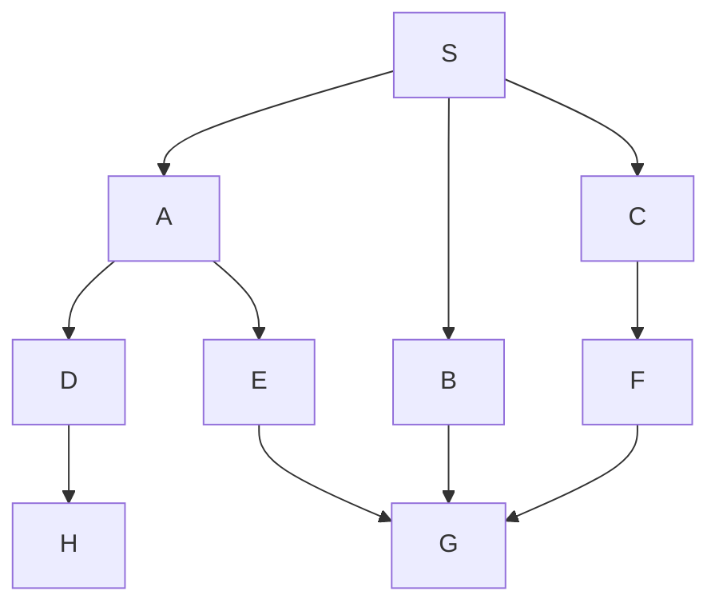

Depth first always selects the longest path from the frontier as opposed to the shortest path. From the perspective of the frontier you are expanding the path that was most recently added as opposed to the oldest path in the frontier.

## Change to Pseudo-code

```
7:	select and remove from frontier the path s_o...s_k that was
8: 	last added to frontier
```

As a result a stack should be used instead of a queue such that the last into the data structure is the first out.

## Example


*Example Graph.*

| Expansion Paths | Frontier |
| --- | --- |
| | S |
| | SA, SB, SC|
| SA is not goal | SB, SC, SAD, SAE |
| SAD is not goal | SB, SC, SAE, SADH |
| SADH is not goal | SB, SC, SAE |
| SAE is not goal | SB, SC, SAEG |
| SAEG is goal | SB, SC |

This additionally illustrates that depth first doesn't always find the shortest path as the longest paths are searched first. 

Breadth first however always finds the shortest path.
