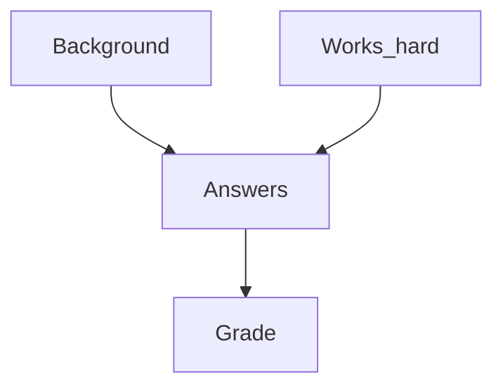
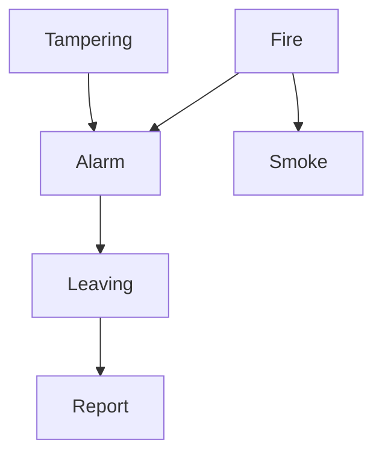

## Joint Probability Distribution
We want to know the joint probability distribution from: 

$$\mathbf{P}(F\vert \text{parents}(F))$$

Given a Belief Network, we can always assume an ordering:

$$F_1,\ldots,F_n$$

of its random variables such that for all $i,j$:

$$F_i\rightarrow F_j \text{ implies } i<j$$

Using the examples we can order the random variables as follows:

1. The student exam domain:
    
    ```mermaid
    graph TD
    Background --> Answers
    w[Works_hard] --> Answers
    Answers --> Grade
    ```

    $\text{Background, Works\_hard, Answers, Grade}$
1. The fire alarm domain:

    ```mermaid
    graph TD
    Tampering --> Alarm
    Fire --> Alarm
    Fire --> Smoke
    Alarm --> Leaving
    Leaving --> Report
    ```

    $\text{Tampering, Fire, Alarm, Smoke, Leaving,}$ $\text{Report}$
    
    In these examples we can see that there are no return/backward dependencies from items in the right of the list to items in the left of the list.
    {:.info}
    
According to the chain rule, given $F_1,\ldots,F_n$ we have for all $r_1,\ldots r_n$:

$$
\begin{aligned}
& P(F_1=r_1,\ldots,F_n=r_n)=\\
& P(F_1=r_1)\times\\
& P(F_2=r_2\vert F_1=r_1)\times\\
& P(F_3=r_3\vert F_1=r_1,F_2=r_2)\times\\
& \cdots\\
& P(F_n=r_n\vert F_1=r_1,\ldots,F_{n-1}=r_{n-1})
\end{aligned}
$$

Using bold $\mathbf{P}$ notation this reads:

$$
\begin{aligned}
\mathbf{P}(F_1,\ldots,F_n)=&\mathbf{P}(F_1)\times\\
& \mathbf{P}(F_2\vert F_1)\times\\
& \mathbf{P}(F_3\vert F_1,F_2)\times\\
& \cdots\\
& \mathbf{P}(F_n\vert F_1,\ldots,F_{n-1})
\end{aligned}
$$

This also means that $F_1$ must have no parents as it is first in the list. This further means that if there are cycles they must start without a parent.
{:.info}

As parents $(F_i)\subseteq\\{F_1,\ldots,F_{i-1}\\}$ conditional independence implies:

$$\mathbf{P}(F_i\vert F_1,\ldots F_{i-1})=\mathbf{P}(F_i\vert\text{parents}(F_i))$$

This is to say that only the parent of the values of $F_i$ are required in order to calculate the probability of $F_i$ given it's parents.

This means that we can rewrite the equation before as:

$$
\begin{aligned}
\mathbf{P}(F_1,\ldots,F_n)=&\mathbf{P}(F_1)\times\\
& \mathbf{P}(F_2\vert \text{parents}(F_2))\times\\
& \mathbf{P}(F_3\vert \text{parents}(F_3))\times\\
& \cdots\\
& \mathbf{P}(F_n\vert \text{parents}(F_n))
\end{aligned}
$$

### Example - Student Exam Domain



This graph gives the full joint probability distribution of:

$$\mathbf{P}(\text{Background, Works\_hard, Answers, Grade})$$

This can then be computed with:

$$
\begin{aligned}
&\mathbf{P}(\text{Background})\times\\
& \mathbf{P}(\text{Works\_hard})\times\\
& \mathbf{P}(\text{Answers}\vert \text{Background, Works\_hard})\times\\
& \mathbf{P}(\text{Grade}\vert \text{Answers})
\end{aligned}
$$

This method gives significantly less entries than calculating using a full joint probability table. E.g. in the fire alarm example we go from $2^6-1$ entries to 12 by using conditional probabilities.
{:.info}

### Example - Fire Alarm Domain



In this set we are using the following abbreviations:

* $P(A\vert B)=P(A=1\vert B=1)$
* $P(\neg A \vert B ) = P(A=0\vert B=1)$
* and so on.

Assume the following (conditional) probabilities:

* $P(\text{Tampering})=0.02$
* $P(\text{Fire})=0.01$
* $P(\text{Smoke} \vert \text{Fire})=0.9$
* $P(\text{Smoke} \vert \neg\text{Fire})=0.01$
* $P(\text{Alarm} \vert \text{Fire}\wedge\text{Tampering})=0.5$
* $P(\text{Alarm} \vert \text{Fire}\wedge\neg\text{Tampering})=0.99$
* $P(\text{Alarm} \vert \neg\text{Fire}\wedge\text{Tampering})=0.85$
* $P(\text{Alarm} \vert \neg\text{Fire}\wedge\neg\text{Tampering})=0.0001$
* $P(\text{Leaving} \vert \text{Alarm})=0.88$
* $P(\text{Leaving} \vert \neg\text{Alarm})=0.001$
* $P(\text{Report} \vert \text{Leaving})=0.75$
* $P(\text{Report} \vert \neg\text{Leaving})=0.01$

#### Querying
If a report is observed, then the probability of fire and tampering go up:

* $P(\text{Fire})=0.01$ and $P(\text{Fire}\vert\text{Report})=0.2305$
* $P(\text{Tampering})=0.02$ and $P(\text{Tampering}\vert\text{Report})=0.399$

If, in addition, Smoke is observed, then probability of Fire goes up further but Tampering goes down:

* $P(\text{Fire}\vert \text{Report}\wedge\text{Smoke})=0.964$
    
    If you have two independent sources of information related to a subject in conjunction then you can expect the probability to increase dramatically.
    {:.info}
* $P(\text{Tampering}\vert \text{Report}\wedge\text{Smoke})=0.0284$

If, however, $\neg$Smoke is observed, then the probability of Fire goes down:

* $P(\text{Fire}\vert \text{Report}\wedge\neg\text{Smoke})=0.0294$
* $P(\text{Tampering}\vert \text{Report}\wedge\neg\text{Smoke})=0.501$

We can see from this that independent sources of evidence to make decisions are crucial.
{:.info}

For worked examples on querying see [these videos](https://liverpool.instructure.com/courses/17569/pages/additional-videos-on-querying-the-alarm-system-belief-network?module_item_id=317996).
{:.info}

### Summary
* Belief network are representations of **conditional independence** in probabilistic models.
* Querying can often be done using exact inference.
* Sometimes exact inference is too hard. There are also approximate algorithms.
* Lots of research on **learning** belief networks from data. Either learning the conditional probabilities or even the structure of a belief network.
