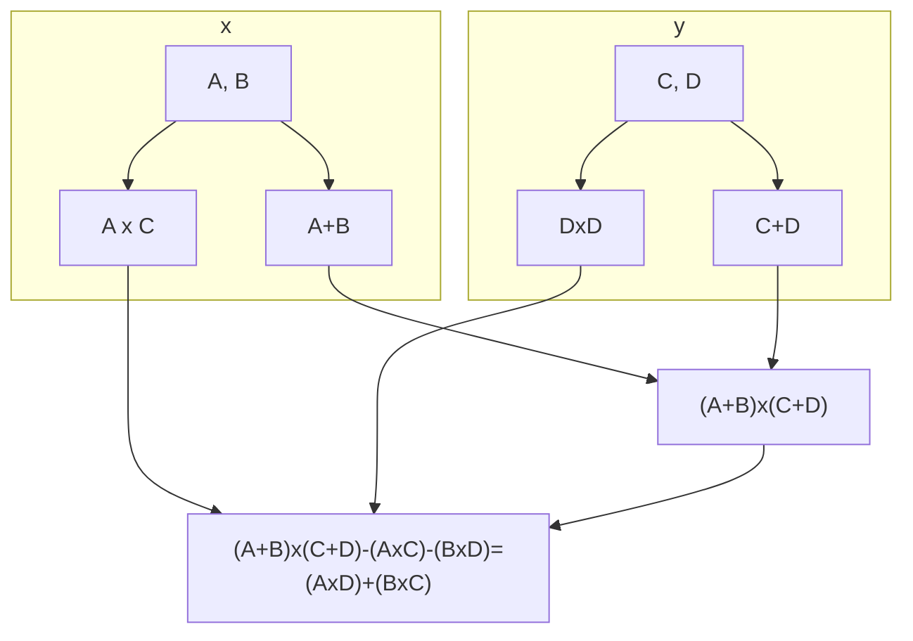

The Fourier transform is an operation that maps between K&#92;(n&#92;)-vectors of complex values and &#92;(n&#92;)-vectors of complex values:

&#92;[F:C^n\leftrightarrow C^n&#92;]

The &#92;(\leftrightarrow&#92;) indicates that this is a two-way process.
{:.info}

This transformation is very useful for reducing noise and distortion in signal processing. 

It is also useful for a method of integer multiplication called the Schönhage-Strassen method.

## Formal Definition
Given a complex vector:

&#92;[\vec x= \langle x_0,x_1,\ldots,x&#95;&#123;n-1}\rangle\in C^n&#92;] 

This should be indexed from 0.
{:.info}

The set &#92;(C^n&#92;) is a **complex &#92;(\mathbf n&#92;)-vector**.
{:.info}

The Fourier transform, &#92;(F(x)&#92;) is:

&#92;[\vec y = \langle y_0,y_1,\ldots,y&#95;&#123;n-1}\rangle \in C^n&#92;]

The components of the previous vector are defined by the following equation:

&#92;[y_t=\sum^{n-1}&#95;&#123;k=0}x_ke^{\frac{-2\pi itk}{n}}&#92;]

By writing &#92;(\omega_k \equiv e^{\frac{-2\pi ik}{n}}&#92;) we can now rewrite this equation as:

&#92;[y_t=\sum^{n-1}&#95;&#123;k=0}x_k\omega_k^t&#92;]

## Important Aspects 
* The object &#92;(\omega_k&#92;) is a **primitive &#92;(n^{th}&#92;) root of unity**:

	&#92;[\omega_k^n=1&#92;]

	This is to say if we take &#92;(\omega_k&#92;) and raise it to the power &#92;(n&#92;) then we get the output one.
	{:.info}
* We can describe the computation as a **matrix-vector product**:

	&#92;[
	\begin{pmatrix}
	y_0&#92;&#92;y_1&#92;&#92;\vdots&#92;&#92;y&#95;&#123;n-1}
	\end{pmatrix} = \begin{pmatrix}
	(\omega_0)^0 & (\omega_1)^0 & \cdots & (\omega&#95;&#123;n-1})^0&#92;&#92;
	(\omega_0)^1 & (\omega_1)^1 & \ddots & (\omega&#95;&#123;n-1})^1&#92;&#92;
	\vdots & \vdots & \ddots & \vdots&#92;&#92;
	(\omega_0)^{n-1} & (\omega_1)^{n-1} & \cdots & (\omega&#95;&#123;n-1})^{n-1}
	\end{pmatrix} \begin{pmatrix}
	x_0&#92;&#92;x_1&#92;&#92;\vdots&#92;&#92;x&#95;&#123;n-1}
	\end{pmatrix}
	&#92;]

	* The shorthand for this is:
	
		&#92;[\vec y= \mathbf M_F\vec x&#92;]
		
## Useful Properties

* It is easily invertible.

	Given &#92;(\vec y\in C^n&#92;) we can find &#92;(\vec x \in C^n&#92;) with &#92;(\vec y = F(\vec x)&#92;) by computing:
	
	&#92;[\vec x = \frac{F(\vec y)}{n}&#92;]
* It is a **linear transformation** therefore:

	&#92;[F(\alpha\vec x + \vec y) = \alpha F(\vec x) + F(\vec y)&#92;]
* It has a **convolution property**. 

	This was not explained. This is the reason that we can complete fast multiplication.

## Fast Multiplication
Traditional methods to multiply two &#92;(n&#92;) digit numbers, &#92;(X&#92;) and &#92;(Y&#92;), take each of the digits in &#92;(X&#92;) and multiply each of the digits in &#92;(Y&#92;).

This involves about &#92;(n^2&#92;) basic operations.

### Karatsuba's Algorithm

&#92;(A&#92;) and &#92;(B&#92;) are two equal length parts of the number &#92;(X&#92;). The same is done for &#92;(Y&#92;).
{:.info}

This is equivalent to:

&#92;[
\begin{aligned}
X\times Y&=(A\times10^m+B)(C\times10^m+D)&#92;&#92;
&=(A\times C)\times 10^{2m}+(A\times D+B\times C)\times10^m+(B\times D)
\end{aligned}
&#92;]

This method only uses three recursive calls and computes:

&#92;[A\times C;B\times D;(A+B)(C+D)&#92;]

The term &#92;(A\times D+B\times C&#92;) needed is then just:

&#92;[(A+B)(C+D)-A\times C-B\times D&#92;]

The extra addition saves one call and the algorithm only needs &#92;(~n^{1.59}&#92;) basic operations. This is much less than &#92;(n^2&#92;)

This method splits into two and exchanges multiplications for additions. By splitting more times then the additions add up and the effectiveness is reduced.
{:.info}

### Schönhage-Strassen Algorithm
This method divides a &#92;(n&#92;)-digit numbers into roughly &#92;(\sqrt n&#92;) parts each having &#92;(\sqrt n&#92;) digits.

The convolution property allows the multiplication to be done quickly via the Fourier transform in &#92;(~n\log n&#92;) steps.

## Summary

* The Fourier transform provides a powerful range of methods of importance in **electronics** and **signal** processing.
* Its basis is in the complex analysis notion of **primitive root**.
* In **computer science** one of the most significant applications was in its use to develop **fast algorithms** for **multiplication**.
* Other uses include **image compression**.
* Fast algorithms to **compute** the Fourier transform have also been developed.
