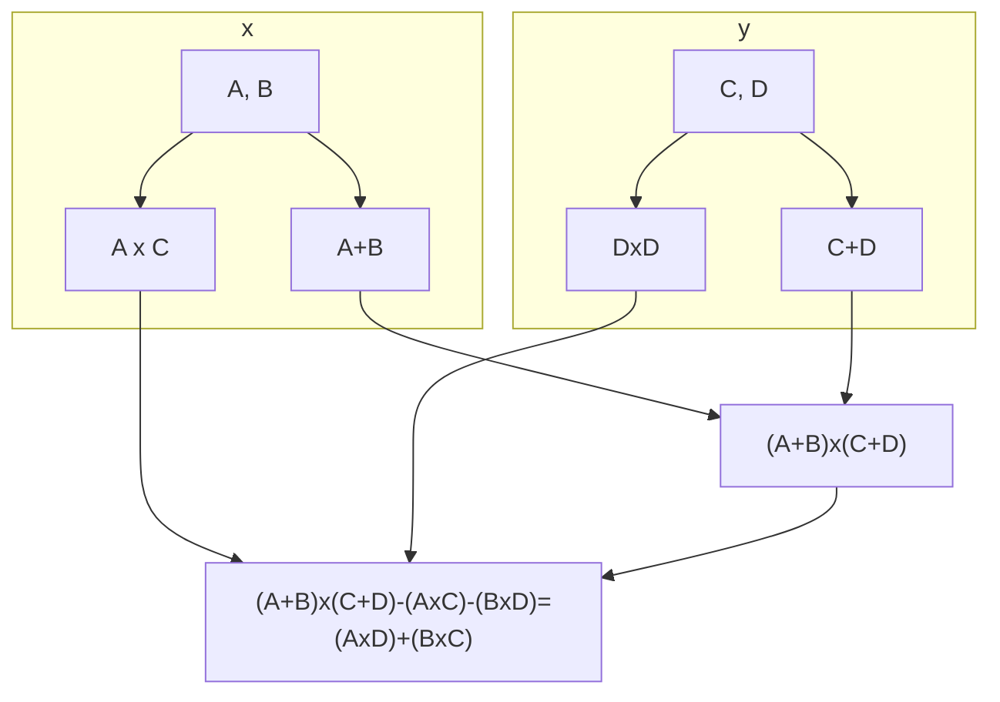

The Fourier transform is an operation that maps between K$n$-vectors of complex values and $n$-vectors of complex values:

$$F:C^n\leftrightarrow C^n$$

The $\leftrightarrow$ indicates that this is a two-way process.
{:.info}

This transformation is very useful for reducing noise and distortion in signal processing. 

It is also useful for a method of integer multiplication called the Schönhage-Strassen method.

## Formal Definition
Given a complex vector:

$$\vec x= \langle x_0,x_1,\ldots,x_{n-1}\rangle\in C^n$$ 

This should be indexed from 0.
{:.info}

The set $C^n$ is a **complex $\mathbf n$-vector**.
{:.info}

The Fourier transform, $F(x)$ is:

$$\vec y = \langle y_0,y_1,\ldots,y_{n-1}\rangle \in C^n$$

The components of the previous vector are defined by the following equation:

$$y_t=\sum^{n-1}_{k=0}x_ke^{\frac{-2\pi itk}{n}}$$

By writing $\omega_k \equiv e^{\frac{-2\pi ik}{n}}$ we can now rewrite this equation as:

$$y_t=\sum^{n-1}_{k=0}x_k\omega_k^t$$

## Important Aspects 
* The object $\omega_k$ is a **primitive $n^{th}$ root of unity**:

	$$\omega_k^n=1$$

	This is to say if we take $\omega_k$ and raise it to the power $n$ then we get the output one.
	{:.info}
* We can describe the computation as a **matrix-vector product**:

	$$
	\begin{pmatrix}
	y_0\\y_1\\\vdots\\y_{n-1}
	\end{pmatrix} = \begin{pmatrix}
	(\omega_0)^0 & (\omega_1)^0 & \cdots & (\omega_{n-1})^0\\
	(\omega_0)^1 & (\omega_1)^1 & \ddots & (\omega_{n-1})^1\\
	\vdots & \vdots & \ddots & \vdots\\
	(\omega_0)^{n-1} & (\omega_1)^{n-1} & \cdots & (\omega_{n-1})^{n-1}
	\end{pmatrix} \begin{pmatrix}
	x_0\\x_1\\\vdots\\x_{n-1}
	\end{pmatrix}
	$$

	* The shorthand for this is:
	
		$$\vec y= \mathbf M_F\vec x$$
		
## Useful Properties

* It is easily invertible.

	Given $\vec y\in C^n$ we can find $\vec x \in C^n$ with $\vec y = F(\vec x)$ by computing:
	
	$$\vec x = \frac{F(\vec y)}{n}$$
* It is a **linear transformation** therefore:

	$$F(\alpha\vec x + \vec y) = \alpha F(\vec x) + F(\vec y)$$
* It has a **convolution property**. 

	This was not explained. This is the reason that we can complete fast multiplication.

## Fast Multiplication
Traditional methods to multiply two $n$ digit numbers, $X$ and $Y$, take each of the digits in $X$ and multiply each of the digits in $Y$.

This involves about $n^2$ basic operations.

### Karatsuba's Algorithm

$A$ and $B$ are two equal length parts of the number $X$. The same is done for $Y$.
{:.info}

This is equivalent to:

$$
\begin{aligned}
X\times Y&=(A\times10^m+B)(C\times10^m+D)\\
&=(A\times C)\times 10^{2m}+(A\times D+B\times C)\times10^m+(B\times D)
\end{aligned}
$$

This method only uses three recursive calls and computes:

$$A\times C;B\times D;(A+B)(C+D)$$

The term $A\times D+B\times C$ needed is then just:

$$(A+B)(C+D)-A\times C-B\times D$$

The extra addition saves one call and the algorithm only needs $~n^{1.59}$ basic operations. This is much less than $n^2$

This method splits into two and exchanges multiplications for additions. By splitting more times then the additions add up and the effectiveness is reduced.
{:.info}

### Schönhage-Strassen Algorithm
This method divides a $n$-digit numbers into roughly $\sqrt n$ parts each having $\sqrt n$ digits.

The convolution property allows the multiplication to be done quickly via the Fourier transform in $~n\log n$ steps.

## Summary

* The Fourier transform provides a powerful range of methods of importance in **electronics** and **signal** processing.
* Its basis is in the complex analysis notion of **primitive root**.
* In **computer science** one of the most significant applications was in its use to develop **fast algorithms** for **multiplication**.
* Other uses include **image compression**.
* Fast algorithms to **compute** the Fourier transform have also been developed.