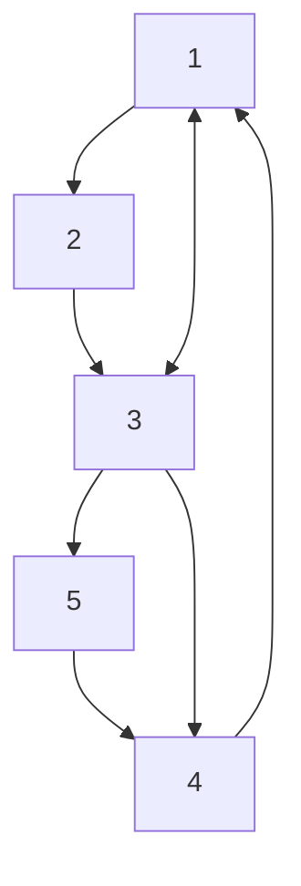
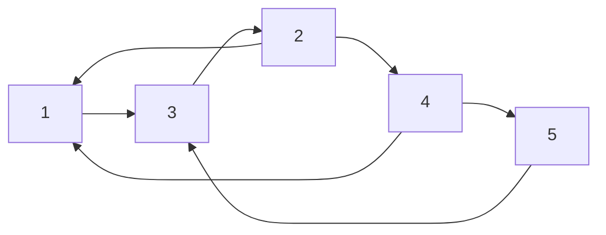

Consider that web-pages form a directed graph. There is a directed edge from one node to another if that page links to it.

We should order these nodes such that the most important is at the top.

* If a node is pointed to by a lot of other pages then it is more important.
* You can also score the sources that point to certain pages.

## Modelling this with Matrices
Consider the following variables:

* Set of pages (graph nodes):
	* $\\{p_1,p_2,\ldots,p_n\\}$
* Set of links (graph edges):
	* $\\{\langle p_i,p_j\rangle\\}:p_i\text{ links to }p_j$
* The score for page $p_k$ that we want to compute:
	* $r_k$
* The number of links out of page $p_i$:
	* $r_i$

The score is defined by the following equation:

$$r_k=\sum_{\langle p_i,p_k\rangle}\frac{r_i}{t_i}$$

This is the sum over the pages that link to $p_k$.
{:.info}

$t_i$ is the total number of links from $p_i$ (the source page).
{:.info}

### Conditions
The score vector $\vec r=\langle r_1,r_2,\ldots,r_n\rangle$ must satisfy:

$$W\cdot \vec r^T=\vec r^T$$

where $W$ is the $n\times n$ matrix with:

$$
w_{ij}=
\begin{cases}
0 & \text{if }\langle p_j,p_i\rangle\notin\text{ link}\\
\frac1{t_j} & \text{if }\langle p_j,p_i\rangle\in\text{ link}
\end{cases}
$$

### Bad Lecture Example
Consider the following set of pages:

This gives the following weight matrix:

$$
W=
\begin{pmatrix}
0 & 0 & \frac 1 3 & 1 & 0\\
\frac 1 2 & 0 & 0 & 0 & 0\\
\frac 1 2 & 1 & 0 & 0 & 0\\
0 & 0 & \frac 1 3 & 0 & 1\\
0 & 0 & \frac 1 3 & 0 & 0\\
\end{pmatrix}
$$

All of the columns add to 1. This means that it is **column stochastic** and there is guaranteed to be an eigenvalue of 1.
{:.info}

#### Connection with Spectra
We are looking for a score vector that satisfies $W\cdot\vec r^T=\vec r^T$. 

* This means that the score vector is an eigenvector of $W$ for an eigenvalue of 1.

It can be shown that 1 is always an eigenvalue of **column stochastic** matrices.
{:.info}

For suitable graphs this eigenvalue is dominant.

* This means that the score vector is **unique**.

### Bad Lecture Example Continued
For our five page example we get the following score vector:

$$\vec r = \langle 1, \frac 1 2, 1, \frac 2 3, \frac 1 3\rangle$$

This means that pages 1 and 3 are the highest ranked.
{:.info}

## Issues with this Model

* A web page that has no outgoing links is called an **dangling page**.
	* These require some adjustments to be made as it makes the matrix **not** column stochastic.
* A page could also manipulate outcomes by altering the link structures.

## Example Question
### Weighting Matrix
Consider the following graph representing webpage links:

Define the **weighting matrix** for the previous graph:

1. First we form the 5 vector that represents the number of edges **leaving** a node:
	
	$$\vec t =\langle1,2,1,2,1\rangle$$
1. Using the following cases construct the weighting matrix:

	$$
	w_{ij}=
	\begin{cases}
	0 & \text{if }\langle p_j,p_i\rangle\notin\text{ link}\\
	\frac1{t_j} & \text{if }\langle p_j,p_i\rangle\in\text{ link}
	\end{cases}
	$$
	
	This states that if there is a link in the previous $n$-vector that the you should but $\frac 1 {t_j}$ in the matrix:
	
	$$
	W=
	\begin{pmatrix}
	0 & \frac 1 2 & 0 & \frac 1 2 & 0\\
	0 & 0 & 1 & 0 & 0\\
	1 & 0 & 0 & 0 & 1\\
	0 & \frac 1 2 & 0 & 0 & 0\\
	0 & 0 & 0 & \frac 1 2 & 0\\
	\end{pmatrix}
	$$
	
	The rows represent the source and columns are the sink.
	{:.info}
	
	As before, as this matrix is column stochastic, 1 is an eigenvalue of this matrix.
	{:.info}

### Ranking Vector
WTF why don't you ever explain how to do this!!!!!!!
{:.error}