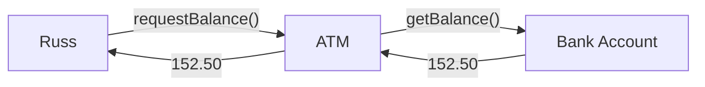

An object represents a specific, identifiable part of the world-model:

* It incorporates (passive) attributes.
	* Variables.
* It has (active) behaviours, services.
	* Methods.
* Objects interact by sending messages.
	* Calling methods.
	
Here is an example of three *objects*:

Here is an interaction between **Russ**, the **ATM near the guild** and **his account**:

Russ has no idea about what happens inside the ATM and only able to directly interact with his account.
{:.info}