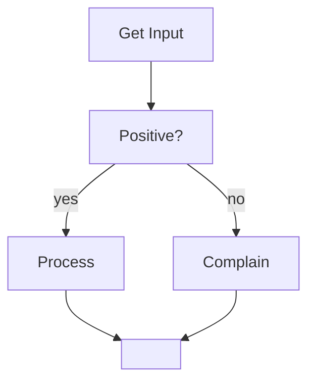

Imagine a program that does the following:



## `if`-`else` Statements in Java

```java
if (condition) {
	// do stuff
}
else {
	// do something else
}
```

This means that if the condition holds the `if` bracket is executed and if not the `else` bracket is.

### Relational Operators
The `condition` takes a boolean variable. Here are functions that take two inputs and return `true` or `false`:

| Operator | Meaning |
| :-: | :-: |
| `>` | greater than |
| `<` | less than |
| `==` | equal to |
| `>=` | greater than or equal to |
| `<=` | less than or equal to |
| `!=` | not equal to |

### Boolean Operators

| Operator | Meaning |
| :-: | :-: |
| `!` | NOT |
| `&&` | AND |
| `||` | OR |
| `^` | XOR |

## Initial Example
The initial example would be coded as follows:

```java
int x = 5; // get input somehow

if (x > 0) {
	System.out.println("you gave me: " + x)
}
else {
	System.out.println(x + " is not positive!")
}
```