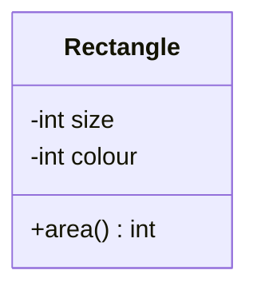

There are two methods of creating objects:

* Copying and adjusting existing ones.
* Instantiating a template.

## Classes
A class is a template of blueprint for objects:

* It specifies which attributes and methods should exist.
* An object can be an **instance** of the class.

For example you may have many instances of rectangles that follow the following class:



This is an **UML** class diagram.
{:.info}

### Class Diagrams

The boxes are laid out in the following order:

1. Name
1. Attributes
1. Methods

## Java Objects & Classes
To create objects in Java you need to:

* Define a class.
* Instantiate a new object of that class.

### Defining a Class

```java
public class Rectangle{
	// Attributes
	private int side;
	private int colour;
	// Methods
	public int area() {
		return side * side;	
	}
}
```

### Instantiating an Object
Every class defines a type and so variables can be declared like this:

```java
Rectangle r;
```

This defines a variable of the type `Rectangle` called `r`.
{:.info}

Object can be instantiated using the keyword `new` like this:

```java
r = new Rectangle();
```